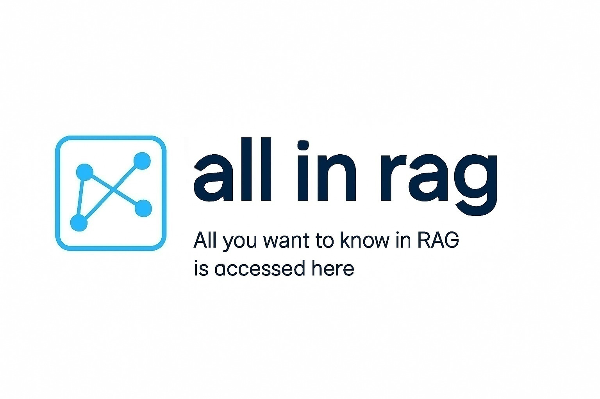
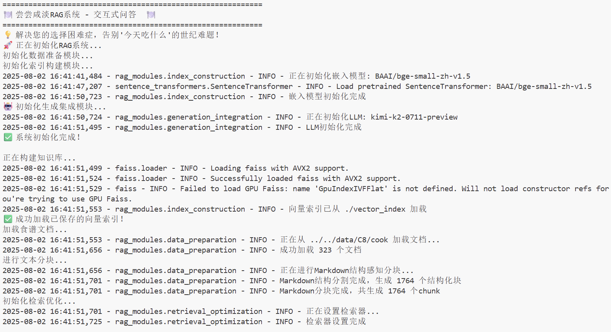

# All-in-RAG | 大模型应用开发实战：RAG技术全栈指南

<div align='center'>
  
</div>

## 项目简介 [](https://github.com/datawhalechina/all-in-rag/stargazers)  [](https://www.python.org/) [](https://github.com/datawhalechina/all-in-rag)

本项目是一个面向大模型应用开发者的RAG（检索增强生成）技术全栈教程，旨在通过体系化的学习路径和动手实践项目，帮助开发者掌握基于大语言模型的RAG应用开发技能，构建生产级的智能问答和知识检索系统。

**主要内容包括：**

1. **RAG技术基础**：深入浅出地介绍RAG的核心概念、技术原理和应用场景
2. **数据处理全流程**：从数据加载、清洗到文本分块的完整数据准备流程
3. **索引构建与优化**：向量嵌入、多模态嵌入、向量数据库构建及索引优化技术
4. **检索技术进阶**：混合检索、查询构建、Text2SQL等高级检索技术
5. **生成集成与评估**：格式化生成、系统评估与优化方法
6. **项目实战**：从基础到进阶的完整RAG应用开发实践

## 项目意义

随着大语言模型的快速发展，RAG技术已成为构建智能问答系统、知识检索应用的核心技术。然而，现有的RAG教程往往零散且缺乏系统性，初学者难以形成完整的技术体系认知。

本项目从实践出发，结合最新的RAG技术发展趋势，构建了一套完整的RAG学习体系，帮助开发者：
- 系统掌握RAG技术的理论基础和实践技能
- 理解RAG系统的完整架构和各组件的作用
- 具备独立开发RAG应用的能力
- 掌握RAG系统的评估和优化方法

## 项目受众

**本项目适合以下人群学习：**
- 具备Python编程基础，对RAG技术感兴趣的开发者
- 希望系统学习RAG技术的AI工程师
- 想要构建智能问答系统的产品开发者
- 对检索增强生成技术有学习需求的研究人员

**前置要求：**
- 掌握Python基础语法和常用库的使用
- 能够简单使用docker
- 了解基本的LLM概念（推荐但非必需）
- 具备基础的Linux命令行操作能力

## 项目亮点

1. **体系化学习路径**：从基础概念到高级应用，构建完整的RAG技术学习体系
2. **理论与实践并重**：每个章节都包含理论讲解和代码实践，确保学以致用
3. **多模态支持**：不仅涵盖文本RAG，还包括多模态嵌入和检索技术
4. **工程化导向**：注重实际应用中的工程化问题，包括性能优化、系统评估等
5. **丰富的实战项目**：提供从基础到进阶的多个实战项目，帮助巩固学习成果

## 内容大纲

### 第一部分：RAG基础入门

**第一章 解锁RAG** [📖 查看章节](./docs/chapter1)
1. [x] [RAG简介](./docs/chapter1/01_RAG_intro.md) - RAG技术概述与应用场景
2. [x] [准备工作](./docs/chapter1/02_preparation.md) - 环境配置与准备
3. [x] [四步构建RAG](./docs/chapter1/03_get_start_rag.md) - 快速上手RAG开发

**第二章 数据准备** [📖 查看章节](./docs/chapter2)
1. [x] [数据加载](./docs/chapter2/04_data_load.md) - 多格式文档处理与加载
2. [x] [文本分块](./docs/chapter2/05_text_chunking.md) - 文本切分策略与优化

### 第二部分：索引构建与优化

**第三章 索引构建** [📖 查看章节](./docs/chapter3)
1. [x] [向量嵌入](./docs/chapter3/06_vector_embedding.md) - 文本向量化技术详解
2. [x] [多模态嵌入](./docs/chapter3/07_multimodal_embedding.md) - 图文多模态向量化
3. [x] [向量数据库](./docs/chapter3/08_vector_db.md) - 向量存储与检索系统
4. [x] [Milvus实践](./docs/chapter3/09_milvus.md) - Milvus多模态检索实战
5. [x] [索引优化](./docs/chapter3/10_index_optimization.md) - 索引性能调优技巧

### 第三部分：检索技术进阶

**第四章 检索优化** [📖 查看章节](./docs/chapter4)
1. [x] [混合检索](./docs/chapter4/11_hybrid_search.md) - 稠密+稀疏检索融合
2. [x] [查询构建](./docs/chapter4/12_query_construction.md) - 智能查询理解与构建
3. [x] [Text2SQL](./docs/chapter4/13_text2sql.md) - 自然语言转SQL查询
4. [x] [查询重构与分发](./docs/chapter4/14_query_rewriting.md) - 查询优化策略
5. [x] [检索进阶技术](./docs/chapter4/15_advanced_retrieval_techniques.md) - 高级检索算法

### 第四部分：生成与评估

**第五章 生成集成** [📖 查看章节](./docs/chapter5)
1. [x] [格式化生成](./docs/chapter5/16_formatted_generation.md) - 结构化输出与格式控制

**第六章 RAG系统评估** [📖 查看章节](./docs/chapter6)
1. [x] [评估介绍](./docs/chapter6/18_system_evaluation.md) - RAG系统评估方法论
2. [x] [评估工具](./docs/chapter6/19_common_tools.md) - 常用评估工具与指标

### 第五部分：高级应用与实战

**第七章 高级RAG架构（拓展选修篇）** [📖 查看章节](./docs/chapter7)

1. [x] [基于知识图谱的RAG](./docs/chapter7/20_kg_rag.md)

**第八章 项目实战一（基础篇）** [📖 查看章节](./docs/chapter8)
1. [x] [环境配置与项目架构](./docs/chapter8/01_env_architecture.md)
2. [x] [数据准备模块实现](./docs/chapter8/02_data_preparation.md)
3. [x] [索引构建与检索优化](./docs/chapter8/03_index_retrieval.md)
4. [x] [生成集成与系统整合](./docs/chapter8/04_generation_sys.md)

**第九章 项目实战一优化（选修篇）** [📖 查看章节](./docs/chapter9)

[🍽️ 项目展示](https://github.com/FutureUnreal/What-to-eat-today)
1. [x] [图RAG架构设计](./docs/chapter9/01_graph_rag_architecture.md)
2. [x] [图数据建模与准备](./docs/chapter9/02_graph_data_modeling.md)
3. [x] [Milvus索引构建](./docs/chapter9/03_index_construction.md)
4. [x] [智能查询路由与检索策略](./docs/chapter9/04_intelligent_query_routing.md)

**第十章 项目实战二（选修篇）** [📖 查看章节](./docs/chapter10) *规划中*

## 目录结构说明

```
all-in-rag/
├── docs/           # 教程文档
├── code/           # 代码示例
├── data/           # 示例数据
├── models/         # 预训练模型
└── README.md       # 项目说明
```

## 实战项目展示

### 第八章 项目一：



### 第九章 项目一（Graph RAG优化）：


### 第十章 项目二：

## 致谢

**核心贡献者**
- [尹大吕-项目负责人](https://github.com/FutureUnreal)（项目发起人与主要贡献者）

### 特别感谢
- 感谢 [@Sm1les](https://github.com/Sm1les) 对本项目的帮助与支持
- 感谢所有为本项目做出贡献的开发者们
- 感谢开源社区提供的优秀工具和框架支持
- 特别感谢以下为教程做出贡献的开发者！

[](https://github.com/datawhalechina/all-in-rag/graphs/contributors)

*Made with [contrib.rocks](https://contrib.rocks).*

## 参与贡献

我们欢迎所有形式的贡献，包括但不限于：

- 🚨 **Bug报告**：发现问题请提交 [Issue](https://github.com/datawhalechina/all-in-rag/issues)
- 💭 **功能建议**：有好的想法欢迎在 [Discussions](https://github.com/datawhalechina/all-in-rag/discussions) 中讨论
- 📚 **文档改进**：帮助完善文档内容和示例代码
- ⚡ **代码贡献**：提交 [Pull Request](https://github.com/datawhalechina/all-in-rag/pulls) 改进项目

### 贡献指南
1. Fork 本仓库
2. 创建你的特性分支 (`git checkout -b feature/AmazingFeature`)
3. 提交你的修改 (`git commit -m 'Add some AmazingFeature'`)
4. 推送到分支 (`git push origin feature/AmazingFeature`)
5. 打开一个 Pull Request

## Star History

[](https://star-history.com/#datawhalechina/all-in-rag&Date)

<div align="center">
  <p>如果这个项目对你有帮助，请给我们一个 ⭐️</p>
  <p>让更多人发现这个项目（护食？发来！）</p>
</div>

## 关于 Datawhale

<div align='center'>
    
    <p>扫描二维码关注 Datawhale 公众号，获取更多优质开源内容</p>
</div>

---

## 许可证

<a rel="license" href="http://creativecommons.org/licenses/by-nc-sa/4.0/"></a>

本作品采用 [知识共享署名-非商业性使用-相同方式共享 4.0 国际许可协议](http://creativecommons.org/licenses/by-nc-sa/4.0/) 进行许可。

---
