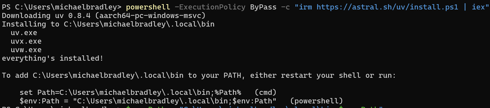
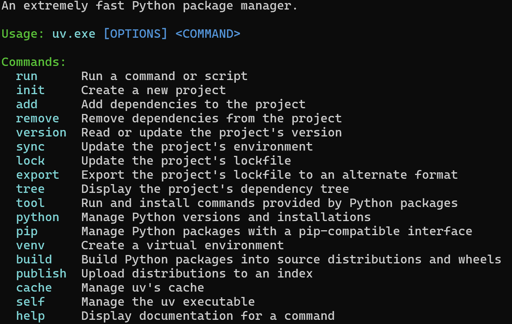
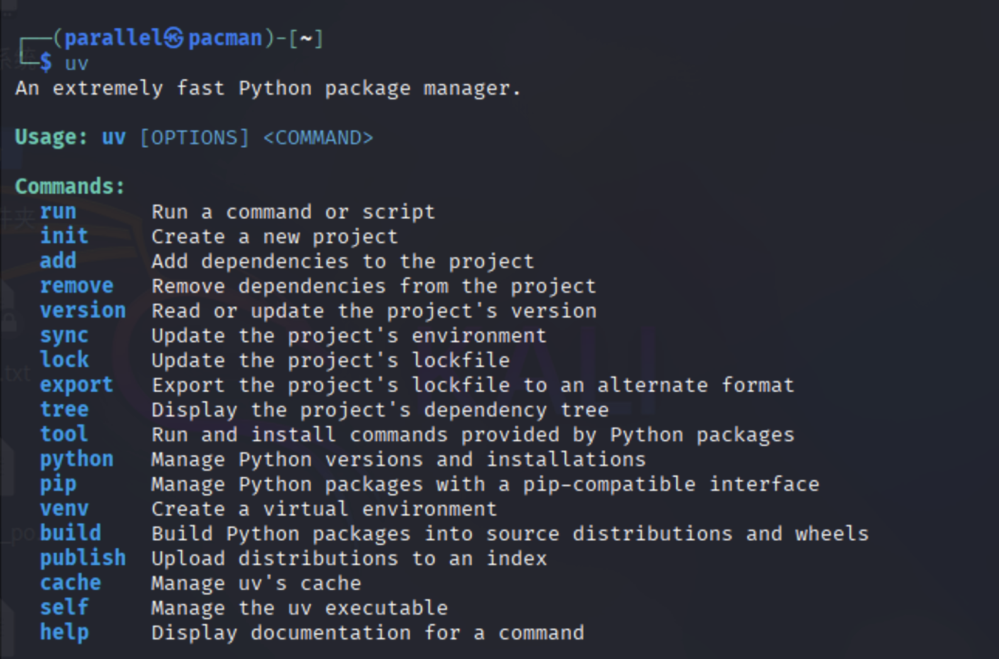

# 附：Python虚拟环境部署方案补充

本项目由于涉及到的包过多，并且**依赖问题**自始至终都是Python的老大难问题，这就造成了 Python 工程化方面生态非常割裂。

对于这种问题，uv提供了统一的虚拟环境管理入口，同时吸收了 Rust 语言先进的包管理经验，使用它可以减少我们在 Python 工程方面折腾的时间，下面我们使用uv来安装项目的虚拟环境。

## 1.1 uv 环境管理

### 1.1.1 Windows 系统

**使用powershell 安装 uv**

```bash
powershell -ExecutionPolicy ByPass -c "irm https://astral.sh/uv/install.ps1 | iex"
```

**安装成功后，按照提示输入以下命令添加环境变量**。这里注意，**不同的人的安装路径不同**，请按照提示自行复制粘贴命令。


```bash
$env:Path = "C:\Users\michaelbradley\.local\bin;$env:Path" 
```




**输入 uv 命令，如果出现以下提示，说明安装成功**



### 1.1.2 Linux / MacOS 系统

**使用 curl 安装 uv**

```bash
curl -LsSf https://astral.sh/uv/install.sh | sh
```

如果无法使用 curl 命令，**使用 wget 命令**安装 uv

```bash
wget -qO- https://astral.sh/uv/install.sh | sh
```

**输入 uv 命令，如果出现以下提示，说明安装成功**




## 1.2 创建并激活虚拟环境

### 1.2.1  **创建虚拟环境**

```bash
uv venv rag --python 3.12.7
```

代码创建的虚拟环境名称为 rag ，使用Python版本为 3.12.7

Windows 系统创建成功后显示如下信息：

```bash
PS C:\Users\parallel> uv venv rag --python 3.12.7
Using CPython 3.12.7
Creating virtual environment at: rag
Activate with: rag\Scripts\activate
```

Linux / MacOS 系统创建成功后显示如下信息：

```bash
┌──(parallel㉿pacman)-[~/桌面]
└─$ uv venv rag -p 3.12.7
Using CPython 3.12.7
Creating virtual environment at: rag
Activate with: source rag/bin/activate
```

### 1.2.2  **激活虚拟环境**

Windows 系统激活虚拟环境命令为：

```bash
rag\Scripts\activate
```

Linux / MacOS 系统激活虚拟环境命令为：

```bash
source rag/bin/activate
```