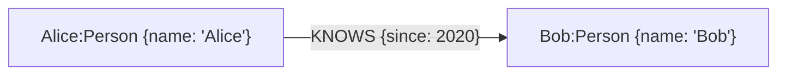
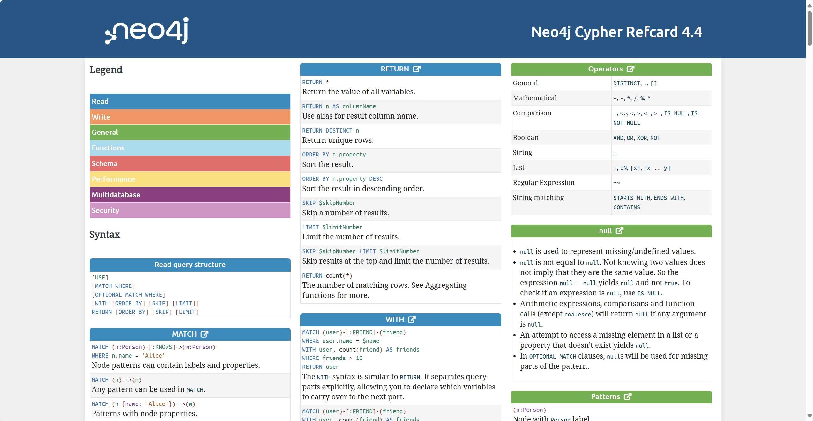
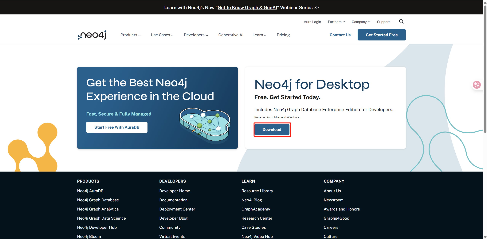
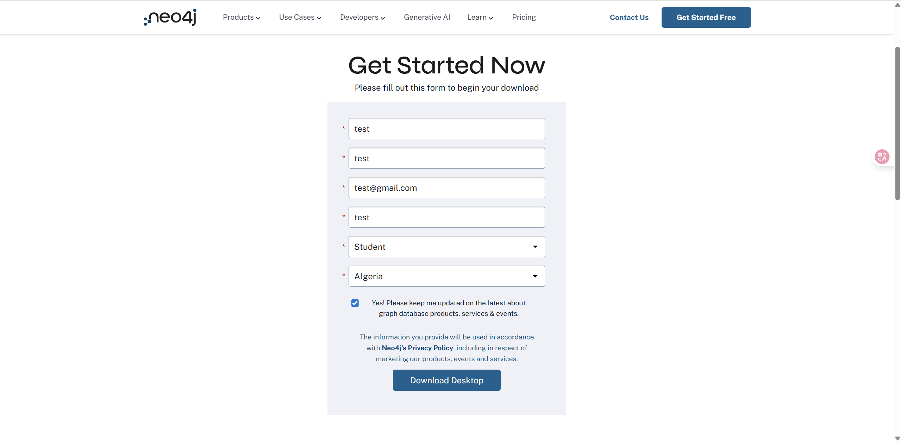
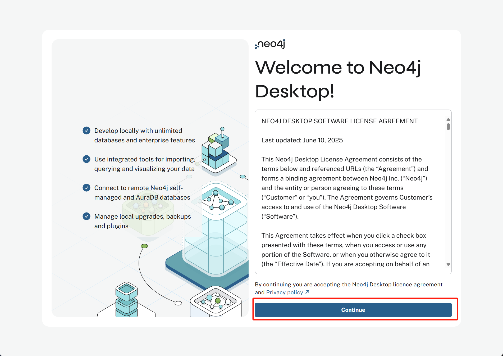

# 第一节 知识图谱与 Neo4j 安装

## 一、什么是知识图谱

**知识图谱（Knowledge Graph, KG）** 源于自然语言理解，其目标是用一种结构化的方式，来描述现实世界中的实体及其相互关系。它主要由两个核心要素构成：

1.  **节点（Nodes）**：代表现实世界中的“实体”（Entities），例如一个人、一部电影、一家公司或一个具体概念。
2.  **边（Edges）**：代表实体与实体之间的“关系”（Relations）。

这些元素共同构成了一个庞大的语义网络，其基本结构可以表示为 **（实体）- [关系] -> （实体）** 的三元组（Triples）。例如，“饺子”和“哪吒2”是两个实体，“导演”就是它们之间的关系，构成一个知识三元组：（饺子）- [导演] -> （哪吒2）。

## 二、知识图谱的应用

知识图谱并非一个孤立的学术概念，它在工业界有着广泛且深入的应用，尤其是在需要深度结合领域知识的场景中。

### 2.1 风险识别与网络分析

俗话说“近朱者赤，近墨者黑”，在许多领域，一个实体的风险或属性，往往与其关联的其他实体有很强的相关性。知识图谱正是挖掘这种关联性的利器。

-   **犯罪网络侦查**：公安部门可以利用通话记录、社交关系、转账流水等信息构建犯罪嫌疑人网络。在这个网络中，如果某个节点与多个已知的犯罪分子有直接或间接的联系，那么他参与犯罪的可能性就大大增加。通过分析网络中的核心人物（连接数最多的节点）和资金流向，可以有效地打击整个犯罪团伙。
-   **信用卡反欺诈**：银行可以将申请人的信息（如电话、地址、公司）构建成一个庞大的关系网络。通过分析这张网络，可以识别出“欺诈团伙”——例如，多个申请人共享同一个联系电话或家庭住址，或者与已知的欺诈分子有紧密的社交关系。

### 2.2 智能诊断与运维

-   **工业设备运维**：将设备的各种“故障现象”、“故障原因”、“解决方案”和“所需零件”构建成知识图谱。当设备出现问题时，系统可以根据上报的现象，在图谱中进行推理，快速定位可能的原因，并给出维修建议，甚至可以提示维修人员需要携带哪些工具和备件，从而提高维修效率。
-   **医疗辅助诊断**：医疗领域知识繁杂，可以通过构建“病症”、“疾病”、“检查项目”、“治疗方案”、“药品”之间的关系图谱。医生输入患者的症状后，系统可以辅助推荐需要进行的检查，并根据检查结果在图谱中推理，给出可能的诊断建议和治疗方案，帮助实现规范化诊疗。

### 2.3 特定领域聊天机器人

对于通用领域的开放式聊天，大语言模型（LLM）已展现出强大的能力。但在许多垂直领域，基于知识图谱的问答系统（KBQA）因其答案的准确性和可解释性，仍然具有不可替代的价值。其工作流程通常如下：

1.  **意图识别**：首先判断用户提问的意图。例如，“我想买一张明天上午的故宫门票”这个问题的意图是“票务预订”。
2.  **槽位填充 (实体抽取)**：从问题中抽取出关键信息，即“实体”。例如：`景点: 故宫`, `时间: 明天上午`, `数量: 一张`。
3.  **知识查询**：利用抽取出的实体，在知识图谱（或数据库）中进行精确查询。
4.  **回复生成**：将查询到的结果，通过预设的模板生成自然语言回复。

这种方式虽然不如 LLM 灵活，但在机票预订、酒店查询、银行客服等业务逻辑明确的场景中，能够提供更加可靠和可控的服务。

## 三、知识图谱的构建

如何从海量的、非结构化的文本（如新闻、财报、医疗记录）中，自动地构建出结构化的知识图谱，是整个技术流程的核心挑战。

### 3.1 经典构建流程

传统的知识图谱构建过程主要依赖于两项关键的 NLP 技术：

1.  **命名实体识别 (Named Entity Recognition, NER)**：从文本中识别并抽取出特定类别的实体。例如，在“英伟达发布了专为 AI 设计的 Blackwell 芯片”这句话中，识别出“英伟达”（公司）、“Blackwell”（产品）。这些被抽取的实体将成为知识图谱中的 **节点**。
2.  **关系抽取 (Relation Extraction, RE)**：在识别出实体的基础上，进一步判断实体与实体之间存在何种语义关系。在上面的例子中，模型需要判断“英伟达”和“Blackwell”之间的关系是“发布”。这个关系将成为连接两个节点的 **边**。

通过对大量文本进行这两步处理，我们就能源源不断地抽取出知识三元组，最终汇聚成一个庞大的知识图谱。

### 3.2 大模型带来的革新

随着大语言模型的兴起，传统的 NLP 任务流程正在被重塑。LLM 同样具备强大的实体识别和关系抽取能力，但这并不意味着对传统流程的简单替代，而是呈现出深度融合的趋势。

-   **局限性与挑战**：完全依赖 LLM 会面临成本高昂、数据隐私（使用闭源 API 时）、以及“幻觉”问题，即模型可能会编造事实。
-   **融合方案**：为了结合知识图谱的准确性和大模型的推理能力，微软提出了 GraphRAG。原理是将知识图谱作为一个可靠、可随时更新的 **外部知识库**，并基于图结构进行“子图检索”（如社区发现、路径搜索等），而非检索孤立事实。当用户提问时：
    1.  利用模型从问题中识别出核心实体与约束。
    2.  在图中检索与之高度相关的子图（社区/路径/邻域），获得准确且可解释的事实与关系。
    3.  将该子图的结构化信息作为上下文，连同原始问题一起输入给大语言模型，生成基于证据的答案。

## 四、图数据库：Neo4j

> [Neo4j 官方文档](https://neo4j.com/docs/)

知识图谱需要专门的数据库进行存储和查询，这类数据库被称为 **图数据库 (Graph Database)**。其中，与传统的关系型数据库（如 MySQL）相比，图数据库的优势在于其对“关系”的查询性能。对于需要进行多层关系遍历的复杂查询（例如，查询“我朋友的朋友”），图数据库的效果远超关系型数据库。而 **Neo4j** 就是目前比较流行的一款开源图数据库。

### 4.1 核心概念

Neo4j 的数据模型主要包含以下几个概念：

-   **节点 (Node)**：节点是图中的基本数据单元，用于表示现实世界中的实体，例如一个人、一家公司、一本书或一个账户。在关系型数据库中，节点可以类比为表中的一行。

-   **标签 (Label)**：用于为节点分类或打上“类型”标记。一个节点可以拥有一个或多个标签。例如，一个节点可以同时拥有 `:Person` 和 `:Author` 两个标签，表示这个人既是一个普通人，也是一位作者。

-   **关系 (Relationship)**：这是图数据库的精髓所在，它以一种富有表现力的方式连接两个节点，并明确地定义了它们之间的联系。每个关系都具有以下特点：
    -   **有方向**：关系总是从一个“起始节点”指向一个“结束节点”。
    -   **有类型**：每个关系都必须有一个类型（例如 `:FRIENDS_WITH`, `:PURCHASED`），用来描述连接的性质。
    -   **可以拥有属性**：和节点一样，关系也可以存储属性，例如，一个 `:PURCHASED` 关系可以有一个 `date` 属性来记录购买日期。

-   **属性 (Property)**：属性是以键值对（Key-Value）形式存储在节点和关系上的详细信息。键是字符串，值可以是各种基本数据类型（如字符串、数字、布尔值）或它们的数组。

这四个概念共同构成了一个灵活而强大的数据模型。


> 在上图中，`Alice` 和 `Bob` 是 **节点**，`:Person` 是 **标签**，`{name: 'Alice'}` 是 **属性**，`KNOWS` 则是连接它们的 **关系** 类型，而 `{since: 2020}` 是这段关系上的 **属性**。

### 4.2 查询语言：Cypher

Cypher 是 Neo4j 的声明式图形查询语言，它的语法灵感来源于 SQL，但针对图的特性进行了优化。通过 Cypher，我们可以用一种直观且高效的方式来查询和操作图数据。

例如，要查找在电影《黑客帝国》(The Matrix) 中出演过的所有演员，可以使用以下查询：

```cypher
MATCH (actor:Person)-[:ACTED_IN]->(movie:Movie {title: 'The Matrix'})
RETURN actor.name
```

官方的 Cypher 语法速查表（[在线版本](https://neo4j.com/docs/cypher-refcard/4.4/)）汇总了常用的命令、操作符和语法结构，可供读者快速查阅。

<div align="center">
  
  <p>图 1.1: Cypher 语法速查表 (Cypher Refcard)</p>
</div>

### 4.3 安装与使用

对于初学者和开发者，推荐以下两种主流的安装方式。

1.  **Neo4j Desktop (推荐用于本地学习)**
    -   **安装**:
        1.  访问 [Neo4j 官网](https://neo4j.com/download/)，在 “Neo4j for Desktop” 板块点击 “Download” 按钮。
            <div align="center">
              
              <p>图 1.2: 在官网点击下载</p>
            </div>
        2.  页面会跳转至一个注册表单。可以填写任意信息，然后点击 “Download Desktop” 按钮，浏览器将自动开始下载安装包。
            <div align="center">
              
              <p>图 1.3: 填写注册表单</p>
            </div>
        3.  下载完成后，双击安装文件，程序会自动进行安装。
        4.  安装完成后首次启动，会看到许可协议界面，点击 “Continue” 即可完成最后的设置。
            <div align="center">
              
              <p>图 1.4: 首次启动并同意许可协议</p>
            </div>

2.  **Docker (推荐用于服务器部署与跨平台开发)**
    -   **安装**: 只需一行命令即可完成拉取镜像和启动容器。
        ```bash
        docker run \
            --name my-neo4j \
            -p 7474:7474 -p 7687:7687 \
            -d \
            -v $HOME/neo4j/data:/data \
            -v $HOME/neo4j/logs:/logs \
            --env NEO4J_AUTH=neo4j/password \
            neo4j:latest
        ```
    -   **参数说明**:
        -   `-p 7474:7474`: 将容器的 HTTP 端口映射到本机，用于浏览器访问。
        -   `-p 7687:7687`: 将容器的 Bolt 驱动端口映射到本机，用于代码连接。
        -   `-v $HOME/neo4j/data:/data`: 将数据目录挂载到本机，确保数据持久化。
        -   `--env NEO4J_AUTH=neo4j/password`: 设置数据库的初始用户名和密码（此处为 `neo4j/password`）。
        -   `neo4j:latest`: 使用最新的官方镜像。
