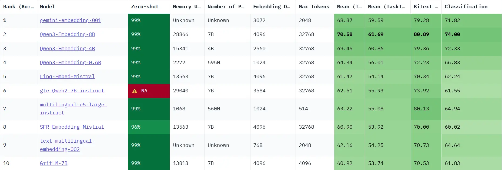
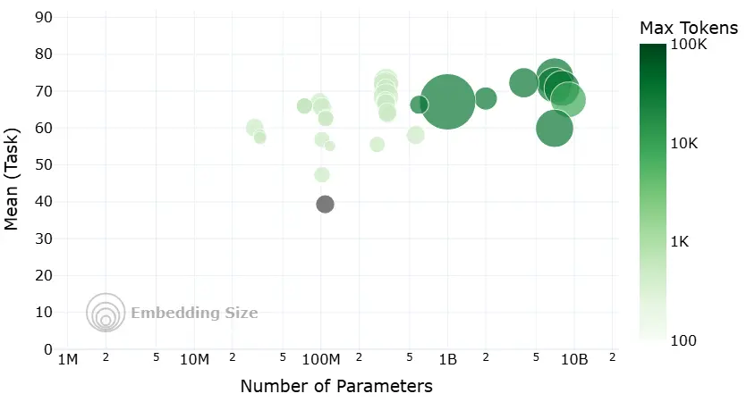

# 第一节 向量嵌入

## 一、向量嵌入基础

### 1.1 基础概念

#### 1.1.1 什么是 Embedding

向量嵌入（Embedding）是一种将真实世界中复杂、高维的数据对象（如文本、图像、音频、视频等）转换为数学上易于处理的、低维、稠密的连续数值向量的技术。

想象一下，我们将每一个词、每一段话、每一张图片都放在一个巨大的多维空间里，并给它一个独一无二的坐标。这个坐标就是一个向量，它“嵌入”了原始数据的所有关键信息。这个过程，就是 Embedding。

- **数据对象**：任何信息，如文本“你好世界”，或一张猫的图片。
- **Embedding 模型**：一个深度学习模型，负责接收数据对象并进行转换。
- **输出向量**：一个固定长度的一维数组，例如 `[0.16, 0.29, -0.88, ...]`。这个向量的维度（长度）通常在几百到几千之间。

 

#### 1.1.2 向量空间的语义表示

Embedding 的真正威力在于，它产生的向量不是随机数值的堆砌，而是对数据**语义**的数学编码。

- **核心原则**：在 Embedding 构建的向量空间中，语义上相似的对象，其对应的向量在空间中的距离会更近；而语义上不相关的对象，它们的向量距离会更远。
- **关键度量**：我们通常使用以下数学方法来衡量向量间的“距离”或“相似度”：
    - **余弦相似度 (Cosine Similarity)**：计算两个向量夹角的余弦值。值越接近 1，代表方向越一致，语义越相似。这是最常用的度量方式。
    - **点积 (Dot Product)**：计算两个向量的乘积和。在向量归一化后，点积等价于余弦相似度。
    - **欧氏距离 (Euclidean Distance)**：计算两个向量在空间中的直线距离。距离越小，语义越相似。

### 1.2 Embedding 在 RAG 中的作用

在RAG流程中，Embedding 扮演着无可替代的重要角色。

#### 1.2.1 语义检索的基础

RAG 的“检索”环节通常以基于 Embedding 的语义搜索为核心。通用流程如下：
1.  **离线索引构建**：将知识库内文档切分后，使用 Embedding 模型将每个文档块（Chunk）转换为向量，存入专门的向量数据库中。
2.  **在线查询检索**：当用户提出问题时，使用**同一个** Embedding 模型将用户的问题也转换为一个向量。
3.  **相似度计算**：在向量数据库中，计算“问题向量”与所有“文档块向量”的相似度。
4.  **召回上下文**：选取相似度最高的 Top-K 个文档块，作为补充的上下文信息，与原始问题一同送给大语言模型（LLM）生成最终答案。

#### 1.2.2 决定检索质量的关键

Embedding 的质量直接决定了 RAG 检索召回内容的准确性与相关性。一个优秀的 Embedding 模型能够精准捕捉问题和文档之间的深层语义联系，即使用户的提问和原文的表述不完全一致。反之，一个劣质的 Embedding 模型可能会因为无法理解语义而召回不相关或错误的信息，从而“污染”提供给 LLM 的上下文，导致最终生成的答案质量低下。

## 二、Embedding 技术发展

Embedding 技术的发展与自然语言处理（NLP）的进步紧密相连，尤其是在 RAG 框架出现后，对嵌入技术提出了新的要求。其演进路径大致可分为以下几个关键阶段。

### 2.1 静态词嵌入：上下文无关的表示

- **代表模型**：Word2Vec (2013), GloVe (2014)
- **主要原理**：为词汇表中的每个单词生成一个固定的、与上下文无关的向量。例如，`Word2Vec` 通过 Skip-gram 和 CBOW 架构，利用局部上下文窗口学习词向量，并验证了向量运算的语义能力（如 `国王 - 男人 + 女人 ≈ 王后`）。`GloVe` 则融合了全局词-词共现矩阵的统计信息。
- **局限性**：无法处理一词多义问题。在“苹果公司发布了新手机”和“我吃了一个苹果”中，“苹果”的词向量是完全相同的，这限制了其在复杂语境下的语义表达能力。

### 2.2 动态上下文嵌入

2017年，`Transformer` 架构的诞生带来了自注意力机制（Self-Attention），它允许模型在生成一个词的向量时，动态地考虑句子中所有其他词的影响。基于此，2018年 `BERT` 模型利用 `Transformer` 的编码器，通过掩码语言模型（MLM）等自监督任务进行预训练，生成了深度上下文相关的嵌入。同一个词在不同语境中会生成不同的向量，这有效解决了静态嵌入的一词多义难题。

### 2.3 RAG 对嵌入技术的新要求

2020年，RAG 框架的提出[^1]，旨在解决大型语言模型**知识固化**（其内部知识难以更新）和**幻觉**（生成的内容可能不符合事实且无法溯源）的问题。RAG 通过“检索-生成”范式，动态地为 LLM 注入外部知识。这一过程的核心是**语义检索**，它完全依赖于高质量的向量嵌入。

RAG 的兴起对嵌入技术提出了更高、更具体的要求：

- **领域自适应能力**：通用的嵌入模型在专业领域（如法律、医疗）可能表现不佳。因此，能够通过微调或使用指令（如 INSTRUCTOR 模型）来适应特定领域术语和语义的嵌入模型变得至关重要。
- **多粒度与多模态支持**：RAG 系统需要处理的不仅仅是短句，还可能包括长文档、代码，甚至是图像和表格。这就要求嵌入模型能够处理不同长度和类型的输入数据。
- **检索效率与混合检索**：嵌入向量的维度和模型大小直接影响存储成本和检索速度。同时，为了结合语义相似性（密集检索）和关键词匹配（稀疏检索）的优点，支持混合检索的嵌入模型（如 BGE-M3）应运而生，在某些任务中成为提升召回率的关键。

## 三、嵌入模型训练原理

了解了嵌入模型的发展，我们来简单探究一下当前主流的嵌入模型（通常是基于 `BERT` 的变体）是如何通过训练获得强大的语义理解能力的。

### 3.1 核心架构：BERT

现代嵌入模型的核心通常是 Transformer 的编码器（Encoder）部分，`BERT` 就是其中的典型代表。它通过堆叠多个 `Transformer Encoder` 层来构建一个深度的双向表示学习网络。

### 3.2 核心训练任务

BERT 的成功很大程度上归功于其巧妙的**自监督学习**策略，它允许模型从海量的、无标注的文本数据中学习知识。

#### 任务一：掩码语言模型 (Masked Language Model, MLM)

- **过程**：
    1.  随机地将输入句子中 15% 的词元（Token）替换为一个特殊的 `[MASK]` 标记。
    2.  让模型去预测这些被遮盖住的原始词元是什么。
- **目标**：通过这个任务，模型被迫学习每个词元与其上下文之间的关系，从而掌握深层次的语境语义。

#### 任务二：下一句预测 (Next Sentence Prediction, NSP)

- **过程**：
    1.  构造训练样本，每个样本包含两个句子 A 和 B。
    2.  其中 50% 的样本，B 是 A 的真实下一句（IsNext）；另外 50% 的样本，B 是从语料库中随机抽取的句子（NotNext）。
    3.  让模型判断 B 是否是 A 的下一句。
- **目标**：这个任务让模型学习句子与句子之间的逻辑关系、连贯性和主题相关性。
- **重要说明**：后续的研究（如 RoBERTa）发现[^2]，NSP 任务可能过于简单，甚至会损害模型性能。因此，许多现代的预训练模型（如 RoBERTa、SBERT）已经放弃了 NSP 任务。

### 3.3 效果增强策略

虽然 MLM 和 NSP 赋予了模型强大的基础语义理解能力，但为了在检索任务中表现更佳，现代嵌入模型通常会引入更具针对性的训练策略。

- **度量学习 (Metric Learning)**：
    - **思想**：直接以“相似度”作为优化目标。
    - **方法**：收集大量相关的文本对（例如，（问题，答案）、（新闻标题，正文））。训练的目标是优化向量空间中的**相对距离**：让“正例对”的向量表示在空间中被“拉近”，而“负例对”的向量表示被“推远”。关键在于优化排序关系，而非追求绝对的相似度值（如 1 或 0），因为过度追求极端值可能导致模型过拟合。

- **对比学习 (Contrastive Learning)**：
    - **思想**：在向量空间中，将相似的样本“拉近”，将不相似的样本“推远”。
    - **方法**：构建一个三元组（Anchor, Positive, Negative）。其中，Anchor 和 Positive 是相关的（例如，同一个问题的两种不同问法），Anchor 和 Negative 是不相关的。训练的目标是让 `distance(Anchor, Positive)` 尽可能小，同时让 `distance(Anchor, Negative)` 尽可能大。

## 四、嵌入模型选型指南

理论已经了解，那么该如何选择最适合你项目的嵌入模型？

### 4.1 从 MTEB 排行榜开始

[**MTEB (Massive Text Embedding Benchmark)**](https://huggingface.co/spaces/mteb/leaderboard) 是一个由 Hugging Face 维护的、全面的文本嵌入模型评测基准。它涵盖了分类、聚类、检索、排序等多种任务，并提供了公开的排行榜，为评估和选择嵌入模型提供了重要的参考依据。

下面这张图是网站中的模型评估图像，非常直观地展示了在选择开源嵌入模型时需要权衡的四个核心维度：

- **横轴 - 模型参数量 (Number of Parameters)**：代表了模型的大小。通常，参数量越大的模型（越靠右），其潜在能力越强，但对计算资源的要求也越高。
- **纵轴 - 平均任务得分 (Mean Task Score)**：代表了模型的综合性能。这个分数是模型在分类、聚类、检索等一系列标准 NLP 任务上的平均表现。分数越高（越靠上），说明模型的通用语义理解能力越强。
- **气泡大小 - 嵌入维度 (Embedding Size)**：代表了模型输出向量的维度。气泡越大，维度越高，理论上能编码更丰富的语义细节，但同时也会占用更多的存储和计算资源。
- **气泡颜色 - 最大处理长度 (Max Tokens)**：代表了模型能处理的文本长度上限。颜色越深，表示模型能处理的 Token 数量越多，对长文本的适应性越好。

MTEB 榜单可以帮助我们快速筛选掉大量不合适的模型。但需要注意，榜单上的得分是在通用数据集上评测的，可能无法完全反映模型在你特定业务场景下的表现。

### 4.2 关键评估维度

在查看榜单时，除了分数，你还需要关注以下几个关键维度：

1.  **任务 (Task)**：对于 RAG 应用，需要重点关注模型在 `Retrieval` (检索) 任务下的排名。
2.  **语言 (Language)**：模型是否支持你的业务数据所使用的语言？对于中文 RAG，应选择明确支持中文或多语言的模型。
3.  **模型大小 (Size)**：模型越大，通常性能越好，但对硬件（显存）的要求也越高，推理速度也越慢。需要根据你的部署环境和性能要求来权衡。
4.  **维度 (Dimensions)**：向量维度越高，能编码的信息越丰富，但也会占用更多的存储空间和计算资源。
5.  **最大 Token 数 (Max Tokens)**：这决定了模型能处理的文本长度上限。这个参数是你设计文本分块（Chunking）策略时必须考虑的重要依据，块大小不应超过此限制。
6.  **得分与机构 (Score & Publisher)**：结合模型的得分排名和其发布机构的声誉进行初步筛选。知名机构发布的模型通常质量更有保障。
7.  **成本 (Cost)**：如果是使用 API 服务的模型，需要考虑其调用成本；如果是自部署开源模型，则需要评估其对硬件资源的消耗（如显存、内存）以及带来的运维成本。

### 4.3 迭代测试与优化

> 不要只依赖公开榜单做最终决定。

1.  **确定基线 (Baseline)**：根据上述维度，选择几个符合要求的模型作为你的初始基准模型。
2.  **构建私有评测集**：根据真实业务数据，手动创建一批高质量的评测样本，每个样本包含一个典型用户问题和它对应的标准答案（或最相关的文档块）。
3.  **迭代优化**：
    - 使用基线模型在你的私有评测集上运行，评估其召回的准确率和相关性。
    - 如果效果不理想，可以尝试更换模型，或者调整 RAG 流程的其他环节（如文本分块策略）。
    - 通过几轮的对比测试和迭代优化，最终选出在你的特定场景下表现最佳的那个“心仪”模型。

## 参考文献

[^1]: [Lewis et al. (2020). *Retrieval-Augmented Generation for Knowledge-Intensive NLP Tasks*](https://arxiv.org/abs/2005.11401)

[^2]: [*RoBERTa: A Modified BERT Model for NLP*](https://www.comet.com/site/blog/roberta-a-modified-bert-model-for-nlp/)
