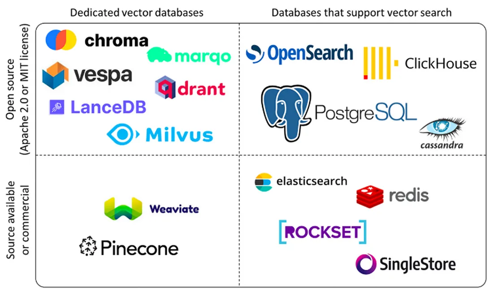

# 第三节 向量数据库

## 一、向量数据库的作用

在前面我们学习了如何使用嵌入模型将文本、图像等非结构化数据转换为高维向量。这些向量是 RAG 系统能够进行语义理解的基础。然而，当向量数量从几百个增长到数百万甚至数十亿时，一个核心问题随之而来：**如何快速、准确地从海量向量中找到与用户查询最相似的那几个？**

### 1.1 向量数据库主要功能

向量数据库的核心价值在于其高效处理海量高维向量的能力。其主要功能可以概括为以下几点：

1.  **高效的相似性搜索**：这是向量数据库最重要的功能。它利用专门的索引技术（如 HNSW, IVF），能够在数十亿级别的向量中实现毫秒级的近似最近邻（ANN）查询，快速找到与给定查询最相似的数据。
2.  **高维数据存储与管理**：专门为存储高维向量（通常维度成百上千）而优化，支持对向量数据进行增、删、改、查等基本操作。
3.  **丰富的查询能力**：除了基本的相似性搜索，还支持按标量字段过滤查询（例如，在搜索相似图片的同时，指定`年份 > 2023`）、范围查询和聚类分析等，满足复杂业务需求。
4.  **可扩展与高可用**：现代向量数据库通常采用分布式架构，具备良好的水平扩展能力和容错性，能够通过增加节点来应对数据量的增长，并确保服务的稳定可靠。
5.  **数据与模型生态集成**：与主流的 AI 框架（如 LangChain, LlamaIndex）和机器学习工作流无缝集成，简化了从模型训练到向量检索的应用开发流程。

### 1.2 向量数据库 vs. 传统数据库

传统的数据库（如 MySQL）擅长处理结构化数据的精确匹配查询（例如，`WHERE age = 25`），但它们并非为处理高维向量的相似性搜索而设计的。在庞大的向量集合中进行暴力、线性的相似度计算，其计算成本和时间延迟无法接受。

**向量数据库 (Vector Database)** 正是为解决这一挑战而生。它是一种专门设计用于高效存储、管理和查询高维向量的数据库系统。在 RAG 流程中，扮演着“知识库”的角色，是连接数据与大语言模型的关键桥梁。

向量数据库与传统数据库的主要差异如下：

| **维度** | **向量数据库** | **传统数据库 (RDBMS)** |
| :--- | :--- | :--- |
| **核心数据类型** | 高维向量 (Embeddings) | 结构化数据 (文本、数字、日期) |
| **查询方式** | **相似性搜索** (ANN) | **精确匹配** |
| **索引机制** | HNSW, IVF, LSH 等 ANN 索引 | B-Tree, Hash Index |
| **主要应用场景** | AI 应用、RAG、推荐系统、图像/语音识别 | 业务系统 (ERP, CRM)、金融交易、数据报表 |
| **数据规模** | 轻松应对千亿级向量 | 通常在千万到亿级行数据，更大规模需复杂分库分表 |
| **性能特点** | 高维数据检索性能极高，计算密集型 | 结构化数据查询快，高维数据查询性能呈指数级下降 |
| **一致性** | 通常为最终一致性 | 强一致性 (ACID 事务) |

向量数据库和传统数据库并非相互替代的关系，而是**互补关系**。在构建现代 AI 应用时，通常会将两者结合使用：利用传统数据库存储业务元数据和结构化信息，而向量数据库则专门负责处理和检索由 AI 模型产生的海量向量数据。

## 二、工作原理

向量数据库的核心是高效处理高维向量的相似性搜索。向量是一组有序的数值，可以表示文本、图像、音频等复杂数据的特征或属性。在 RAG 系统中，向量一般通过嵌入模型将原始数据转换为高维向量表示，比如上一节的图文示例。

向量数据库通常采用四层架构，通过以下技术手段实现高效相似性搜索：

1. **存储层**：存储向量数据和元数据，优化存储效率，支持分布式存储
2. **索引层**：维护索引算法（HNSW、LSH、PQ等），创建和优化索引，支持索引调整
3. **查询层**：处理查询请求，支持混合查询，实现查询优化
4. **服务层**：管理客户端连接，提供监控和日志，实现安全管理

主要技术手段包括：
- **基于树的方法**：如 Annoy 使用的随机投影树，通过树形结构实现对数复杂度的搜索
- **基于哈希的方法**：如 LSH（局部敏感哈希），通过哈希函数将相似向量映射到同一“桶”
- **基于图的方法**：如 HNSW（分层可导航小世界图），通过多层邻近图结构实现快速搜索
- **基于量化的方法**：如 Faiss 的 IVF 和 PQ，通过聚类和量化压缩向量

## 三、主流向量数据库介绍



当前主流的向量数据库产品包括：

[ **Pinecone** ](https://www.pinecone.io/)是一款完全托管的向量数据库服务，采用Serverless架构设计。它提供存储计算分离、自动扩展和负载均衡等企业级特性，并保证99.95%的SLA。Pinecone支持多种语言SDK，提供极高可用性和低延迟搜索（<100ms），特别适合企业级生产环境、高并发场景和大规模部署。

[ **Milvus** ](https://github.com/milvus-io/milvus)是一款开源的分布式向量数据库，采用分布式架构设计，支持GPU加速和多种索引算法。它能够处理亿级向量检索，提供高性能GPU加速和完善的生态系统。Milvus特别适合大规模部署、高性能要求的场景，以及需要自定义开发的开源项目。

[ **Qdrant** ](https://github.com/qdrant/qdrant)是一款高性能的开源向量数据库，采用Rust开发，支持二进制量化技术。它提供多种索引策略和向量混合搜索功能，能够实现极高的性能（RPS>4000）和低延迟搜索。Qdrant特别适合性能敏感应用、高并发场景以及中小规模部署。

[ **Weaviate** ](https://github.com/weaviate/weaviate)是一款支持GraphQL的AI集成向量数据库，提供20+AI模块和多模态支持。它采用GraphQL API设计，支持RAG优化，特别适合AI开发、多模态处理和快速开发场景。Weaviate具有活跃的社区支持和易于集成的特点。

[ **Chroma** ](https://github.com/chroma-core/chroma)是一款轻量级的开源向量数据库，采用本地优先设计，无依赖。它提供零配置安装、本地运行和低资源消耗等特性，特别适合原型开发、教育培训和小规模应用。Chroma的部署简单，适合快速原型开发。

**选择建议**：
-   **新手入门/小型项目**：从 `ChromaDB` 或 `FAISS` 开始是最佳选择。它们与 LangChain/LlamaIndex 紧密集成，几行代码就能运行，且能满足基本的存储和检索需求。
-   **生产环境/大规模应用**：当数据量超过百万级，或需要高并发、实时更新、复杂元数据过滤时，应考虑更专业的解决方案，如 `Milvus`、`Weaviate` 或云服务 `Pinecone`。

## 四、本地向量存储

ChromaDB 是一个对开发者非常友好的开源向量数据库，它提供了“开箱即用”的体验，非常适合作为入门选择。

### 4.1 环境准备

```bash
# 安装 chromadb 和 embedding 模型依赖
pip install chromadb sentence-transformers
```

### 4.2 基础示例

下面的代码演示了使用 ChromaDB 完成一个完整的“索引-查询”流程。

```python
import chromadb

# 1. 初始化 ChromaDB 客户端
# settings=... 用于指定 ChromaDB 的存储路径，实现数据持久化
client = chromadb.PersistentClient(path="./chroma_db")

# 2. 创建或获取一个集合 (Collection)
# 集合类似于关系数据库中的“表”
collection = client.get_or_create_collection(name="my_collection")

# 3. 添加文档到集合中
# ChromaDB 会自动使用默认的嵌入模型处理文本并存储向量
collection.add(
    documents=[
        "这是一份关于苹果公司的文档。",
        "那是一篇介绍香蕉营养价值的文章。",
        "我最喜欢的水果是苹果。"
    ],
    metadatas=[
        {"source": "doc1"},
        {"source": "doc2"},
        {"source": "doc3"}
    ],
    ids=["id1", "id2", "id3"] # 每个文档都需要一个唯一的ID
)

# 4. 执行相似性搜索
query_text = "我想了解苹果这种水果"
results = collection.query(
    query_texts=[query_text],
    n_results=2 # 返回最相似的2个结果
)

# 5. 查看结果
print(results)
```

**运行结果**：

```json
{
    "ids": [["id3", "id1"]],
    "distances": [[0.528..., 1.018...]],
    "metadatas": [[{"source": "doc3"}, {"source": "doc1"}]],
    "embeddings": null,
    "documents": [["我最喜欢的水果是苹果。", "这是一份关于苹果公司的文档。"]],
    "uris": null,
    "data": null
}
```

**结果解读**：
-   `ids`, `documents`, `metadatas` 分别返回了与查询最相关的两个文档的 ID、原始内容和元数据。
-   `distances` 表示查询向量与每个返回文档向量之间的“距离”。值越小，代表语义越相似。
-   可以看到，模型成功地区分了“苹果（水果）”和“苹果（公司）”，并将最相关的“我最喜欢的水T果是苹果。”排在了第一位。

通过这个简单的例子，我们了解了向量数据库是如何简化 RAG 中最核心的检索步骤的。在后续章节中，我们将更深入地探讨如何将其与 LangChain 等框架结合，构建更复杂的应用。
