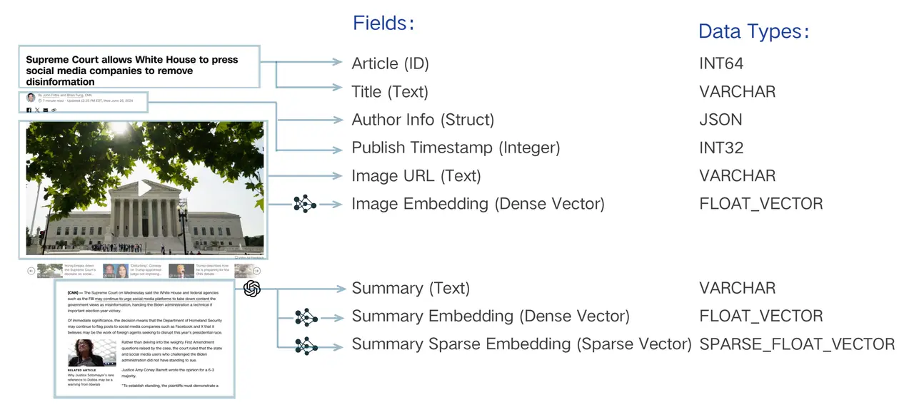
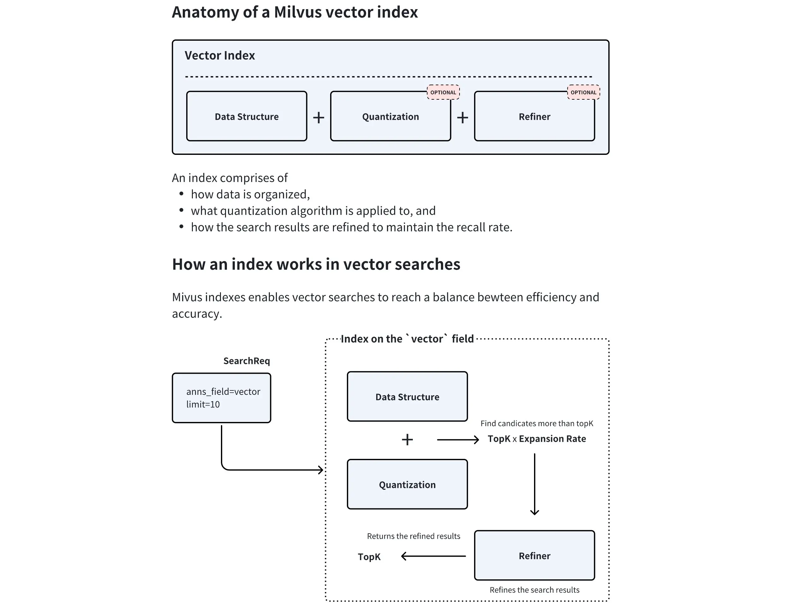

# Milvus介绍
## 一、简介

Milvus 是一个开源的、专为大规模向量相似性搜索和分析而设计的向量数据库。它诞生于 Zilliz 公司，并已成为 LF AI & Data 基金会的顶级项目，在AI领域拥有广泛的应用。

与 FAISS、ChromaDB 等轻量级本地存储方案不同，Milvus 从设计之初就瞄准了**生产环境**。它采用云原生架构，具备高可用、高性能、易扩展的特性，能够处理十亿、百亿甚至更大规模的向量数据。

**官网地址**: [https://milvus.io/](https://milvus.io/)
**GitHub**: [https://github.com/milvus-io/milvus](https://github.com/milvus-io/milvus)

## 二、 部署安装

Milvus 提供了多种部署方式，这里以 **Milvus Standalone (单机版)** 为例。

### 1. 环境准备

- **安装 Docker 与 Docker Compose**: 确保系统中已安装并正在运行 Docker 和 Docker Compose。如果你对 Docker 不熟悉，可以参考这篇详细的教程：[Docker 万字教程：从入门到掌握](https://mp.weixin.qq.com/s/u2es87JU5FNlGo3qDLY_ng)。

### 2. 下载并启动 Milvus

在你选定的工作目录下，打开终端（Terminal）或命令行工具（PowerShell），执行以下步骤：

**第一步：下载配置文件**

使用以下命令下载官方的 `docker-compose.yml` 文件。这个文件定义了 Milvus Standalone 及其运行所需的两个核心依赖服务：`etcd` 用于存储元数据，`MinIO` 用于对象存储（更多架构细节请参考[官方文档](https://milvus.io/docs/architecture_overview.md)）。

```bash
# macOS / Linux (使用 wget)
wget https://github.com/milvus-io/milvus/releases/download/v2.5.14/milvus-standalone-docker-compose.yml -O docker-compose.yml
```

```powershell
# Windows (使用 PowerShell)
Invoke-WebRequest -Uri "https://github.com/milvus-io/milvus/releases/download/v2.5.14/milvus-standalone-docker-compose.yml" -OutFile "docker-compose.yml"
```

**第二步：启动 Milvus 服务**

在 `docker-compose.yml` 文件所在的目录中，运行以下命令以后台模式启动 Milvus：

```bash
docker compose up -d
```

Docker 将会自动拉取所需的镜像并启动三个容器：`milvus-standalone`, `milvus-minio`, 和 `milvus-etcd`。这个过程可能需要几分钟，具体取决于你的网络状况。

### 3. 验证安装

可以通过以下方式验证 Milvus 是否成功启动：

- **查看 Docker 容器**: 打开 Docker Desktop 的仪表盘 (Windows/macOS) 或在终端运行 `docker ps` 命令 (Linux)，确认三个 Milvus 相关容器（`milvus-standalone`, `milvus-minio`, `milvus-etcd`）都处于 `running` 或 `up` 状态。
- **检查服务端口**: Milvus Standalone 默认通过 `19530` 端口提供服务，这是后续代码连接时需要用到的地址。

### 4. 常用管理命令

- **停止服务**:
  ```bash
  docker compose down
  ```
  此命令会停止并移除容器，但保留存储的数据卷。

- **彻底清理 (停止并删除数据)**:
  如果想彻底删除所有数据（包括向量、元数据等），可以执行以下命令：
  ```bash
  docker compose down -v
  ```

## 三、核心组件

### 3.1 Collection (集合)

可以用一个图书馆的比喻来理解 Collection：

- **Collection (集合)**: 相当于一个**图书馆**，是所有数据的顶层容器。一个 Collection 可以包含多个 Partition，每个 Partition 可以包含多个 Entity。
- **Partition (分区)**: 相当于图书馆里的**不同区域**（如“小说区”、“科技区”），将数据物理隔离，让检索更高效。
- **Schema (模式)**: 相当于图书馆的**图书卡片规则**，定义了每本书（数据）必须登记哪些信息（字段）。
- **Entity (实体)**: 相当于**一本具体的书**，是数据本身。
- **Alias (别名)**: 相当于一个**动态的推荐书单**（如“本周精选”），它可以指向某个具体的 Collection，方便应用层调用，实现数据更新时的无缝切换。 

**Collection** 是 Milvus 中最基本的数据组织单位，类似于关系型数据库中的一张**表 (Table)**。是我们存储、管理和查询向量及相关元数据的容器。所有的数据操作，如插入、删除、查询等，都是围绕 Collection 展开的。

一个 Collection 由其 **Schema** 定义，并包含以下重要的子概念和特性：

#### 3.1.1 Schema

在创建 Collection 之前，必须先定义它的 **Schema**。 `Schema` 规定了 Collection 的数据结构，定义了其中包含的所有**字段 (Field)** 及其属性。一个设计良好的 Schema 对于保证数据一致性和提升查询性能至关重要。

Schema 通常包含以下几类字段：

- **主键字段 (Primary Key Field)**: 每个 Collection 必须有且仅有一个主键字段，用于唯一标识每一条数据（实体）。它的值必须是唯一的，通常是整数或字符串类型。
- **向量字段 (Vector Field)**: 用于存储核心的向量数据。一个 Collection 可以有一个或多个向量字段，以满足多模态等复杂场景的需求。
- **标量字段 (Scalar Field)**: 用于存储除向量之外的元数据，如字符串、数字、布尔值、JSON 等。这些字段可以用于过滤查询，实现更精确的检索。



上图以一篇新闻文章为例，生动地展示了一个典型的多模态、混合向量 Schema 设计。它将一篇文章拆解为：唯一的 `Article (ID)`、文本元数据（如 `Title`、`Author Info`）、图像信息（`Image URL`），并为图像和摘要内容分别生成了密集向量（`Image Embedding`, `Summary Embedding`）和稀疏向量（`Summary Sparse Embedding`）。

#### 3.1.2 Partition (分区)

**Partition** 是 Collection 内部的一个逻辑划分。每个 Collection 在创建时都会有一个名为 `_default` 的默认分区。我们可以根据业务需求创建更多的分区，将数据按特定规则（如类别、日期等）存入不同分区。

**为什么使用分区？**

- **提升查询性能**: 在查询时，可以指定只在一个或几个分区内进行搜索，从而大幅减少需要扫描的数据量，显著提升检索速度。
- **数据管理**: 便于对部分数据进行批量操作，如加载/卸载特定分区到内存，或者删除整个分区的数据。

一个 Collection 最多可以有 1024 个分区。合理利用分区是 Milvus 性能优化的重要手段之一。

#### 3.1.3 Alias (别名)

**Alias** (别名) 是为 Collection 提供的一个“昵称”。通过为一个 Collection 设置别名，我们可以在应用程序中使用这个别名来执行所有操作，而不是直接使用真实的 Collection 名称。

**为什么使用别名？**

- **安全地更新数据**：想象一下，你需要对一个在线服务的 Collection 进行大规模的数据更新或重建索引。直接在原 Collection 上操作风险很高。正确的做法是：
    1. 创建一个新的 Collection (`collection_v2`) 并导入、索引好所有新数据。
    2. 将指向旧 Collection (`collection_v1`) 的别名（例如 `my_app_collection`）原子性地切换到新 Collection (`collection_v2`) 上。
- **代码解耦**：整个切换过程对上层应用完全透明，无需修改任何代码或重启服务，实现了数据的平滑无缝升级。

### 3.2 索引 (Index)

如果说 Collection 是 Milvus 的骨架，那么**索引 (Index)** 就是其加速检索的神经系统。从宏观上看，索引本身就是一种**为了加速查询而设计的复杂数据结构**。对向量数据创建索引后，Milvus 可以极大地提升向量相似性搜索的速度，代价是会占用额外的存储和内存资源。



上图清晰地展示了 Milvus 向量索引的内部组件及其工作流程：
- **数据结构**：这是索引的骨架，定义了向量的组织方式（如 HNSW 中的图结构）。
- **量化**(可选)：数据压缩技术，通过降低向量精度来减少内存占用和加速计算。
- **结果精炼**(可选)：在找到初步候选集后，进行更精确的计算以优化最终结果。

Milvus 支持对标量字段和向量字段分别创建索引。

- **标量字段索引**：主要用于加速元数据过滤，常用的有 `INVERTED`、`BITMAP` 等。通常使用推荐的索引类型即可。
- **向量字段索引**：这是 Milvus 的核心。选择合适的向量索引是在查询性能、召回率和内存占用之间做出权衡的艺术。

#### 3.2.1 主要向量索引类型

Milvus 提供了多种向量索引算法，以适应不同的应用场景。以下是几种最核心的类型：

- **FLAT (精确查找)**
  - **原理**：暴力搜索（Brute-force Search）。它会计算查询向量与集合中所有向量之间的实际距离，返回最精确的结果。
  - **优点**：100% 的召回率，结果最准确。
  - **缺点**：速度慢，内存占用大，不适合海量数据。
  - **适用场景**：对精度要求极高，且数据规模较小（百万级以内）的场景。

- **IVF 系列 (倒排文件索引)**
  - **原理**：类似于书籍的目录。它首先通过聚类将所有向量分成多个“桶”(`nlist`)，查询时，先找到最相似的几个“桶”，然后只在这几个桶内进行精确搜索。`IVF_FLAT`、`IVF_SQ8`、`IVF_PQ` 是其不同变体，主要区别在于是否对桶内向量进行了压缩（量化）。
  - **优点**：通过缩小搜索范围，极大地提升了检索速度，是性能和效果之间很好的平衡。
  - **缺点**：召回率不是100%，因为相关向量可能被分到了未被搜索的桶中。
  - **适用场景**：通用场景，尤其适合需要高吞吐量的大规模数据集。

- **HNSW (基于图的索引)**
  - **原理**：构建一个多层的邻近图。查询时从最上层的稀疏图开始，快速定位到目标区域，然后在下层的密集图中进行精确搜索。
  - **优点**：检索速度极快，召回率高，尤其擅长处理高维数据和低延迟查询。
  - **缺点**：内存占用非常大，构建索引的时间也较长。
  - **适用场景**：对查询延迟有严格要求（如实时推荐、在线搜索）的场景。

- **DiskANN (基于磁盘的索引)**
  - **原理**：一种为在 SSD 等高速磁盘上运行而优化的图索引。
  - **优点**：支持远超内存容量的海量数据集（十亿级甚至更多），同时保持较低的查询延迟。
  - **缺点**：相比纯内存索引，延迟稍高。
  - **适用场景**：数据规模巨大，无法全部加载到内存的场景。

#### 3.2.2 如何选择索引？

选择索引没有唯一的“最佳答案”，需要根据业务场景在**数据规模、内存限制、查询性能和召回率**之间进行权衡。

| 场景 | 推荐索引 | 备注 |
| :--- | :--- | :--- |
| 数据可完全载入内存，追求低延迟 | **HNSW** | 内存占用较大，但查询性能和召回率都很优秀。 |
| 数据可完全载入内存，追求高吞吐 | **IVF_FLAT / IVF_SQ8** | 性能和资源消耗的平衡之选。 |
| 数据量巨大，无法载入内存 | **DiskANN** | 在 SSD 上性能优异，专为海量数据设计。 |
| 追求 100% 准确率，数据量不大 | **FLAT** | 暴力搜索，确保结果最精确。 |

在实际应用中，通常需要通过测试来找到最适合自己数据和查询模式的索引类型及其参数。

### 3.3 检索

拥有了数据容器 (Collection) 和检索引擎 (Index) 后，最后一步就是从海量数据中高效地检索信息。

#### 3.3.1 基础向量检索 (ANN Search)

这是 Milvus 的核心功能之一，**近似最近邻 (Approximate Nearest Neighbor, ANN) 检索**。与需要计算全部数据的暴力检索（Brute-force Search）不同，ANN 检索利用预先构建好的索引，能够极速地从海量数据中找到与查询向量最相似的 Top-K 个结果。这是一种在速度和精度之间取得极致平衡的策略。

- **主要参数**:
  - `anns_field`: 指定要在哪个向量字段上进行检索。
  - `data`: 传入一个或多个查询向量。
  - `limit` (或 `top_k`): 指定需要返回的最相似结果的数量。
  - `search_params`: 指定检索时使用的参数，例如距离计算方式 (`metric_type`) 和索引相关的查询参数。

#### 3.3.2 增强检索

在基础的 ANN 检索之上，Milvus 提供了多种增强检索功能，以满足更复杂的业务需求。

##### 过滤检索 (Filtered Search)

在实际应用中，我们很少只进行单纯的向量检索。更常见的需求是“在满足特定条件的向量中，查找最相似的结果”，这就是过滤检索。它将**向量相似性检索**与**标量字段过滤**结合在一起。

- **工作原理**: 先根据提供的过滤表达式 (`filter`) 筛选出符合条件的实体，然后仅在这个子集内执行 ANN 检索。这极大地提高了查询的精准度。
- **应用示例**: 
  - **电商**: “检索与这件红色连衣裙最相似的商品，但只看价格低于500元且有库存的。”
  - **知识库**: “查找与‘人工智能’相关的文档，但只从‘技术’分类下、且发布于2023年之后的文章中寻找。”

##### 范围检索 (Range Search)

有时我们关心的不是最相似的 Top-K 个结果，而是“所有与查询向量的相似度在特定范围内的结果”。

- **工作原理**: 范围检索允许定义一个距离（或相似度）的阈值范围。Milvus 会返回所有与查询向量的距离落在这个范围内的实体。
- **应用示例**: 
  - **人脸识别**: “查找所有与目标人脸相似度超过 0.9 的人脸”，用于身份验证。
  - **异常检测**: “查找所有与正常样本向量距离过大的数据点”，用于发现异常。

##### 多向量混合检索 (Hybrid Search)

这是 Milvus 提供的一种极其强大的高级检索模式，它允许在一个请求中同时检索**多个向量字段**，并将结果智能地融合在一起。

- **工作原理**:
  1. **并行检索**: 应用针对不同的向量字段（如一个用于文本语义的密集向量，一个用于关键词匹配的稀疏向量，一个用于图像内容的多模态向量）分别发起 ANN 检索请求。
  2. **结果融合 (Rerank)**: Milvus 使用一个重排策略（Reranker）将来自不同检索流的结果合并成一个统一的、更高质量的排序列表。常用的策略有 `RRFRanker`（平衡各方结果）和 `WeightedRanker`（可为特定字段结果加权）。

- **应用示例**:
  - **多模态商品检索**: 用户输入文本“安静舒适的白色耳机”，系统可以同时检索商品的**文本描述向量**和**图片内容向量**，返回最匹配的商品。
  - **增强型 RAG**: 结合**密集向量**（捕捉语义）和**稀疏向量**（精确匹配关键词），实现比单一向量更精准的文档检索效果。

#### 3.3.3 分组检索 (Grouping Search)

分组检索解决了一个常见的痛点：检索结果多样性不足。想象一下，你检索“机器学习”，返回的前10篇文章都来自同一本教科书不同章节。这显然不是理想的结果。

- **工作原理**: 分组检索允许指定一个字段（如 `document_id`）对结果进行分组。Milvus 会在检索后，确保返回的结果中每个组（每个 `document_id`）只出现一次（或指定的次数），且返回的是该组内与查询最相似的那个实体。
- **应用示例**: 
  - **视频检索**: 检索“可爱的猫咪”，确保返回的视频来自不同的博主。
  - **文档检索**: 检索“数据库索引”，确保返回的结果来自不同的书籍或来源。

通过这些灵活的检索功能组合，开发者可以构建出满足各种复杂业务需求的向量检索应用。

## 四、milvus多模态实战

在本节中，我们将通过一个完整的案例，演示如何使用 Milvus 和 Visualized-BGE 模型构建一个端到端的图文多模态检索引擎。

### 4.1 初始化与工具定义

首先导入所有必需的库，定义好模型路径、数据目录等常量。为了代码的整洁和复用，将 Visualized-BGE 模型的加载和编码逻辑封装在一个 `Encoder` 类中，并定义了一个 `visualize_results` 函数用于后续的结果可视化。

```python
import os
from tqdm import tqdm
from glob import glob
import torch
from visual_bge.visual_bge.modeling import Visualized_BGE
from pymilvus import MilvusClient, FieldSchema, CollectionSchema, DataType
import numpy as np
import cv2
from PIL import Image

# 1. 初始化设置
MODEL_NAME = "BAAI/bge-base-en-v1.5"
MODEL_PATH = "../../models/bge/Visualized_base_en_v1.5.pth"
DATA_DIR = "../../data/C3"
COLLECTION_NAME = "multimodal_demo"
MILVUS_URI = "http://localhost:19530"

# 2. 定义工具 (编码器和可视化函数)
class Encoder:
    """编码器类，用于将图像和文本编码为向量。"""
    def __init__(self, model_name: str, model_path: str):
        self.model = Visualized_BGE(model_name_bge=model_name, model_weight=model_path)
        self.model.eval()

    def encode_query(self, image_path: str, text: str) -> list[float]:
        with torch.no_grad():
            query_emb = self.model.encode(image=image_path, text=text)
        return query_emb.tolist()[0]

    def encode_image(self, image_path: str) -> list[float]:
        with torch.no_grad():
            query_emb = self.model.encode(image=image_path)
        return query_emb.tolist()[0]

def visualize_results(query_image_path: str, retrieved_images: list, img_height: int = 300, img_width: int = 300, row_count: int = 3) -> np.ndarray:
    """从检索到的图像列表创建一个全景图用于可视化。"""
    panoramic_width = img_width * row_count
    panoramic_height = img_height * row_count
    panoramic_image = np.full((panoramic_height, panoramic_width, 3), 255, dtype=np.uint8)
    query_display_area = np.full((panoramic_height, img_width, 3), 255, dtype=np.uint8)

    # 处理查询图像
    query_pil = Image.open(query_image_path).convert("RGB")
    query_cv = np.array(query_pil)[:, :, ::-1]
    resized_query = cv2.resize(query_cv, (img_width, img_height))
    bordered_query = cv2.copyMakeBorder(resized_query, 10, 10, 10, 10, cv2.BORDER_CONSTANT, value=(255, 0, 0))
    query_display_area[img_height * (row_count - 1):, :] = cv2.resize(bordered_query, (img_width, img_height))
    cv2.putText(query_display_area, "Query", (10, panoramic_height - 20), cv2.FONT_HERSHEY_SIMPLEX, 1, (255, 0, 0), 2)

    # 处理检索到的图像
    for i, img_path in enumerate(retrieved_images):
        row, col = i // row_count, i % row_count
        start_row, start_col = row * img_height, col * img_width
        
        retrieved_pil = Image.open(img_path).convert("RGB")
        retrieved_cv = np.array(retrieved_pil)[:, :, ::-1]
        resized_retrieved = cv2.resize(retrieved_cv, (img_width - 4, img_height - 4))
        bordered_retrieved = cv2.copyMakeBorder(resized_retrieved, 2, 2, 2, 2, cv2.BORDER_CONSTANT, value=(0, 0, 0))
        panoramic_image[start_row:start_row + img_height, start_col:start_col + img_width] = bordered_retrieved
        
        # 添加索引号
        cv2.putText(panoramic_image, str(i), (start_col + 10, start_row + 30), cv2.FONT_HERSHEY_SIMPLEX, 1, (0, 0, 255), 2)

    return np.hstack([query_display_area, panoramic_image])
```

### 4.2 创建 Collection

这是与 Milvus 交互的开始。首先初始化 Milvus 客户端，然后定义 Collection 的 Schema，它规定了集合的数据结构。

```python
# 3. 初始化客户端
print("--> 正在初始化编码器和Milvus客户端...")
encoder = Encoder(MODEL_NAME, MODEL_PATH)
milvus_client = MilvusClient(uri=MILVUS_URI)

# 4. 创建 Milvus Collection
print(f"\n--> 正在创建 Collection '{COLLECTION_NAME}'")
if milvus_client.has_collection(COLLECTION_NAME):
    milvus_client.drop_collection(COLLECTION_NAME)
    print(f"已删除已存在的 Collection: '{COLLECTION_NAME}'")

image_list = glob(os.path.join(DATA_DIR, "dragon", "*.png"))
if not image_list:
    raise FileNotFoundError(f"在 {DATA_DIR}/dragon/ 中未找到任何 .png 图像。")
dim = len(encoder.encode_image(image_list[0]))

fields = [
    FieldSchema(name="id", dtype=DataType.INT64, is_primary=True, auto_id=True),
    FieldSchema(name="vector", dtype=DataType.FLOAT_VECTOR, dim=dim),
    FieldSchema(name="image_path", dtype=DataType.VARCHAR, max_length=512),
]

# 创建集合 Schema
schema = CollectionSchema(fields, description="多模态图文检索")
print("Schema 结构:")
print(schema)

# 创建集合
milvus_client.create_collection(collection_name=COLLECTION_NAME, schema=schema)
print(f"成功创建 Collection: '{COLLECTION_NAME}'")
print("Collection 结构:")
print(milvus_client.describe_collection(collection_name=COLLECTION_NAME))
```

**输出结果：**
```bash
--> 正在创建 Collection 'multimodal_demo'

Schema 结构:
{
    'auto_id': True, 
    'description': '多模态图文检索', 
    'fields': [
        {'name': 'id', 'description': '', 'type': <DataType.INT64: 5>, 'is_primary': True, 'auto_id': True}, 
        {'name': 'vector', 'description': '', 'type': <DataType.FLOAT_VECTOR: 101>, 'params': {'dim': 768}}, 
        {'name': 'image_path', 'description': '', 'type': <DataType.VARCHAR: 21>, 'params': {'max_length': 512}}
    ], 
    'enable_dynamic_field': False
}

成功创建 Collection: 'multimodal_demo'

Collection 结构:
{
    'collection_name': 'multimodal_demo', 
    'auto_id': True, 
    'num_shards': 1, 
    'description': '多模态图文检索', 
    'fields': [
        {'field_id': 100, 'name': 'id', 'description': '', 'type': <DataType.INT64: 5>, 'params': {}, 'auto_id': True, 'is_primary': True}, 
        {'field_id': 101, 'name': 'vector', 'description': '', 'type': <DataType.FLOAT_VECTOR: 101>, 'params': {'dim': 768}}, 
        {'field_id': 102, 'name': 'image_path', 'description': '', 'type': <DataType.VARCHAR: 21>, 'params': {'max_length': 512}}
    ], 
    'functions': [], 
    'aliases': [], 
    'collection_id': 459243798405253751, 
    'consistency_level': 2, 
    'properties': {}, 
    'num_partitions': 1, 
    'enable_dynamic_field': False, 
    'created_timestamp': 459249546649403396, 
    'update_timestamp': 459249546649403396
}
```

上面的输出详细展示了刚刚创建的 `multimodal_demo` Collection 的完整结构。其 **Schema** 包含了三个核心字段（**Field**）：一个自增的 `id` 作为**主键**，一个 768 维的 `vector` **向量字段**用于存储图像嵌入，以及一个 `image_path` **标量字段**来记录原始图片路径。

### 4.3 准备并插入数据

创建好 Collection 后，需要将数据填充进去。通过遍历指定目录下的所有图片，将它们逐一编码成向量，然后与图片路径一起组织成符合 Schema 结构的格式，最后批量插入到 Collection 中。

```python
# 5. 准备并插入数据
print(f"\n--> 正在向 '{COLLECTION_NAME}' 插入数据")
data_to_insert = []
for image_path in tqdm(image_list, desc="生成图像嵌入"):
    vector = encoder.encode_image(image_path)
    data_to_insert.append({"vector": vector, "image_path": image_path})

if data_to_insert:
    result = milvus_client.insert(collection_name=COLLECTION_NAME, data=data_to_insert)
    print(f"成功插入 {result['insert_count']} 条数据。")
```

### 4.4 创建索引

为了实现快速检索，需要为向量字段创建索引。这里选择 `HNSW` 索引，它在召回率和查询性能之间有着很好的平衡。创建索引后，必须调用 `load_collection` 将集合加载到内存中才能进行搜索。

```python
# 6. 创建索引
print(f"\n--> 正在为 '{COLLECTION_NAME}' 创建索引")
index_params = milvus_client.prepare_index_params()
index_params.add_index(
    field_name="vector",
    index_type="HNSW",
    metric_type="COSINE",
    params={"M": 16, "efConstruction": 256}
)
milvus_client.create_index(collection_name=COLLECTION_NAME, index_params=index_params)
print("成功为向量字段创建 HNSW 索引。")
print("索引详情:")
print(milvus_client.describe_index(collection_name=COLLECTION_NAME, index_name="vector"))
milvus_client.load_collection(collection_name=COLLECTION_NAME)
print("已加载 Collection 到内存中。")
```

**输出结果：**
```bash
--> 正在为 'multimodal_demo' 创建索引
成功为向量字段创建 HNSW 索引。
索引详情:
{'M': '16', 'efConstruction': '256', 'metric_type': 'COSINE', 'index_type': 'HNSW', 'field_name': 'vector', 'index_name': 'vector', 'total_rows': 0, 'indexed_rows': 0, 'pending_index_rows': 0, 'state': 'Finished'}
已加载 Collection 到内存中。
```

可以看出，索引创建成功，在 `vector` 字段上成功创建了 `HNSW` 索引，并使用 `COSINE` 作为距离度量。`M: '16'` 和 `efConstruction: '256'` 是 HNSW 索引的两个关键参数，分别控制着图中每个节点的最大连接数和索引构建时的搜索范围，这些参数直接影响检索的性能和准确性。`state: 'Finished'` 状态表明索引已成功构建。

### 4.5 执行多模态检索

这里通过定义一个包含图片和文本的组合查询，将其编码为查询向量，然后调用 `search` 方法在 Milvus 中执行近似最近邻搜索。

```python
# 7. 执行多模态检索
print(f"\n--> 正在 '{COLLECTION_NAME}' 中执行检索")
query_image_path = os.path.join(DATA_DIR, "dragon", "dragon01.png")
query_text = "一条龙"
query_vector = encoder.encode_query(image_path=query_image_path, text=query_text)

search_results = milvus_client.search(
    collection_name=COLLECTION_NAME,
    data=[query_vector],
    output_fields=["image_path"],
    limit=5,
    search_params={"metric_type": "COSINE", "params": {"ef": 128}}
)[0]

retrieved_images = []
print("检索结果:")
for i, hit in enumerate(search_results):
    print(f"  Top {i+1}: ID={hit['id']}, 距离={hit['distance']:.4f}, 路径='{hit['entity']['image_path']}'")
    retrieved_images.append(hit['entity']['image_path'])
```

**输出结果：**

```bash
--> 正在 'multimodal_demo' 中执行检索
检索结果:
  Top 1: ID=459243798403756667, 距离=0.9411, 路径='../../data/C3\dragon\dragon01.png'
  Top 2: ID=459243798403756668, 距离=0.5818, 路径='../../data/C3\dragon\dragon02.png'
  Top 3: ID=459243798403756671, 距离=0.5731, 路径='../../data/C3\dragon\dragon05.png'
  Top 4: ID=459243798403756670, 距离=0.4894, 路径='../../data/C3\dragon\dragon04.png'
  Top 5: ID=459243798403756669, 距离=0.4100, 路径='../../data/C3\dragon\dragon03.png'
```

这段输出展示了与图文组合查询最相似的5个**实体 (Entity)**。`distance` 字段代表了**余弦相似度**，值越接近 1 表示越相似。可以看到，`Top 1` 结果正是查询图片本身，其相似度得分最高（0.9411），这验证了检索的有效性。其余结果也都是龙的图片，并按相似度从高到低精确排列，证明该多模态检索系统成功地理解了查询意图。

### 4.6 可视化与清理

最后，将检索到的图片路径用于可视化，生成一张直观的结果对比图。在完成所有操作后，应该释放 Milvus 中的资源，包括从内存中卸载 Collection 和删除整个 Collection。

```python
# 8. 可视化与清理
print(f"\n--> 正在可视化结果并清理资源")
if not retrieved_images:
    print("没有检索到任何图像。")
else:
    panoramic_image = visualize_results(query_image_path, retrieved_images)
    combined_image_path = os.path.join(DATA_DIR, "search_result.png")
    cv2.imwrite(combined_image_path, panoramic_image)
    print(f"结果图像已保存到: {combined_image_path}")
    Image.open(combined_image_path).show()

milvus_client.release_collection(collection_name=COLLECTION_NAME)
print(f"已从内存中释放 Collection: '{COLLECTION_NAME}'")
milvus_client.drop_collection(COLLECTION_NAME)
print(f"已删除 Collection: '{COLLECTION_NAME}'")
```


这张图清晰地表明，这个多模态检索引擎成功地理解了“一条龙”这个图文组合查询的意图，并准确地从图库中找到了最相关的几张龙的图片。
