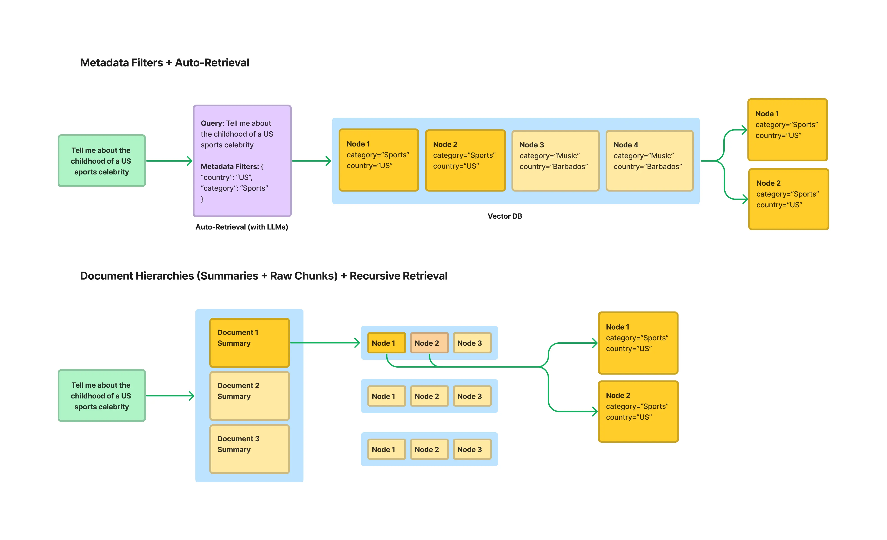

# 第五节 索引优化

在上一章的文本分块部分，已经简单介绍了一些索引优化的策略。本节将基于LlamaIndex的高性能生产级RAG构建方案[^1]，对索引优化进行更深入的探讨。

## 一、上下文扩展

在RAG系统中，常常面临一个权衡问题：使用小块文本进行检索可以获得更高的精确度，但小块文本缺乏足够的上下文，可能导致大语言模型（LLM）无法生成高质量的答案；而使用大块文本虽然上下文丰富，却容易引入噪音，降低检索的相关性。为了解决这一矛盾，LlamaIndex 提出了一种实用的索引策略——**句子窗口检索（Sentence Window Retrieval）**[^2]。该技术巧妙地结合了两种方法的优点：它在检索时聚焦于高度精确的单个句子，在送入LLM生成答案前，又智能地将上下文扩展回一个更宽的“窗口”，从而同时保证检索的准确性和生成的质量。

### 1.1 主要思路

句子窗口检索的思想可以概括为：**为检索精确性而索引小块，为上下文丰富性而检索大块**。

其工作流程如下：

1.  **索引阶段**：在构建索引时，文档被分割成**单个句子**。每个句子都作为一个独立的“节点（Node）”存入向量数据库。同时，每个句子节点都会在元数据（metadata）中存储其**上下文窗口**，即该句子原文中的前N个和后N个句子。这个窗口内的文本不会被索引，仅仅是作为元数据存储。

2.  **检索阶段**：当用户发起查询时，系统会在所有**单一句子节点**上执行相似度搜索。因为句子是表达完整语义的最小单位，所以这种方式可以非常精确地定位到与用户问题最相关的核心信息。

3.  **后处理阶段**：在检索到最相关的句子节点后，系统会使用一个名为 `MetadataReplacementPostProcessor` 的后处理模块。该模块会读取到检索到的句子节点的元数据，并用元数据中存储的**完整上下文窗口**来替换节点中原来的单一句子内容。

4.  **生成阶段**：最后，这些被替换了内容的、包含丰富上下文的节点被传递给LLM，用于生成最终的答案。

### 1.2 代码实现

下面通过 LlamaIndex 官网的示例，来演示如何实现句子窗口检索，并与常规的检索方法进行对比。该示例将加载一份PDF格式的IPCC气候报告，并就其中的专业问题进行提问。

核心代码如下：

```python
# 假设 Settings.llm 和 Settings.embed_model 已经预先配置好

# 1. 加载文档
documents = SimpleDirectoryReader(
    input_files=["../../data/C3/pdf/IPCC_AR6_WGII_Chapter03.pdf"]
).load_data()

# 2. 创建节点与构建索引
# 2.1 句子窗口索引
node_parser = SentenceWindowNodeParser.from_defaults(
    window_size=3,
    window_metadata_key="window",
    original_text_metadata_key="original_text",
)
sentence_nodes = node_parser.get_nodes_from_documents(documents)
sentence_index = VectorStoreIndex(sentence_nodes)
```

根据 LlamaIndex 的底层源码，`SentenceWindowNodeParser` 的核心逻辑位于 `build_window_nodes_from_documents` 方法中。其实现过程可以分解为以下几个关键步骤：

1.  **句子切分 (`sentence_splitter`)**：解析器首先接收一个文档（`Document`），然后调用 `self.sentence_splitter(doc.text)` 方法。这个 `sentence_splitter` 是一个可配置的函数，默认为 `split_by_sentence_tokenizer`，它负责将文档的全部文本精确地切分成一个句子列表（`text_splits`）。

2.  **创建基础节点 (`build_nodes_from_splits`)**：切分出的 `text_splits` 列表被传递给 `build_nodes_from_splits` 工具函数。这个函数会为列表中的**每一个句子**都创建一个独立的 `TextNode`。此时，每个 `TextNode` 的 `text` 属性就是这个句子的内容。

3.  **构建窗口并填充元数据 (主要循环)**：接下来，解析器会遍历所有新创建的 `TextNode`。对于位于第 `i` 个位置的节点，它会执行以下操作：
    *   **定位窗口**：通过列表切片 `nodes[max(0, i - self.window_size) : min(i + self.window_size + 1, len(nodes))]` 来获取一个包含中心句子及其前后 `window_size`（默认为3）个邻近节点的列表（`window_nodes`）。这个切片操作很巧妙地处理了文档开头和结尾的边界情况。
    *   **组合窗口文本**：将 `window_nodes` 列表中所有节点的 `text`（即所有在窗口内的句子）用空格拼接成一个长字符串。
    *   **填充元数据**：将上一步生成的长字符串（完整的上下文窗口）存入当前节点（第`i`个节点）的元数据中，键为 `self.window_metadata_key`（默认为 `"window"`）。同时，也会将节点自身的文本（原始句子）存入元数据，键为 `self.original_text_metadata_key`（默认为 `"original_text"`）。

4.  **设置元数据排除项**：这是一个非常关键的细节。在填充完元数据后，代码会执行 `node.excluded_embed_metadata_keys.extend(...)` 和 `node.excluded_llm_metadata_keys.extend(...)`。这行代码的作用是告诉后续的嵌入模型和LLM，在处理这个节点时，**应当忽略** `"window"` 和 `"original_text"` 这两个元数据字段。这确保了只有单个句子的纯净文本被用于生成向量嵌入，从而保证了检索的高精度。而 `"window"` 字段仅供后续的 `MetadataReplacementPostProcessor` 使用。

通过以上步骤，`SentenceWindowNodeParser` 最终返回一个 `TextNode` 列表。列表中的每个节点都代表一个独立的句子，其 `text` 属性用于精确检索，而其 `metadata` 中则“隐藏”了用于生成答案的丰富上下文窗口。

```python
# 2.2 常规分块索引 (基准)
base_parser = SentenceSplitter(chunk_size=512)
base_nodes = base_parser.get_nodes_from_documents(documents)
base_index = VectorStoreIndex(base_nodes)

# 3. 构建查询引擎
sentence_query_engine = sentence_index.as_query_engine(
    similarity_top_k=2,
    node_postprocessors=[
        MetadataReplacementPostProcessor(target_metadata_key="window")
    ],
)
base_query_engine = base_index.as_query_engine(similarity_top_k=2)

# 4. 执行查询并对比结果
query = "What are the concerns surrounding the AMOC?"
print(f"查询: {query}\n")

print("--- 句子窗口检索结果 ---")
window_response = sentence_query_engine.query(query)
print(f"回答: {window_response}\n")

print("--- 常规检索结果 ---")
base_response = base_query_engine.query(query)
print(f"回答: {base_response}\n")
```

1.  **构建句子窗口索引**：这一步利用了 `SentenceWindowNodeParser`。它将文档解析为以单个句子为单位的 `Node`，同时将包含上下文的“窗口”文本（默认为前后各3个句子）存储在每个 `Node` 的元数据中。这一步是实现“为检索精确性而索引小块”思想的关键。

2.  **构建查询引擎与后处理**：查询引擎的构建是实现“为生成质量而扩展上下文”的关键。
    *   在创建 `sentence_query_engine` 时，配置中加入了一个重要的后处理器 `MetadataReplacementPostProcessor`。
    *   它的作用是：当检索器根据用户查询找到最相关的节点（也就是单个句子）后，这个后处理器会立即介入。
    *   它会从该节点的元数据中读取出预先存储的完整“窗口”文本，并用它**替换**掉节点中原来的单个句子内容。
    *   这样，最终传递给大语言模型的就不再是孤立的句子，而是包含丰富上下文的完整文本段落，从而确保了生成答案的质量和连贯性。

我们向两个引擎提出的问题是：“关于大西洋经向翻转环流（AMOC），人们主要担忧什么？” (What are the concerns surrounding the AMOC?)。

**代码输出如下：**
```bash
查询: What are the concerns surrounding the AMOC?

--- 句子窗口检索结果 ---
回答: The Atlantic Meridional Overturning Circulation (AMOC) is projected to decline over the 21st century with high confidence, though there is low confidence in quantitative projections of this decline. Observational records since the mid-2000s are too short to determine the relative contributions of internal variability, natural forcing, and anthropogenic forcing to AMOC changes. Additionally, there is low confidence in reconstructed and modeled AMOC changes for the 20th century due to limited agreement in quantitative trends. While an abrupt collapse before 2100 is not expected, the decline could have significant implications for global climate patterns.

--- 常规检索结果 ---
回答: The concerns surrounding the Atlantic Meridional Overturning Circulation (AMOC) primarily involve its projected decline over the 21st century across all Shared Socioeconomic Pathway (SSP) scenarios. While an abrupt collapse before 2100 is not expected, there is high confidence in this decline, though quantitative projections remain uncertain. Observational records since the mid-2000s are too short to clearly distinguish the contributions of internal variability, natural forcing, and anthropogenic forcing to these changes. This uncertainty highlights the need for further research to better understand and predict AMOC behavior and its broader climate impacts.
```

从输出结果中可以观察到：

*   **两个答案都抓住了核心**：两个引擎都正确地识别出，对AMOC的主要担忧是其在21世纪预计的衰退。
*   **句子窗口检索的答案更详尽、更连贯**：句子窗口检索的回答不仅指出了衰退的趋势，还补充了关于“定量预测的置信度低”、“观测记录时间过短”、“20世纪重建和模拟的变化置信度低”等多个维度的细节。这使得答案的信息量更大，上下文更完整，更像一个综述。
*   **常规检索的答案相对宽泛**：常规检索的回答虽然正确，但内容相对概括，最后以“需要进一步研究”这样较为笼同的结论收尾。

这种差异正是句子窗口检索策略优势的体现。它通过“精确检索小文本块（单个句子），再扩展上下文（句子窗口）”的方式，为大语言模型提供了高度相关且信息丰富的上下文，从而生成了质量更高的答案。

> [完整代码](https://github.com/datawhalechina/all-in-rag/blob/main/code/C3/05_sentence_window_retrieval.py)

## 二、结构化索引

随着知识库的规模不断扩大（例如，包含数百个PDF文件），传统的RAG方法（即对所有文本块进行top-k相似度搜索）会遇到瓶颈。当一个查询可能只与其中一两个文档相关时，在整个文档库中进行无差别的向量搜索，不仅效率低下，还容易被不相关的文本块干扰，导致检索结果不精确。

为了解决这个问题，一个有效的方法是利用**结构化索引**。其原理是在索引文本块的同时，为其附加结构化的**元数据（Metadata）**。这些元数据可以是任何有助于筛选和定位信息的标签，例如：

*   文件名
*   文档创建日期
*   章节标题
*   作者
*   任何自定义的分类标签



实际上，在第二章“文本分块”中介绍的**基于文档结构的分块**方法，就是实现结构化索引的一种前置步骤。例如，在使用 `MarkdownHeaderTextSplitter` 时，分块器会自动将Markdown文档的各级标题（如 `Header 1`, `Header 2` 等）提取并存入每个文本块的元数据中。这些标题信息就是非常有价值的结构化数据，可以直接用于后续的元数据过滤。

通过这种方式，可以在检索时实现“元数据过滤”和“向量搜索”的结合。例如，当用户查询“请总结一下2023年第二季度财报中关于AI的论述”时，系统可以：

1.  **元数据预过滤**：首先通过元数据筛选，只在 `document_type == '财报'`、`year == 2023` 且 `quarter == 'Q2'` 的文档子集中进行搜索。
2.  **向量搜索**：然后，在经过滤的、范围更小的文本块集合中，执行针对查询“关于AI的论述”的向量相似度搜索。

这种“先过滤，再搜索”的策略，能够极大地缩小检索范围，显著提升大规模知识库场景下RAG应用的检索效率和准确性。LlamaIndex 提供了包括“自动检索”（Auto-Retrieval）在内的多种工具来支持这种结构化的检索范式。

### 2.1 代码实现：基于多表格的递归检索

在更复杂的场景中，结构化数据可能分布在多个来源中，例如一个包含多个工作表（Sheet）的 Excel 文件，每个工作表都代表一个独立的表格。在这种情况下，需要一种更强大的策略：**递归检索**[^3]。它能实现“路由”功能，先将查询引导至正确的知识来源（正确的表格），然后再在该来源内部执行精确查询。

下面使用一个包含多个工作表的电影数据 Excel 文件（`movie.xlsx`）来演示，其中每个工作表（如 `年份_1994`, `年份_2002` 等）都存储了对应年份的电影信息。

```python
# 1. 为每个工作表创建查询引擎和摘要节点
excel_file = '../../data/C3/excel/movie.xlsx'
xls = pd.ExcelFile(excel_file)

df_query_engines = {}
all_nodes = []

for sheet_name in xls.sheet_names:
    df = pd.read_excel(xls, sheet_name=sheet_name)
    # 为当前工作表创建一个 PandasQueryEngine
    query_engine = PandasQueryEngine(df=df, llm=Settings.llm, verbose=True)
    # 为当前工作表创建一个摘要节点（IndexNode）
    year = sheet_name.replace('年份_', '')
    summary = f"这个表格包含了年份为 {year} 的电影信息，可以用来回答关于这一年电影的具体问题。"
    node = IndexNode(text=summary, index_id=sheet_name)
    all_nodes.append(node)
    # 存储工作表名称到其查询引擎的映射
    df_query_engines[sheet_name] = query_engine

# 2. 创建顶层索引（只包含摘要节点）
vector_index = VectorStoreIndex(all_nodes)

# 3. 创建递归检索器
vector_retriever = vector_index.as_retriever(similarity_top_k=1)
recursive_retriever = RecursiveRetriever(
    "vector",
    retriever_dict={"vector": vector_retriever},
    query_engine_dict=df_query_engines,
    verbose=True,
)

# 4. 创建查询引擎
query_engine = RetrieverQueryEngine.from_args(recursive_retriever)

# 5. 执行查询
query = "1994年评分人数最多的电影是哪一部？"
print(f"查询: {query}")
response = query_engine.query(query)
print(f"回答: {response}")
```

1.  **创建 PandasQueryEngine**：遍历 Excel 中的每个工作表，为每个工作表（即一个独立的 DataFrame）都实例化一个 `PandasQueryEngine`。其强大之处在于，它能将关于表格的自然语言问题（如“评分人数最多的是哪个”）转换成实际的 Pandas 代码（如 `df.sort_values('评分人数').iloc[-1]`）来执行。
2.  **创建摘要节点 (`IndexNode`)**：对每个工作表，都创建一个 `IndexNode`，其内容是关于这个表格的一段摘要文本。这个节点将作为顶层检索的“指针”。
3.  **构建顶层索引**：使用所有创建的 `IndexNode` 构建一个 `VectorStoreIndex`。这个索引不包含任何表格的详细数据，只包含指向各个表格的“指针”信息。
4.  **创建 `RecursiveRetriever`**：这是实现递归检索的核心。将其配置为：
    *   `retriever_dict`: 指定顶层的检索器，即在摘要节点中进行检索的 `vector_retriever`。
    *   `query_engine_dict`: 提供一个从节点 ID（即工作表名称）到其对应查询引擎的映射。当顶层检索器匹配到某个摘要节点后，递归检索器就知道该调用哪个 `PandasQueryEngine` 来处理后续查询。

**运行结果：**

```bash
查询: 1994年评分人数最少的电影是哪一部？
> Retrieving with query id None: 1994年评分人数最少的电影是哪一部？
> Retrieved node with id, entering: 年份_1994
> Retrieving with query id 年份_1994: 1994年评分人数最少的电影是哪一部？
> Pandas Instructions:
```
df[df['年份'] == 1994].nsmallest(1, '评分人数')['电影名称'].iloc[0]
```
> Pandas Output: 燃情岁月
回答: 燃情岁月
```

从输出中可以清晰地看到递归检索的完整流程：
1.  **顶层路由**：`Retrieving with query id None`，系统首先在顶层的摘要索引中检索，根据问题“1994年...”匹配到了摘要节点 `年份_1994`。
2.  **进入子层**：`Retrieved node with id, entering: 年份_1994`，系统决定进入与“年份_1994”这个工作表关联的查询引擎。
3.  **子层查询**：`Retrieving with query id 年份_1994`，`PandasQueryEngine` 接管查询，并将问题发送给 LLM，让其生成 Pandas 代码。
4.  **代码生成与执行**：LLM 生成了 `df[df['年份'] == 1994].nsmallest(1, '评分人数')['电影名称'].iloc[0]`，引擎执行后得到输出 `燃情岁月`。

> [完整代码](https://github.com/datawhalechina/all-in-rag/blob/main/code/C3/06_recursive_retrieval.py)

> ⚠️ **重要安全警告**：实际上在 LlamaIndex 的官网有提到，`PandasQueryEngine` 是一个实验性功能，具有潜在的安全风险。它的工作原理是让 LLM 生成 Python 代码，然后使用 `eval()` 函数在本地执行。这意味着，在没有严格沙箱隔离的环境下，理论上可能执行任意代码。**因此，强烈不建议在生产环境中使用此工具**。

### 2.2 另一种实现方式

鉴于 `PandasQueryEngine` 的安全风险，还可以采用一种更安全的方式来实现类似的多表格查询，思路是**将路由和检索彻底分离**。

这种改进方法的具体步骤如下：

1.  **创建两个独立的向量索引**：
    *   **摘要索引（用于路由）**：为每个Excel工作表（例如，“1994年电影数据”）创建一个非常简短的摘要性`Document`，例如：“此文档包含1994年的电影信息”。然后，用所有这些摘要文档构建一个轻量级的向量索引。这个索引的唯一目的就是充当“路由器”。
    *   **内容索引（用于问答）**：将每个工作表的实际数据（例如，整个表格）转换为一个大的文本`Document`，并为其附加一个关键的元数据标签，如 `{"sheet_name": "年份_1994"}`。然后，用所有这些包含真实内容的文档构建一个向量索引。

2.  **执行两步查询**：
    *   **第一步：路由**。当用户提问（例如，“1994年评分人数最少的电影是哪一部？”）时，首先在“摘要索引”中进行检索。由于问题中的“1994年”与“此文档包含1994年的电影信息”这个摘要高度相关，检索器会快速返回其对应的元数据，告诉系统目标是 `年份_1994` 这个工作表。
    *   **第二步：检索**。拿到 `年份_1994` 这个目标后，系统会在“内容索引”中进行检索，但这次会附加一个**元数据过滤器**（`MetadataFilter`），强制要求只在 `sheet_name == "年份_1994"` 的文档中进行搜索。这样，LLM就能在正确的、经过筛选的数据范围内找到问题的答案。

通过这种“先路由，后用元数据过滤检索”的方式，既实现了跨多个数据源的查询能力，又避免了执行代码的安全隐患。LlamaIndex 官方也提供了类似的结构化分层检索[^4]可以参考。

> [完整代码](https://github.com/datawhalechina/all-in-rag/blob/main/code/C3/07_recursive_retrieval_v2.py)

## 题外话：关于框架

> **有些人可能疑惑，为什么本教程不专注于一个框架（如 LlamaIndex 或 LangChain），而是混合使用，甚至造轮子？**

框架是加速开发的强大工具，是帮助我们快速跨越技术鸿沟的“桥梁”。但任何桥梁都有其设计边界和局限性。我们的目标不是成为一个熟练的“过桥者”，而是成为一个懂得如何设计和建造桥梁的“工程师”。

因此，本教程选择的路径是：

1.  **以原理为主**：我们优先关心的是“它是如何工作的？”而不是“我该调用哪个函数？”。理解了底层的思想，你将能更快地掌握任何现有或未来的框架。
2.  **拥抱灵活性**：真实世界的业务需求往往比框架预设的场景更复杂。当框架无法满足需求，或者像本节使用的 `PandasQueryEngine` 那样存在安全隐患时，懂得原理的话，就有能力去修改它，或者像本节的示例一样，用更底层的模块组合出更安全、合适的解决方案。
3.  **培养解决问题的能力**：只学习使用框架，好比是照着菜谱做菜，虽然能快速复刻出指定的菜肴，但一旦缺少某个食材或遇到意外情况，就可能束手无策。而理解原理，则像是学会了烹饪的精髓。这让你不仅能轻松地做出各种美食，还能创造新菜式。

如果你希望深入某个框架的细节，它的官方文档永远是最好、最权威的学习资料。而本教程的使命，是帮助你建立起关于 RAG 的坚实知识体系，让你无论面对何种工具，都能游刃有余。


## 参考文献

[^1]: [*Building Performant RAG Applications for Production*](https://docs.llamaindex.ai/en/stable/optimizing/production_rag/)

[^2]: [*LlamaIndex - Sentence Window Retrieval*](https://docs.llamaindex.ai/en/stable/examples/node_postprocessor/MetadataReplacementDemo/#metadata-replacement-node-sentence-window)

[^3]: [*Recursive Retriever + Query Engine Demo*](https://docs.llamaindex.ai/en/stable/examples/query_engine/pdf_tables/recursive_retriever)

[^4]: [*Structured Hierarchical Retrieval*](https://docs.llamaindex.ai/en/stable/examples/query_engine/multi_doc_auto_retrieval/multi_doc_auto_retrieval/)