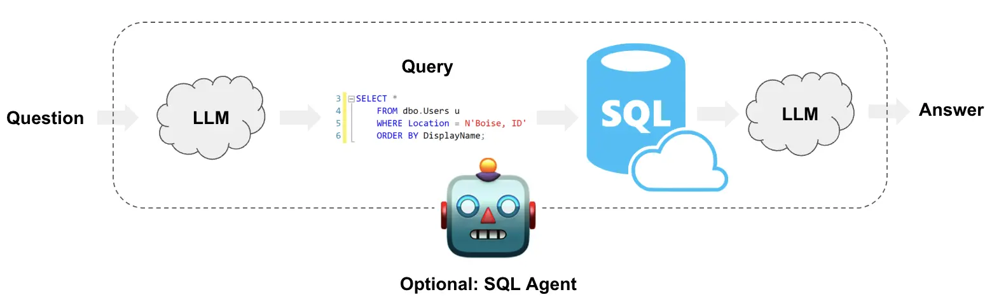
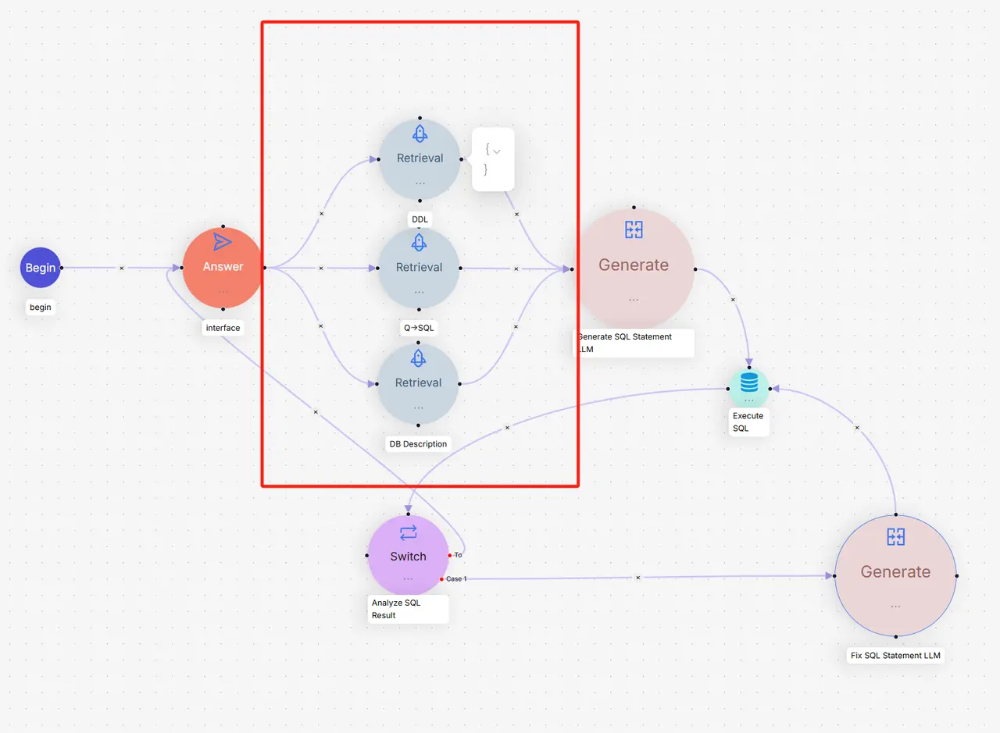

# 第三节：文本到SQL

继上一节探讨了如何为元数据和图数据构建查询后，本节将聚焦于结构化数据领域中一个至关重要的应用。在数据世界中，除了向量数据库能够处理的非结构化数据，关系型数据库（如 MySQL, PostgreSQL, SQLite）仍然是存储和管理结构化数据的核心。**文本到SQL（Text-to-SQL）**[^1] 正是为了打破人与结构化数据之间的语言障碍而生。它利用大语言模型（LLM）将用户的自然语言问题，直接翻译成可以在数据库上执行的SQL查询语句。



## 一、业务挑战

- **“幻觉”问题**：LLM 可能会“想象”出数据库中不存在的表或字段，导致生成的SQL语句无效。
- **对数据库结构理解不足**：LLM 需要准确理解表的结构、字段的含义以及表与表之间的关联关系，才能生成正确的 `JOIN` 和 `WHERE` 子句。
- **处理用户输入的模糊性**：用户的提问可能存在拼写错误或不规范的表达（例如，“上个月的销售冠军是谁？”），模型需要具备一定的容错和推理能力。

## 二、优化策略

1.  **提供精确的数据库模式 (Schema)**：这是最基础也是最关键的一步。我们需要向LLM提供数据库中相关表的 `CREATE TABLE` 语句。这就像是给了LLM一张地图，让它了解数据库的结构，包括表名、列名、数据类型和外键关系。

2.  **提供少量高质量的示例 (Few-shot Examples)**：在提示（Prompt）中加入一些“问题-SQL”的示例对，可以极大地提升LLM生成查询的准确性。这相当于给了LLM几个范例，让它学习如何根据相似的问题构建查询。

3.  **利用RAG增强上下文**：这是更进一步的策略。我们可以像RAGFlow一样，为数据库构建一个专门的“知识库”[^2]，其中不仅包含表的DDL（数据定义语言），还可以包含：
    *   **表和字段的详细描述**：用自然语言解释每个表是做什么的，每个字段代表什么业务含义。
    *   **同义词和业务术语**：例如，将用户的“花费”映射到数据库的 `cost` 字段。
    *   **复杂的查询示例**：提供一些包含 `JOIN`、`GROUP BY` 或子查询的复杂问答对。
    当用户提问时，系统首先从这个知识库中检索最相关的信息（如相关的表结构、字段描述、相似的Q&A），然后将这些信息和用户的问题一起组合成一个内容更丰富的提示，交给LLM生成最终的SQL查询。这种方式极大地降低了“幻觉”的风险，提高了查询的准确度。

4.  **错误修正与反思 (Error Correction and Reflection)**：在生成SQL后，系统会尝试执行它。如果数据库返回错误，可以将错误信息反馈给LLM，让它“反思”并修正SQL语句，然后重试。这个迭代过程可以显著提高查询的成功率。

## 三、实现一个简单的Text2SQL框架

本节基于RAGFlow方案实现了一个简单的Text2SQL框架。该框架使用Milvus向量数据库作为知识库，BGE-M3模型进行语义检索，DeepSeek作为大语言模型，专门针对SQLite数据库进行了优化。



### 3.1 知识库模块 (`knowledge_base.py`)

知识库模块是整个框架的核心，负责存储和检索SQL相关的知识信息。

```python
class SimpleKnowledgeBase:
    """知识库"""
    
    def __init__(self, milvus_uri: str = "http://localhost:19530"):
        self.milvus_uri = milvus_uri
        self.client = MilvusClient(uri=milvus_uri)
        self.embedding_function = BGEM3EmbeddingFunction(use_fp16=False, device="cpu")
        self.collection_name = "text2sql_kb"
        self._setup_collection()
```

**设计思想：**

1. **统一知识管理**：将DDL定义、Q-SQL示例和表描述三种类型的知识统一存储在一个Milvus集合中，通过 `type` 字段区分。

2. **语义检索能力**：使用BGE-M3模型进行向量化，支持中英文混合的语义相似度搜索。

```python
def _setup_collection(self):
    """设置集合"""
    # 定义字段
    fields = [
        FieldSchema(name="pk", dtype=DataType.VARCHAR, is_primary=True, auto_id=True, max_length=100),
        FieldSchema(name="content", dtype=DataType.VARCHAR, max_length=4096),
        FieldSchema(name="type", dtype=DataType.VARCHAR, max_length=32),  # ddl, qsql, description
        FieldSchema(name="dense_vector", dtype=DataType.FLOAT_VECTOR, dim=self.embedding_function.dim["dense"])
    ]
```

**数据加载策略：**

```python
def load_data(self):
    """加载所有知识库数据"""
    # 加载DDL数据 - 表结构定义
    # 加载Q->SQL数据 - 问答示例
    # 加载描述数据 - 表和字段的业务描述
```

框架支持三种类型的知识：
- **DDL知识**[^3]：表的结构定义，包括字段类型、约束等
- **Q-SQL知识**[^4]：历史问答对，为新问题提供参考模式
- **描述知识**[^5]：表和字段的业务含义，帮助理解数据语义

**检索机制：**

```python
def search(self, query: str, top_k: int = 5) -> List[Dict[str, Any]]:
    """搜索相关内容"""
    query_embeddings = self.embedding_function([query])
    
    search_results = self.client.search(
        collection_name=self.collection_name,
        data=query_embeddings["dense"],
        anns_field="dense_vector",
        search_params={"metric_type": "IP"},  # 内积相似度
        limit=top_k,
        output_fields=["content", "type"]
    )
```


### 3.2 SQL生成模块 (`sql_generator.py`)

SQL生成模块负责将自然语言问题转换为SQL查询语句，并具备错误修复能力。

```python
class SimpleSQLGenerator:
    """简化的SQL生成器"""
    
    def __init__(self, api_key: str = None):
        self.llm = ChatDeepSeek(
            model="deepseek-chat",
            temperature=0,  # 确保结果的确定性
            api_key=api_key or os.getenv("DEEPSEEK_API_KEY")
        )
```

**SQL生成策略：**

```python
def generate_sql(self, user_query: str, knowledge_results: List[Dict[str, Any]]) -> str:
    """生成SQL语句"""
    # 构建上下文
    context = self._build_context(knowledge_results)
    
    # 构建提示
    prompt = f"""你是一个SQL专家。请根据以下信息将用户问题转换为SQL查询语句。

数据库信息：
{context}

用户问题：{user_query}

要求：
1. 只返回SQL语句，不要包含任何解释
2. 确保SQL语法正确
3. 使用上下文中提供的表名和字段名
4. 如果需要JOIN，请根据表结构进行合理关联

SQL语句："""
```

**关键设计原则：**

1. **上下文驱动**：通过知识库检索结果构建丰富的上下文信息
2. **结构化提示**：明确的任务要求和格式约束
3. **确定性输出**：设置temperature=0确保相同输入产生相同输出

**错误修复机制：**

```python
def fix_sql(self, original_sql: str, error_message: str, knowledge_results: List[Dict[str, Any]]) -> str:
    """修复SQL语句"""
    context = self._build_context(knowledge_results)
    
    prompt = f"""请修复以下SQL语句的错误。

数据库信息：
{context}

原始SQL：
{original_sql}

错误信息：
{error_message}

请返回修复后的SQL语句（只返回SQL，不要解释）："""
```

**上下文构建策略：**

```python
def _build_context(self, knowledge_results: List[Dict[str, Any]]) -> str:
    """构建上下文信息"""
    # 按类型分组
    ddl_info = []        # 表结构信息
    qsql_examples = []   # 查询示例
    descriptions = []    # 表描述信息
    
    # 分层次组织信息：结构 → 描述 → 示例
    if ddl_info:
        context += "=== 表结构信息 ===\n"
    if descriptions:
        context += "=== 表和字段描述 ===\n"
    if qsql_examples:
        context += "=== 查询示例 ===\n"
```


### 3.3 代理模块 (`text2sql_agent.py`)

代理模块是整个框架的控制中心，协调知识库检索、SQL生成和执行的完整流程。

```python
class SimpleText2SQLAgent:
    """Text2SQL代理"""
    
    def __init__(self, milvus_uri: str = "http://localhost:19530", api_key: str = None):
        self.knowledge_base = SimpleKnowledgeBase(milvus_uri)
        self.sql_generator = SimpleSQLGenerator(api_key)
        
        # 配置参数
        self.max_retry_count = 3      # 最大重试次数
        self.top_k_retrieval = 5      # 检索数量
        self.max_result_rows = 100    # 结果行数限制
```

**主要查询流程：**

```python
def query(self, user_question: str) -> Dict[str, Any]:
    """执行Text2SQL查询"""
    # 1. 从知识库检索相关信息
    knowledge_results = self.knowledge_base.search(user_question, self.top_k_retrieval)
    
    # 2. 生成SQL语句
    sql = self.sql_generator.generate_sql(user_question, knowledge_results)
    
    # 3. 执行SQL（带重试机制）
    retry_count = 0
    while retry_count < self.max_retry_count:
        success, result = self._execute_sql(sql)
        
        if success:
            return {"success": True, "sql": sql, "results": result}
        else:
            # 尝试修复SQL
            sql = self.sql_generator.fix_sql(sql, result, knowledge_results)
            retry_count += 1
```

**安全执行策略：**

```python
def _execute_sql(self, sql: str) -> Tuple[bool, Any]:
    """执行SQL语句"""
    # 添加LIMIT限制，防止大量数据返回
    if sql.strip().upper().startswith('SELECT') and 'LIMIT' not in sql.upper():
        sql = f"{sql.rstrip(';')} LIMIT {self.max_result_rows}"
    
    # 结构化结果返回
    if sql.strip().upper().startswith('SELECT'):
        columns = [desc[0] for desc in cursor.description]
        rows = cursor.fetchall()
        
        results = []
        for row in rows:
            result_row = {}
            for i, value in enumerate(row):
                result_row[columns[i]] = value
            results.append(result_row)
        
        return True, {"columns": columns, "rows": results, "count": len(results)}
```

### 3.4 完整流程模拟

以查询"年龄大于30的用户有哪些"为例，演示框架三个核心模块的完整协作过程：

#### 3.4.1 模拟数据

假设数据库中的users表包含以下用户数据：

| ID | 姓名 | 邮箱 | 年龄 | 城市 |
|----|------|------|------|------|
| 1 | 张三 | zhangsan@email.com | 25 | 北京 |
| 2 | 李四 | lisi@email.com | 32 | 上海 |
| 3 | 王五 | wangwu@email.com | 28 | 广州 |
| 4 | 赵六 | zhaoliu@email.com | 35 | 深圳 |
| 5 | 陈七 | chenqi@email.com | 29 | 杭州 |

#### 3.4.2 Step 1: 知识库检索

**用户输入**："年龄大于30的用户有哪些"

**检索过程**：
1. BGE-M3模型将查询文本转换为768维向量
2. Milvus在知识库中进行语义相似度搜索
3. 返回最相关的5条知识，按相似度排序

**检索结果**：

**DDL知识** (相似度: 0.85)
- 表名：users
- 结构：包含id、name、email、age、city字段
- 约束：id为主键，email唯一

**Q-SQL示例** (相似度: 0.82)  
- 问题："查询年龄超过25岁的用户"
- SQL：`SELECT * FROM users WHERE age > 25`
> 这是检索到的相似示例，最终SQL会基于用户实际问题调整为age > 30

**表描述** (相似度: 0.78)
- age字段：用户年龄，整数类型
- name字段：用户姓名，文本类型

#### 3.4.3 Step 2: SQL生成

**上下文构建**：
系统将检索到的知识整理成结构化的上下文信息：

**表结构信息**
- 表名：users
- DDL定义：完整的CREATE TABLE语句
- 字段约束：主键、唯一性等

**表和字段描述**  
- age字段：用户年龄，INTEGER类型
- name字段：用户姓名，TEXT类型

**查询示例**
- 相似问题：查询年龄超过25岁的用户
- 参考SQL：`SELECT * FROM users WHERE age > 25`

**SQL生成过程**：
1. DeepSeek分析用户问题的意图：查询满足年龄条件的用户
2. 识别关键信息：年龄字段（age）、比较操作（大于）、阈值（**30**）
3. 参考示例模式：从`WHERE age > 25`学习到`WHERE age > 数值`的模式
4. 模式应用：将用户的实际数值30替换示例中的25
5. 生成目标SQL：`SELECT * FROM users WHERE age > 30`

#### 3.4.4 Step 3: SQL执行与结果处理

**安全处理**：
- 原始SQL：`SELECT * FROM users WHERE age > 30`
- 自动添加限制：`SELECT * FROM users WHERE age > 30 LIMIT 100`

**数据库执行**：
SQLite引擎逐行检查users表中的数据：

| 用户 | 年龄检查 | 结果 |
|------|----------|------|
| 张三 | 25 > 30? | ❌ 不符合 |
| 李四 | 32 > 30? | ✅ 符合 |
| 王五 | 28 > 30? | ❌ 不符合 |
| 赵六 | 35 > 30? | ✅ 符合 |
| 陈七 | 29 > 30? | ❌ 不符合 |

**结果处理**：
- 筛选出2条符合条件的记录
- 转换为结构化JSON格式
- 包含字段名称和数据类型信息

**最终输出**：
```json
{
    "success": true,
    "error": null,
    "sql": "SELECT * FROM users WHERE age > 30 LIMIT 100",
    "results": {
        "columns": ["id", "name", "email", "age", "city"],
        "rows": [
            {"id": 2, "name": "李四", "email": "lisi@email.com", "age": 32, "city": "上海"},
            {"id": 4, "name": "赵六", "email": "zhaoliu@email.com", "age": 35, "city": "深圳"}
        ],
        "count": 2
    },
    "retry_count": 0
}
```

通过这个**语义理解 → 结构化查询 → 数据过滤 → 结果输出**的完整流程，框架成功将用户的自然语言问题转换为精确的数据库查询结果。

### 3.5 代码运行

如果你想测试这个Text2SQL框架，可以通过以下方式进行：

**快速体验**：运行演示程序
```bash
python code/C4/03_text2sql_demo.py
```
> 完整演示代码：[03_text2sql_demo.py](https://github.com/FutureUnreal/all-in-rag/blob/main/code/C4/03_text2sql_demo.py)

**核心代码获取**：三个核心模块的完整实现
- `knowledge_base.py` - 知识库模块
- `sql_generator.py` - SQL生成模块  
- `text2sql_agent.py` - 代理协调模块

> 源码地址：[code/C4/text2sql/](https://github.com/FutureUnreal/all-in-rag/tree/main/code/C4/text2sql)

**数据资源**：框架使用的JSON知识数据
- `ddl_examples.json` - DDL结构示例
- `qsql_examples.json` - 问题-SQL对示例
- `db_descriptions.json` - 表和字段描述

> 数据文件：[code/C4/text2sql/data/](https://github.com/FutureUnreal/all-in-rag/tree/main/code/C4/text2sql/data)

### 3.6 为什么不直接使用封装好的框架？

> 因为淋过雨，所以想为你撑把伞🤪

市面上确实有很多成熟的Text2SQL框架，但这些高度封装的工具往往存在**黑盒问题**——当查询结果不符合预期时，很难定位是检索环节、SQL生成环节还是执行环节出了问题。正如上一节LangChain示例中遇到的查询异常，我们很难深入到框架内部进行精确调试和优化。

## 参考文献

[^1]: [*LangChain Docs: Text to SQL*](https://python.langchain.com/docs/tutorials/sql_qa/)

[^2]: [*RAGFlow Blog: Implementing Text2SQL with RAGFlow*](https://ragflow.io/blog/implementing-text2sql-with-ragflow)

[^3]: DDL（Data Definition Language）是数据定义语言，用于定义数据库结构，如CREATE TABLE语句。

[^4]: Q-SQL示例是指"问题-SQL"对，即自然语言问题与对应SQL查询的配对示例，用于少样本学习。

[^5]: 表描述是对数据库表和字段的业务语义说明，帮助模型理解数据的实际含义和用途。
