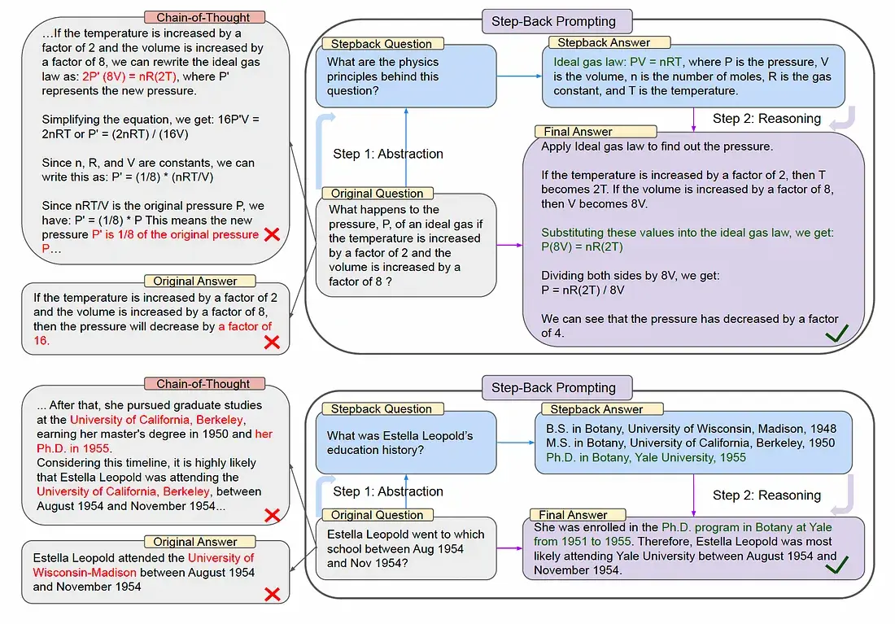
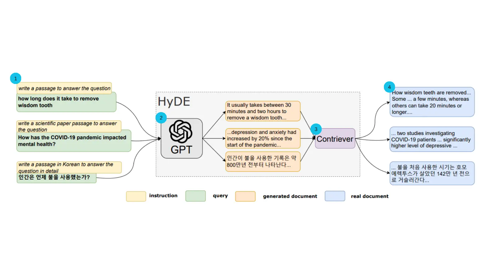
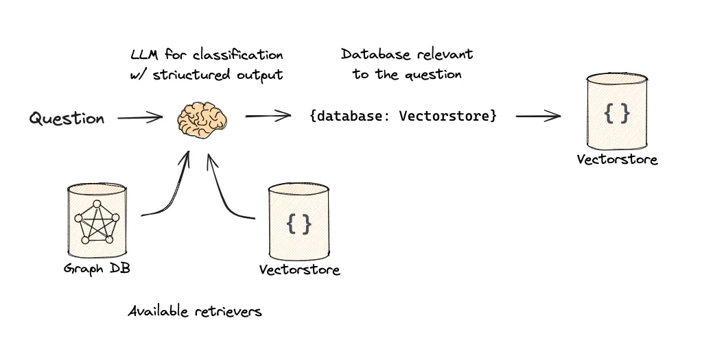
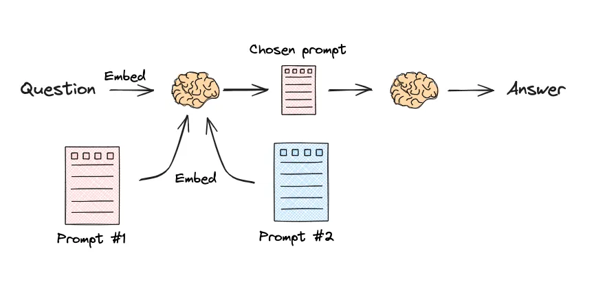

# 第四节：查询重构与分发

此前已经学习了如何从不同类型的数据源（如向量数据库、关系型数据库）中构建查询。然而，用户的原始问题往往不是最优的检索输入。它可能过于复杂、包含歧义，或者与文档的实际措辞存在偏差。为了解决这些问题，我们需要在检索之前对用户的查询进行“预处理”，这就是本节要探讨的**查询重构与分发**。

这个阶段主要包含两个关键技术：

1.  **查询翻译（Query Translation）**：将用户的原始问题转换成一个或多个更适合检索的形式。
2.  **查询路由（Query Routing）**：根据问题的性质，将其智能地分发到最合适的数据源或检索器。

本节将重点介绍几种主流的查询翻译技术，并简要讨论查询路由的概念。

## 一、查询翻译

查询翻译的目标是弥合用户自然语言提问与文档库中存储信息之间的“语义鸿沟”。通过重写、分解或扩展查询，我们可以显著提升检索的准确率。

### 1.1 提示工程

这是最直接的查询重构方法。通过精心设计的提示词（Prompt），可以引导 LLM 将用户的原始查询改写得更清晰、更具体，或者转换成一种更利于检索的叙述风格。

在第二节查询构建的代码示例中，我们发现 `SelfQueryRetriever` 无法正确处理“时间最短的视频”这类需要排序或进行比较的查询。

为了解决这个问题，我们可以采用一种更高级的提示工程技巧：**让 LLM 直接构建出查询指令**。

这种方法的思路是，要求 LLM 直接分析用户的意图，并生成一个结构化（例如 JSON 格式）的指令，告诉我们的代码应该如何操作。对于“时间最短的视频”这个问题，我们期望 LLM 能直接告诉我们：“请按‘时长’字段进行升序排序，并返回第一条结果”。

下面，来看看如何修改代码来实现这一思路。我们不再使用 `SelfQueryRetriever`，而是直接与 LLM 交互，并根据其返回的指令在代码中执行排序逻辑。

关键的修改主要有两部分：

1.  **设计一个新的提示词（Prompt），要求 LLM 输出 JSON 格式的排序指令。**

    ```python
    # 使用大模型将自然语言转换为排序指令
    prompt = f"""你是一个智能助手，请将用户的问题转换成一个用于排序视频的JSON指令。

    你需要识别用户想要排序的字段和排序方向。
    - 排序字段必须是 'view_count' (观看次数) 或 'length' (时长) 之一。
    - 排序方向必须是 'asc' (升序) 或 'desc' (降序) 之一。

    例如:
    - '时间最短的视频' 或 '哪个视频时间最短' 应转换为 {{"sort_by": "length", "order": "asc"}}
    - '播放量最高的视频' 或 '哪个视频最火' 应转换为 {{"sort_by": "view_count", "order": "desc"}}

    请根据以下问题生成JSON指令:
    原始问题: "{query}"

    JSON指令:"""
    ```

2.  **在代码中调用 LLM，解析其返回的 JSON 指令，并执行相应的排序操作。**

    ```python
    # ... (前略，初始化LLM客户端)

    # 请求LLM生成指令，并指定返回JSON格式
    response = client.chat.completions.create(
        model="deepseek-chat",
        messages=[
            {"role": "user", "content": prompt}
        ],
        temperature=0,
        response_format={"type": "json_object"}
    )

    # 解析指令并执行排序
    try:
        import json
        instruction_str = response.choices[0].message.content
        instruction = json.loads(instruction_str)
        print(f"--- 生成的排序指令: {instruction} ---")

        sort_by = instruction.get('sort_by')
        order = instruction.get('order')

        if sort_by in ['length', 'view_count'] and order in ['asc', 'desc']:
            # 在代码中执行排序
            reverse_order = (order == 'desc')
            sorted_docs = sorted(all_documents, key=lambda doc: doc.metadata.get(sort_by, 0), reverse=reverse_order)
            # 获取排序后的第一个结果并打印
            if sorted_docs:
                doc = sorted_docs[0]
                # ... (打印结果的代码)

    except (json.JSONDecodeError, KeyError) as e:
        print(f"解析或执行指令失败: {e}")
    ```

通过这种方式，成功地将 LLM 从一个简单的“文本改写员”提升为了一个能够理解复杂意图并生成可执行计划的“智能代理”，从而优雅地解决了“最值”查询的难题。

> [完整代码](https://github.com/FutureUnreal/all-in-rag/tree/main/code/C4/04_text_to_metadata_filter_v2.py)

### 1.2 多查询分解 (Multi-query)

当用户提出一个复杂的问题时，直接用整个问题去检索可能效果不佳，因为它可能包含多个子主题或意图。分解技术的核心思想是将这个复杂问题拆分成多个更简单、更具体的子问题。然后，系统分别对每个子问题进行检索，最后将所有检索到的结果合并、去重，形成一个更全面的上下文，再交给 LLM 生成最终答案。

**示例**：
*   **原始问题**：“在《流浪地球》中，刘慈欣对人工智能和未来社会结构有何看法？”
*   **分解后的子问题**：
    1.  “《流浪地球》中描述的人工智能技术有哪些？”
    2.  “《流浪地球》中描绘的未来社会是怎样的？”
    3.  “刘慈欣关于人工智能的观点是什么？”

LangChain 提供了 `MultiQueryRetriever` 来完成这一过程[^1]。它在内部利用 LLM 将原始问题从不同角度分解成多个子问题，然后并行为每个子问题检索相关文档。最后，它将所有检索到的文档合并并去重，形成一个更全面的上下文，再传递给语言模型生成最终答案。通过这种策略，极大地丰富了检索结果，在有些应用种可以有效提升后续生成环节的质量。

### 1.3 退步提示（Step-Back Prompting）

退步提示是由 Google DeepMind 团队提出的一种旨在提升大语言模型推理能力的提示工程技巧[^2]。当面对一个细节繁多或过于具体的问题时，模型直接作答（即便是使用思维链）也容易出错。退步提示通过引导模型“退后一步”来解决这个问题。

其核心流程分为两步：

1.  **抽象化**：首先，引导 LLM 从用户的原始具体问题中，生成一个更高层次、更概括的“退步问题”（Step-back Question）。这个退步问题旨在探寻原始问题背后的通用原理或核心概念。
2.  **推理**：接着，系统会先获取“退步问题”的答案（例如，一个物理定律、一段历史背景等），然后将这个通用原理作为上下文，再结合原始的具体问题，进行推理并生成最终答案。



**示例**：
*   **原始问题**：“如果理想气体的温度增加2倍，体积增加8倍，其压力会如何变化？”
*   **退步问题**：“这个问题背后的物理原理是什么？”
*   **推理过程**：首先回答退步问题，得到“理想气体定律 PV=nRT”。然后基于这个定律，代入具体数值进行计算，最终得出压力变为原来的1/4。

通过先检索或生成高层知识，再进行具体推理，退步提示能够帮助模型构建一个更坚实的逻辑基础，从而提高在复杂问答场景下的准确性。

### 1.4 假设性文档嵌入 (HyDE)

假设性文档嵌入（Hypothetical Document Embeddings, HyDE）是一种无需微调即可显著提升向量检索质量的查询改写技术，由 Luyu Gao 等人在其论文中首次提出[^3]。其核心是解决一个普遍存在于检索任务中的难题：用户的查询（Query）通常简短、关键词有限，而数据库中存储的文档则内容详实、上下文丰富，两者在语义向量空间中可能存在“鸿沟”，导致直接用查询向量进行搜索效果不佳。Zilliz 的一篇技术博客[^4]也对该技术进行了深入浅出的解读。



HyDE 通过一种巧妙的方式来“绕过”这个问题：它不直接使用用户的原始查询，而是先利用一个生成式大语言模型（LLM）来生成一个“假设性”的、能够完美回答该查询的文档。然后，HyDE 将这个内容详实的假设性文档进行向量化，用其生成的向量去数据库中寻找与之最相似的真实文档。

#### 工作原理

HyDE 的工作流程可以分为三个步骤：

1.  **生成 (Generate)**：当接收到用户查询时，首先调用一个生成式 LLM（例如，GPT-3.5）。提示该模型根据查询生成一个详细的、可能是理想答案的文档。这个文档不必完全符合事实，但它必须在语义上与一个好的答案高度相关。
2.  **编码 (Encode)**：将上一步生成的假设性文档输入到一个对比编码器（如 Contriever）中，将其转换为一个高维向量嵌入。这个向量在语义上代表了一个“理想答案”的位置。
3.  **检索 (Retrieve)**：使用这个假设性文档的向量，在向量数据库中执行相似性搜索，找出与这个“理想答案”最接近的真实文档。这些被检索出的文档将作为最终的上下文信息。

通过这种方式，HyDE 将困难的“查询到文档”的匹配问题，转化为了一个相对容易的“文档到文档”的匹配问题，从而提升检索的准确率。

## 二、查询路由

**查询路由（Query Routing）** 是用于优化复杂 RAG 系统的一项关键技术。当系统接入了多个不同的数据源或具备多种处理能力时，就需要一个“智能调度中心”来分析用户的查询，并动态选择最合适的处理路径。其本质是替代硬编码规则，通过语义理解将查询分发至最匹配的数据源、处理组件或提示模板，从而提升系统的效率与答案的准确性。

### 2.1 应用场景

查询路由的应用场景十分广泛。

1.  **数据源路由**：这是最常见的场景。根据查询意图，将其路由到不同的知识库。例如：
    *   查询“最新的 iPhone 有什么功能？” -> 路由到**产品文档向量数据库**。
    *   查询“我上次订购了什么？” -> 路由到**用户历史SQL数据库**（执行Text-to-SQL）。
    *   查询“A公司和B公司的投资关系是怎样的？” -> 路由到**企业知识图谱数据库**。

2.  **组件路由**：根据问题的复杂性，将其分配给不同的处理组件，以平衡成本和效果。
    *   简单FAQ → 直接进行向量检索，速度快、成本低。
    *   复杂操作或需要与外部API交互 → 调用 Agent 来执行任务。

3.  **提示模板路由**：为不同类型的任务动态选择最优的提示词模板，以优化生成效果。
    *   数学问题 → 选用包含分步思考（Step-by-Step）逻辑的提示模板。
    *   代码生成 → 选用专门为代码优化过的提示模板。

### 2.2 实现方法

实现查询路由主要有两种主流方法[^5]：

#### 2.2.1 基于LLM的意图识别

这是最灵活的方法。通过设计一个包含路由选项的提示词，让大语言模型（LLM）直接对用户的查询进行分类，并输出一个代表路由选择的标签。



*   **实现流程**：
    1.  定义清晰的路由选项（例如，数据源名称、功能分类）。
    2.  LLM 分析查询并输出决策标签。
    3.  代码根据标签调用相应的检索器或工具。

该方法的核心在于构建一个“分类-分发”的流水线。这里以一个菜谱问答为例，系统需要根据用户提问的菜系（川菜、粤菜或其他）调用不同的专家模型。

> 接下来的代码示例广泛使用了 **LCEL**[^6]，它是 LangChain 中用于构建链（Chain）的声明式方法。其核心是 `|` （管道）符号，可以将不同的组件（如提示、模型、解析器）串联起来，形成一个处理流水线。例如，`prompt | llm | parser` 就清晰地定义了一个“提示->模型->解析器”的调用顺序。这种方式不仅代码可读性强，而且 LangChain 会在底层自动进行并行、异步和流式等优化。

**第一步：定义分类器**

首先创建一个 `classifier_chain`，它的任务是读取用户问题，并利用 LLM 的理解能力给问题打上分类标签（例如 '川菜', '粤菜', '其他'）。

```python
# 假设 llm 已经定义
classifier_prompt = ChatPromptTemplate.from_template(
    """根据用户问题中提到的菜品，将其分类为：['川菜', '粤菜', 或 '其他']。
    不要解释你的理由，只返回一个单词的分类结果。
    问题: {question}"""
)
classifier_chain = classifier_prompt | llm | StrOutputParser()
```

**第二步：定义路由分支**

接着，使用 `RunnableBranch` 来定义路由规则。它就像一个 `if-elif-else` 语句，根据输入的 `topic` 字段来选择执行哪一个处理链（`sichuan_chain`, `cantonese_chain` 或 `general_chain`）。
```python
# 假设 sichuan_chain, cantonese_chain, general_chain 已定义
router_branch = RunnableBranch(
    (lambda x: "川菜" in x["topic"], sichuan_chain),
    (lambda x: "粤菜" in x["topic"], cantonese_chain),
    general_chain  # 默认选项
)
```

**第三步：组合完整路由链**

最后，将分类器和路由分支组合起来。这个 `full_router_chain` 首先会并行执行两个操作：用 `classifier_chain` 为问题生成 `topic`，同时保留原始的 `question`。然后，它将这个包含 `topic` 和 `question` 的字典传递给 `router_branch`，由后者根据 `topic` 做出最终的路由决策。

```python
full_router_chain = {"topic": classifier_chain, "question": lambda x: x["question"]} | router_branch

# 调用示例
# result = full_router_chain.invoke({"question": "麻婆豆腐怎么做？"})
```

> [完整代码](https://github.com/FutureUnreal/all-in-rag/blob/main/code/C4/05_llm_based_routing.py)

#### 2.2.2 嵌入相似性路由

这种方法不依赖 LLM 进行分类，延迟更低。它通过计算用户查询与预设的“路由示例语句”之间的向量嵌入相似度来做出决策。



**第一步：定义路由描述并向量化**

为每个路由创建一个详细的文本描述，并使用嵌入模型将其转换为向量，供后续相似度计算使用。

```python
# 假设 embeddings 模型已经初始化
sichuan_route_prompt = "你是一位处理川菜的专家。用户的问题是关于麻辣、辛香、重口味的菜肴，例如水煮鱼、麻婆豆腐、鱼香肉丝、宫保鸡丁、花椒、海椒等。"
cantonese_route_prompt = "你是一位处理粤菜的专家。用户的问题是关于清淡、鲜美、原汁原味的菜肴，例如白切鸡、老火靓汤、虾饺、云吞面等。"

route_prompts = [sichuan_route_prompt, cantonese_route_prompt]
route_names = ["川菜", "粤菜"]
route_prompt_embeddings = embeddings.embed_documents(route_prompts)
```

**第二步：定义目标链**

创建路由最终要分发到的目标处理链，并用一个字典 `route_map` 将路由名称和链对应起来。

```python
# 假设 llm 已经定义
sichuan_chain = (
    PromptTemplate.from_template("你是一位川菜大厨。请用正宗的川菜做法，回答关于「{query}」的问题。")
    | llm
    | StrOutputParser()
)
cantonese_chain = (
    PromptTemplate.from_template("你是一位粤菜大厨。请用经典的粤菜做法，回答关于「{query}」的问题。")
    | llm
    | StrOutputParser()
)

route_map = { "川菜": sichuan_chain, "粤菜": cantonese_chain }
```

**第三步：定义路由函数**

定义一个 `route` 函数，接收用户问题，计算与各路由描述的相似度，选择最相似的路由并调用相应的处理链。

```python
def route(info):
    # 1. 对用户查询进行嵌入
    query_embedding = embeddings.embed_query(info["query"])
    
    # 2. 计算与各路由提示的余弦相似度
    similarity_scores = cosine_similarity([query_embedding], route_prompt_embeddings)[0]
    
    # 3. 找到最相似的路由名称
    chosen_route_index = np.argmax(similarity_scores)
    chosen_route_name = route_names[chosen_route_index]
    
    # 4. 获取并调用对应的处理链，返回结果
    chosen_chain = route_map[chosen_route_name]
    return chosen_chain.invoke(info)
```

**第四步：组合并调用**

最后，将 `route` 函数包装成一个 `RunnableLambda`，形成一个完整的、可执行的路由链。

```python
full_chain = RunnableLambda(route)

# 调用示例
# result = full_chain.invoke({"question": "如何做一碗清淡的云吞面？"})
```

> [完整代码](https://github.com/FutureUnreal/all-in-rag/blob/main/code/C4/06_embedding_based_routing.py)

### 2.3 LlamaIndex 拓展

与 LangChain 类似，LlamaIndex 也提供了强大的查询路由功能[^7]，其思路是将不同的数据源或查询策略包装为“工具（Tool）”，然后通过一个“路由器（Router）”来为用户查询动态选择最合适的工具。实现方式与 LangChain 有异曲同工之处：

*   **基于LLM的意图识别**：这是 LlamaIndex 的主要实现方式。通过 `RouterQueryEngine` 来管理一组 `QueryEngineTool`。每个 `Tool` 都包含一个查询引擎和一段描述其功能的文本。路由器会利用一个 `Selector`（如 `LLMSingleSelector` 或更稳定的 `PydanticSingleSelector`）来让 LLM 根据工具的描述文本和用户问题进行语义匹配，从而选择一个或多个最合适的工具来执行。

*   **嵌入相似性路由**：LlamaIndex 没有提供直接基于向量相似度计算的独立路由组件。它的“语义路由”是融合在基于 LLM 的意图识别中的——即让 LLM 理解每个 `Tool` 描述的 *语义*，并据此做出决策。这种方式更灵活，能够处理更复杂的路由逻辑，而不仅仅是文本相似度匹配。

## 参考文献

[^1]: [*How to use the MultiQueryRetriever*](https://python.langchain.com/docs/how_to/MultiQueryRetriever/)

[^2]: [Zheng, H. S. et al. (2023). *Take a Step Back: Evoking Reasoning via Abstraction in Large Language Models*](https://arxiv.org/abs/2310.06117).

[^3]: [Gao, L. et al. (2022). *Precise Zero-Shot Dense Retrieval without Relevance Labels*](https://arxiv.org/abs/2212.10496).

[^4]: [*使用假设性文档嵌入（HyDE）改进信息检索和 RAG*](https://zilliz.com.cn/blog/improve-rag-and-information-retrieval-with-hyde-hypothetical-document-embeddings).

[^5]: [*How to route between sub-chains*](https://python.langchain.com/docs/how_to/routing/).

[^6]: [*LangChain Expression Language*](https://python.langchain.com/docs/concepts/lcel/).

[^7]: [*LlamaIndex Routing*](https://docs.llamaindex.ai/en/stable/module_guides/querying/router/).