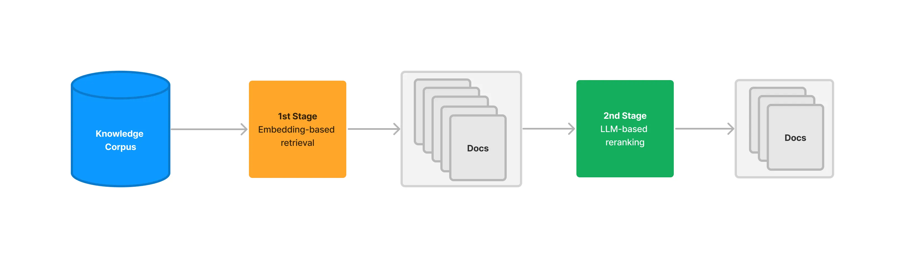
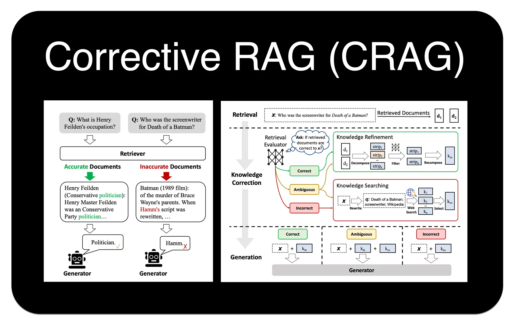

# 第五节：检索进阶

在基础的 RAG 流程中，依赖向量相似度从知识库中检索信息。然而，这种方法存在一些固有的局限性，例如最相关的文档不总是在检索结果的顶端，以及语义理解的偏差等。为了构建更强大、更精准的生产级 RAG 应用，需要引入更高级的检索技术。


## 一、重排序 (Re-ranking)

### 1.1 RRF (Reciprocal Rank Fusion)

我们在 [**混合检索章节**](./11_hybrid_search.md) 中已经接触过 RRF。它是一种简单而有效的**零样本**重排方法，不依赖于任何模型训练，而是纯粹基于文档在多个不同检索器（例如，一个稀疏检索器和一个密集检索器）结果列表中的**排名**来计算最终分数。

一个文档如果在多个检索结果中都排名靠前，那么它很可能更重要。RRF 通过计算排名的倒数来为文档打分，有效融合了不同检索策略的优势。但是如果只考虑排名信息，会忽略原始的相似度分数，可能丢失部分有用信息。

### 1.2 RankLLM / LLM-based Reranker



RankLLM 代表了一类直接利用大型语言模型本身来进行重排的方法[^1]。其基本逻辑非常直观：既然 LLM 最终要负责根据上下文来生成答案，那么为什么不直接让它来判断哪些上下文最相关呢？

这种方法通过一个精心设计的提示词来实现。该提示词会包含用户的查询和一系列候选文档（通常是文档的摘要或关键部分），然后要求 LLM 以特定格式（如 JSON）输出一个排序后的文档列表，并给出每个文档的相关性分数。

一个典型的提示词示例如下：

```text
以下是一个文档列表，每个文档都有一个编号和摘要。同时提供一个问题。请根据问题，按相关性顺序列出您认为需要查阅的文档编号，并给出相关性分数（1-10分）。请不要包含与问题无关的文档。

示例格式:
文档 1: <文档1的摘要>
文档 2: <文档2的摘要>
...
文档 10: <文档10的摘要>

问题: <用户的问题>

回答:
Doc: 9, Relevance: 7
Doc: 3, Relevance: 4
Doc: 7, Relevance: 3
```

### 1.3 Cross-Encoder 重排

Cross-Encoder（交叉编码器）能提供出色的重排精度[^2]。它的工作原理是将查询（Query）和每个候选文档（Document）**拼接**成一个单一的输入（例如，`[CLS] query [SEP] document [SEP]`），然后将这个整体输入到一个预训练的 Transformer 模型（如 BERT）中，模型最终会输出一个单一的分数（通常在 0 到 1 之间），这个分数直接代表了文档与查询的**相关性**。

> 注：**[SEP]** 是在 BERT 这类基于 Transformer 架构的模型中，用于分隔不同文本片段（如查询和文档）的特殊标记。

<div align="center">

</div>

上图清晰地展示了 Cross-Encoder 的工作流程：
1.  **初步检索**：搜索引擎首先从知识库中召回一个初始的文档列表（例如，前 50 篇）。
2.  **逐一评分**：对于列表中的**每一篇**文档，系统都将其与原始查询**配对**，然后发送给 Cross-Encoder 模型。
3.  **独立推理**：模型对每个“查询-文档”对进行一次完整的、独立的推理计算，得出一个精确的相关性分数。
4.  **返回重排结果**：系统根据这些新的分数对文档列表进行重新排序，并将最终结果返回给用户。

这个流程凸显了其高精度的来源（同时分析查询和文档），也解释了其高延迟的原因（需要N次独立的模型推理）。

常见的 Cross-Encoder 模型包括 `ms-marco-MiniLM-L-12-v2`、`ms-marco-TinyBERT-L-2-v2` 等。

### 1.4 ColBERT 重排

ColBERT（Contextualized Late Interaction over BERT）是一种创新的重排模型，它在 Cross-Encoder 的高精度和双编码器（Bi-Encoder）的高效率之间取得了平衡[^3]。采用了一种“**后期交互**”机制。

其工作流程如下：

1.  **独立编码**：ColBERT 分别为查询（Query）和文档（Document）中的每个 Token 生成上下文相关的嵌入向量。这一步是独立完成的，可以预先计算并存储文档的向量，从而加快查询速度。
2.  **后期交互**：在查询时，模型会计算查询中每个 Token 的向量与文档中每个 Token 向量之间的最大相似度（MaxSim）。
3.  **分数聚合**：最后，将查询中所有 Token 得到的最大相似度分数相加，得到最终的相关性总分。

通过这种方式，ColBERT 避免了将查询和文档拼接在一起进行昂贵的联合编码，同时又比单纯比较单个 `[CLS]` 向量的双编码器模型捕捉了更细粒度的词汇级交互信息。

### 1.5 重排方法对比

为了更直观地理解不同重排方法的特点和适用场景，下表对讨论过的几种主流方法进行了总结：

| 特性 | RRF | RankLLM | Cross-Encoder | ColBERT |
| :--- | :--- | :--- | :--- | :--- |
| **核心机制** | 融合多个排名 | LLM 推理，生成排序列表 | 联合编码查询与文档，计算单一相关分 | 独立编码，后期交互 |
| **计算成本** | 低（简单数学计算） | 中 (API 费用与延迟) | 高（N次模型推理） | 中（向量点积计算） |
| **交互粒度** | 无（仅排名） | 概念/语义级 | 句子级（Query-Doc Pair） | Token 级 |
| **适用场景** | 多路召回结果融合 | 高价值语义理解场景 | Top-K 精排 | Top-K 重排 |

## 二、压缩 (Compression)

“压缩”技术旨在解决一个常见问题：初步检索到的文档块（Chunks）虽然整体上与查询相关，但可能包含大量无关的“噪音”文本。将这些未经处理的、冗长的上下文直接提供给 LLM，不仅会增加 API 调用的成本和延迟，还可能因为信息过载而降低最终生成答案的质量。

压缩的目标就是对检索到的内容进行“压缩”和“提炼”，只保留与用户查询最直接相关的信息。这可以通过两种主要方式实现：
1.  **内容提取**：从文档中只抽出与查询相关的句子或段落。
2.  **文档过滤**：完全丢弃那些虽然被初步召回，但经过更精细判断后认为不相关的整个文档。

### 2.1 LangChain 的 ContextualCompressionRetriever

LangChain 提供了一个强大的组件 `ContextualCompressionRetriever` 来实现上下文压缩[^4]。它像一个包装器，包裹在基础的检索器（如 `FAISS.as_retriever()`）之上。当基础检索器返回文档后，`ContextualCompressionRetriever` 会使用一个指定的 `DocumentCompressor` 对这些文档进行处理，然后再返回给调用者。

LangChain 内置了多种 `DocumentCompressor`：

*   `LLMChainExtractor`: 这是最直接的压缩方式。它会遍历每个文档，并利用一个 LLM Chain 来判断并提取出其中与查询相关的部分。这是一种“内容提取”。
*   `LLMChainFilter`: 这种压缩器同样使用 LLM，但它做的是“文档过滤”。它会判断整个文档是否与查询相关，如果相关，则保留整个文档；如果不相关，则直接丢弃。
*   `EmbeddingsFilter`: 这是一种更快速、成本更低的过滤方法。它会计算查询和每个文档的嵌入向量之间的相似度，只保留那些相似度超过预设阈值的文档。

### 2.2 自定义重排器与压缩管道

在前面我们就提到根据实际应用，需要自己进行一些功能的实现。这里以 ColBERT 为例，展示如何集成未被官方支持的功能。

整个探索和实现过程如下：

1.  **从官方文档出发**：首先，通过 LangChain 官方文档，了解到可以通过 `DocumentCompressorPipeline` 来组合多个压缩器和文档转换器。
2.  **需求缺口**：希望使用 ColBERT 模型进行重排，但发现 LangChain 并没有内置的 `ColBERT` 重排器。
3.  **分析示例与源码**：回头分析 `ContextualCompressionRetriever` 的用法和源码。我们发现，其处理逻辑分为两步：首先使用 `base_retriever` 获取原始文档，然后将这些文档交给 `base_compressor` 进行压缩或重排。这说明，实现自定义后处理（如重排）功能的关键在于 `base_compressor`。
4.  **定位核心基类**：通过f12查看源码，确定 `base_compressor` 参数接收的是 `BaseDocumentCompressor` 类型的对象。这就是实现自定义功能的核心切入点。
5.  **参考与实现**：最后，参考 LangChain 中其他重排器的实现方式，通过继承 `BaseDocumentCompressor` 基类并实现其关键方法，创建自己的 `ColBERTReranker` 类。

> PS：如果代码基础薄弱，想借助大模型帮你完成 `ColBERTReranker` ，需要提供给大模型的关键信息：`BaseDocumentCompressor` 的源码和 `ContextualCompressionRetriever` 的源码及其使用示例、你的明确目标（实现 ColBERT 重排逻辑）、以及 LangChain 中其他重排器的代码作为参考。信息越充分，模型生成的代码越准确。

#### 代码示例

自定义 `ColBERTReranker` 的代码实现：

```python
class ColBERTReranker(BaseDocumentCompressor):
    """ColBERT重排器"""

    def __init__(self, **kwargs):
        super().__init__(**kwargs)

        model_name = "bert-base-uncased"

        # 加载模型和分词器
        object.__setattr__(self, 'tokenizer', AutoTokenizer.from_pretrained(model_name))
        object.__setattr__(self, 'model', AutoModel.from_pretrained(model_name))
        self.model.eval()
        print(f"ColBERT模型加载完成")

    def encode_text(self, texts):
        """ColBERT文本编码"""
        inputs = self.tokenizer(
            texts,
            return_tensors="pt",
            padding=True,
            truncation=True,
            max_length=128
        )

        with torch.no_grad():
            outputs = self.model(**inputs)

        embeddings = outputs.last_hidden_state
        embeddings = F.normalize(embeddings, p=2, dim=-1)

        return embeddings

    def calculate_colbert_similarity(self, query_emb, doc_embs, query_mask, doc_masks):
        """ColBERT相似度计算（MaxSim操作）"""
        scores = []

        for i, doc_emb in enumerate(doc_embs):
            doc_mask = doc_masks[i:i+1]

            # 计算相似度矩阵
            similarity_matrix = torch.matmul(query_emb, doc_emb.unsqueeze(0).transpose(-2, -1))

            # 应用文档mask
            doc_mask_expanded = doc_mask.unsqueeze(1)
            similarity_matrix = similarity_matrix.masked_fill(~doc_mask_expanded.bool(), -1e9)

            # MaxSim操作
            max_sim_per_query_token = similarity_matrix.max(dim=-1)[0]

            # 应用查询mask
            query_mask_expanded = query_mask.unsqueeze(0)
            max_sim_per_query_token = max_sim_per_query_token.masked_fill(~query_mask_expanded.bool(), 0)

            # 求和得到最终分数
            colbert_score = max_sim_per_query_token.sum(dim=-1).item()
            scores.append(colbert_score)

        return scores

    def compress_documents(
        self,
        documents: Sequence[Document],
        query: str,
        callbacks=None,
    ) -> Sequence[Document]:
        """对文档进行ColBERT重排序"""
        if len(documents) == 0:
            return documents

        # 编码查询
        query_inputs = self.tokenizer(
            [query],
            return_tensors="pt",
            padding=True,
            truncation=True,
            max_length=128
        )

        with torch.no_grad():
            query_outputs = self.model(**query_inputs)
            query_embeddings = F.normalize(query_outputs.last_hidden_state, p=2, dim=-1)

        # 编码文档
        doc_texts = [doc.page_content for doc in documents]
        doc_inputs = self.tokenizer(
            doc_texts,
            return_tensors="pt",
            padding=True,
            truncation=True,
            max_length=128
        )

        with torch.no_grad():
            doc_outputs = self.model(**doc_inputs)
            doc_embeddings = F.normalize(doc_outputs.last_hidden_state, p=2, dim=-1)

        # 计算ColBERT相似度
        scores = self.calculate_colbert_similarity(
            query_embeddings,
            doc_embeddings,
            query_inputs['attention_mask'],
            doc_inputs['attention_mask']
        )

        # 排序并返回前5个
        scored_docs = list(zip(documents, scores))
        scored_docs.sort(key=lambda x: x[1], reverse=True)
        reranked_docs = [doc for doc, _ in scored_docs[:5]]

        return reranked_docs
```

1.  **继承与实现**：`ColBERTReranker` 类继承自 `BaseDocumentCompressor`，并实现了其核心的抽象方法 `compress_documents`。这个方法接收基础检索器返回的文档列表 `documents` 和原始查询 `query` 作为输入。

2.  **实现ColBERT逻辑**：`compress_documents` 方法的内部逻辑遵循了在 “1.4 ColBERT 重排” 中描述的“后期交互”原理。
    *   **独立编码**：在 `_colbert_score` 辅助函数中，查询和文档分别被独立编码，通过 `self.model` 得到各自所有 Token 的嵌入向量（`query_embeddings` 和 `doc_embeddings`）。
    *   **后期交互**：代码 `similarity_matrix.max(dim=1).values` 实现了最大相似度（MaxSim）计算。为查询中的每一个 Token 向量，都从文档的所有 Token 向量中寻找一个最相似的，并记录下这个最大相似度值。
    *   **分数聚合**：最后的 `.sum()` 操作将查询中所有 Token 算出的最大相似度值相加，得到该文档与查询的最终相关性总分。

3.  **排序与返回**：`compress_documents` 方法遍历所有文档、计算出各自的分数后，根据分数从高到低对文档进行重新排序，并返回排序后的文档列表。

接下来，将这个自定义的 `ColBERTReranker` 与 LangChain 的其他组件（如 `LLMChainExtractor`）组合成一个强大的“重排+压缩”管道，并应用在实际的检索任务中。

```python
# 初始化配置...(略)

# 1. 加载和处理文档
loader = TextLoader("../../data/C4/txt/ai.txt", encoding="utf-8")
documents = loader.load()
text_splitter = RecursiveCharacterTextSplitter(chunk_size=500, chunk_overlap=100)
docs = text_splitter.split_documents(documents)

# 2. 创建向量存储和基础检索器
vectorstore = FAISS.from_documents(docs, hf_bge_embeddings)
base_retriever = vectorstore.as_retriever(search_kwargs={"k": 20})

# 3. 设置ColBERT重排序器
reranker = ColBERTReranker()

# 4. 设置LLM压缩器
compressor = LLMChainExtractor.from_llm(llm)

# 5. 使用DocumentCompressorPipeline组装压缩管道
# 流程: ColBERT重排 -> LLM压缩
pipeline_compressor = DocumentCompressorPipeline(
    transformers=[reranker, compressor]
)

# 6. 创建最终的压缩检索器
final_retriever = ContextualCompressionRetriever(
    base_compressor=pipeline_compressor,
    base_retriever=base_retriever
)

# 7. 执行查询并展示结果
query = "AI还有哪些缺陷需要克服？"
print(f"\n{'='*20} 开始执行查询 {'='*20}")
print(f"查询: {query}\n")

# 7.1 基础检索结果
print(f"--- (1) 基础检索结果 (Top 20) ---")
base_results = base_retriever.get_relevant_documents(query)
for i, doc in enumerate(base_results):
    print(f"  [{i+1}] {doc.page_content[:100]}...\n")

# 7.2 使用管道压缩器的最终结果
print(f"\n--- (2) 管道压缩后结果 (ColBERT重排 + LLM压缩) ---")
final_results = final_retriever.get_relevant_documents(query)
for i, doc in enumerate(final_results):
    print(f"  [{i+1}] {doc.page_content}\n")
```

这段代码展示了如何将各个组件串联起来，形成一个完整的检索流程：

1.  **创建基础组件**：首先创建一个标准的 `FAISS` 向量存储和一个基础检索器 `base_retriever`，负责从向量库中初步召回20个可能相关的文档。
2.  **准备处理单元**：实例化两个关键的处理单元：
    *   `reranker`: 自定义的 `ColBERTReranker` 实例。
    *   `compressor`: LangChain 内置的 `LLMChainExtractor`，用于从文档中提取与查询相关的句子。
3.  **构建处理管道 (`DocumentCompressorPipeline`)**：这是整个流程的核心。创建一个 `DocumentCompressorPipeline` 实例，并将 `reranker` 和 `compressor` 按顺序放入 `transformers` 列表中。根据 `DocumentCompressorPipeline` 的源码，它会依次调用列表中的每个处理器。因此，文档会先经过 `ColBERTReranker` 重排，重排后的结果再被送入 `LLMChainExtractor` 进行压缩。
4.  **组装最终检索器**：最后，用 `ContextualCompressionRetriever` 将 `base_retriever` 和我们创建的 `pipeline_compressor` 包装在一起。当调用 `final_retriever` 时，它会自动执行“基础检索 -> 管道处理（重排 -> 压缩）”的完整流程。

> [完整代码](https://github.com/datawhalechina/all-in-rag/blob/main/code/C4/07_rerank_and_refine.py)

### 2.3 LlamaIndex 中的检索压缩

LlamaIndex 同样提供了封装好的压缩功能，其代表是 `SentenceEmbeddingOptimizer`[^5]。它也是一个后处理器（Node Postprocessor），工作在检索之后。

它的工作原理是：对于每个检索到的文档，将其分解成句子，然后计算每个句子与用户查询的嵌入相似度，最后只保留那些相似度最高的句子，从而“优化”文档，去除无关信息。

## 三、校正 (Correcting)

传统的 RAG 流程有一个隐含的假设：检索到的文档总是与问题相关且包含正确答案。然而在现实世界中，检索系统可能会失败，返回不相关、过时或甚至完全错误的文档。如果将这些“有毒”的上下文直接喂给 LLM，就可能导致幻觉（Hallucination）或产生错误的回答。

**校正检索（Corrective-RAG, C-RAG）** 正是为解决这一问题而提出的一种策略[^6]。思路是引入一个“自我反思”或“自我修正”的循环，在生成答案之前，对检索到的文档质量进行评估，并根据评估结果采取不同的行动。

C-RAG 的工作流程可以概括为 **“检索-评估-行动”** 三个阶段：



1.  **检索 (Retrieve)** ：与标准 RAG 一样，首先根据用户查询从知识库中检索一组文档。

2.  **评估 (Assess)** ：这是 C-RAG 的关键步骤。如图所示，一个“检索评估器 (Retrieval Evaluator)”会判断每个文档与查询的相关性，并给出“正确 (Correct)”、“不正确 (Incorrect)”或“模糊 (Ambiguous)”的标签。

3.  **行动 (Act)** ：根据评估结果，系统会进入不同的知识修正与获取流程：
    *   **如果评估为“正确”**：系统会进入“知识精炼 (Knowledge Refinement)”环节。如图，它会将原始文档分解成更小的知识片段 (strips)，过滤掉无关部分，然后重新组合成更精准、更聚焦的上下文，再送给大模型生成答案。
    *   **如果评估为“不正确”**：系统认为内部知识库无法回答问题，此时会触发“知识搜索 (Knowledge Searching)”。它会先对原始查询进行“查询重写 (Query Rewriting)”，生成一个更适合搜索引擎的查询，然后进行 Web 搜索，用外部信息来回答问题。
    *   **如果评估为“模糊”**：同样会触发“知识搜索”，但通常会直接使用原始查询进行 Web 搜索，以获取额外信息来辅助生成答案。

通过这种方式，C-RAG 极大地增强了 RAG 系统的鲁棒性。不再盲目信任检索结果，而是增加了一个“事实核查”层，能够在检索失败时主动寻求外部帮助，从而有效减少幻觉，提升答案的准确性和可靠性。

在 LangChain 的 `langgraph` 库中，可以利用其图（Graph）结构来灵活地构建这种带有条件判断和循环的复杂 RAG 流程[^7]。

## 练习

- 本节“自定义重排器与压缩管道”部分的代码运行后的输出会出现重复的情况，思考为什么会出现这个问题并尝试修改代码解决。（[参考代码](https://github.com/datawhalechina/all-in-rag/blob/main/code/C4/work_rerank_and_refine.py)）

## 参考文献

[^1]: [*Using LLM’s for Retrieval and Reranking*](https://www.llamaindex.ai/blog/using-llms-for-retrieval-and-reranking-23cf2d3a14b6).

[^2]: [Nogueira, R., & Cho, K. (2019). *Passage Re-ranking with BERT*](https://arxiv.org/abs/1901.04085).

[^3]: [*Advanced RAG: ColBERT Reranker*](https://www.pondhouse-data.com/blog/advanced-rag-colbert-reranker).

[^4]: [*How to do retrieval with contextual compression*](https://python.langchain.com/docs/how_to/contextual_compression/).

[^5]: [*Sentence Embedding Optimizer*](https://docs.llamaindex.ai/en/stable/examples/node_postprocessor/OptimizerDemo/).

[^6]: [Jiang, Z. et al. (2024). *Corrective Retrieval Augmented Generation*](https://arxiv.org/pdf/2401.15884.pdf).

[^7]: [*Corrective-RAG (CRAG)*](https://langchain-ai.github.io/langgraph/tutorials/rag/langgraph_crag/).


