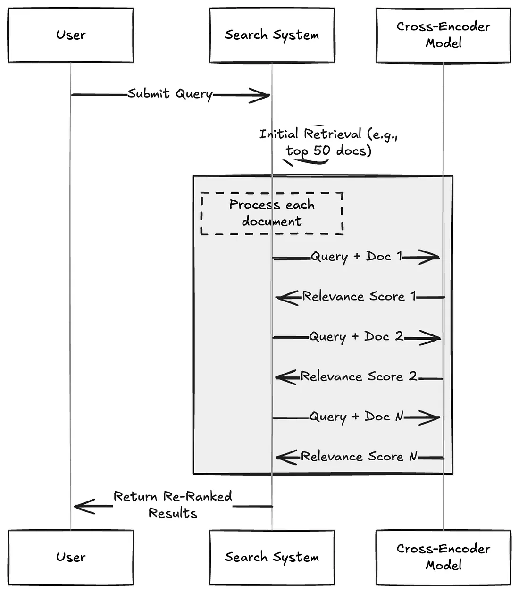

# 第五节：检索进阶
在基础的 RAG 流程中，依赖向量相似度从知识库中检索信息。然而，这种方法存在一些固有的局限性，例如最相关的文档不总是在检索结果的顶端，以及语义理解的偏差等。为了构建更强大、更精准的生产级 RAG 应用，我们需要引入更高级的检索技术。


## 一、重排序 (Re-ranking)

### 1.1 RRF (Reciprocal Rank Fusion)

我们在 [**第十一节：混合检索**](./11_hybrid_search.md) 中已经接触过 RRF。它是一种简单而有效的**零样本**重排方法，不依赖于任何模型训练，而是纯粹基于文档在多个不同检索器（例如，一个稀疏检索器和一个密集检索器）结果列表中的**排名**来计算最终分数。

一个文档如果在多个检索结果中都排名靠前，那么它很可能更重要。RRF 通过计算排名的倒数来为文档打分，有效融合了不同检索策略的优势。但是如果只考虑排名信息，会忽略原始的相似度分数，可能丢失部分有用信息。

### 1.2 RankLLM / LLM-based Reranker


RankLLM 代表了一类直接利用大型语言模型本身来进行重排的方法[^1]。其基本逻辑非常直观：既然 LLM 最终要负责根据上下文来生成答案，那么为什么不直接让它来判断哪些上下文最相关呢？

这种方法通过一个精心设计的提示词来实现。该提示词会包含用户的查询和一系列候选文档（通常是文档的摘要或关键部分），然后要求 LLM 以特定格式（如 JSON）输出一个排序后的文档列表，并给出每个文档的相关性分数。

一个典型的提示词示例如下：

```text
以下是一个文档列表，每个文档都有一个编号和摘要。同时提供一个问题。请根据问题，按相关性顺序列出您认为需要查阅的文档编号，并给出相关性分数（1-10分）。请不要包含与问题无关的文档。

示例格式:
文档 1: <文档1的摘要>
文档 2: <文档2的摘要>
...
文档 10: <文档10的摘要>

问题: <用户的问题>

回答:
Doc: 9, Relevance: 7
Doc: 3, Relevance: 4
Doc: 7, Relevance: 3
```

- **优点**：
    - **高精度**：能够利用 LLM 强大的语言理解和推理能力，对复杂、抽象的查询做出非常精准的相关性判断。
    - **灵活性**：提示词可以被高度定制，以适应不同的任务需求。
- **缺点**：
    - **延迟较高**：调用 LLM 进行推理通常比专门的重排模型要慢。
    - **成本较高**：依赖商业 LLM API 会产生费用。
    - **窗口限制**：LLM 的上下文窗口大小限制了可以同时处理的文档数量和长度。

### 1.3 Cross-Encoder 重排

Cross-Encoder（交叉编码器）能提供出色的重排精度[^2]。它的工作原理是将查询（Query）和每个候选文档（Document）**拼接**成一个单一的输入（例如，`[CLS] query [SEP] document [SEP]`），然后将这个整体输入到一个预训练的 Transformer 模型（如 BERT）中，模型最终会输出一个单一的分数（通常在 0 到 1 之间），这个分数直接代表了文档与查询的**相关性**。

> 注：**[SEP]** 是在 BERT 这类基于 Transformer 架构的模型中，用于分隔不同文本片段（如查询和文档）的特殊标记。



上图清晰地展示了 Cross-Encoder 的工作流程：
1.  **初步检索**：搜索引擎首先从知识库中召回一个初始的文档列表（例如，前 50 篇）。
2.  **逐一评分**：对于列表中的**每一篇**文档，系统都将其与原始查询**配对**，然后发送给 Cross-Encoder 模型。
3.  **独立推理**：模型对每个“查询-文档”对进行一次完整的、独立的推理计算，得出一个精确的相关性分数。
4.  **返回重排结果**：系统根据这些新的分数对文档列表进行重新排序，并将最终结果返回给用户。

这个流程凸显了其高精度的来源（同时分析查询和文档），也解释了其高延迟的原因（需要N次独立的模型推理）。

- **优点**：由于模型可以同时关注查询和文档的内部细节及其交互关系，其相关性判断非常精确。
- **缺点**：计算极其昂贵。如果需要对 50 个文档进行重排，就需要独立进行 50 次模型推理，导致延迟非常高，不适合对大规模候选集进行操作。

常见的 Cross-Encoder 模型包括 `ms-marco-MiniLM-L-12-v2`、`ms-marco-TinyBERT-L-2-v2` 等。

### 1.4 ColBERT 重排器

ColBERT（Contextualized Late Interaction over BERT）是一种创新的重排模型，它在 Cross-Encoder 的高精度和双编码器（Bi-Encoder）的高效率之间取得了平衡[^3]。采用了一种“**后期交互**”机制。

其工作流程如下：

1.  **独立编码**：ColBERT 分别为查询（Query）和文档（Document）中的每个 Token 生成上下文相关的嵌入向量。这一步是独立完成的，可以预先计算并存储文档的向量，从而加快查询速度。
2.  **后期交互**：在查询时，模型会计算查询中每个 Token 的向量与文档中每个 Token 向量之间的最大相似度（MaxSim）。
3.  **分数聚合**：最后，将查询中所有 Token 得到的最大相似度分数相加，得到最终的相关性总分。

通过这种方式，ColBERT 避免了将查询和文档拼接在一起进行昂贵的联合编码，同时又比单纯比较单个 `[CLS]` 向量的双编码器模型捕捉了更细粒度的词汇级交互信息。

- **优点**：比 Cross-Encoder 快得多，同时保持了较高的精度，非常适合在 RAG 中对中等大小的候选集（如 50-100 个文档）进行重排。
- **缺点**：比传统的向量检索（双编码器）要慢，实现也更复杂。

### 1.5 重排方法对比

为了更直观地理解不同重排方法的特点和适用场景，下表对我们讨论过的几种主流方法进行了总结：

| 特性 | RRF | RankLLM | Cross-Encoder | ColBERT |
| :--- | :--- | :--- | :--- | :--- |
| **核心机制** | 融合多个排名 | LLM 推理，生成排序列表 | 联合编码查询与文档，计算单一相关分 | 独立编码，后期交互 |
| **计算成本** | 低（简单数学计算） | 中 (API 费用与延迟) | 高（N次模型推理） | 中（向量点积计算） |
| **交互粒度** | 无（仅排名） | 概念/语义级 | 句子级（Query-Doc Pair） | Token 级 |
| **适用场景** | 多路召回结果融合 | 高价值语义理解场景 | Top-K 精排 | Top-K 重排 |

## 二、精炼 (Refining)

“精炼”技术旨在解决一个常见问题：初步检索到的文档块（Chunks）虽然整体上与查询相关，但可能包含大量无关的“噪音”文本。将这些未经处理的、冗长的上下文直接提供给 LLM，不仅会增加 API 调用的成本和延迟，还可能因为信息过载而降低最终生成答案的质量。

精炼的目标就是对检索到的内容进行“压缩”和“提炼”，只保留与用户查询最直接相关的信息。这可以通过两种主要方式实现：
1.  **内容提取**：从文档中只抽出与查询相关的句子或段落。
2.  **文档过滤**：完全丢弃那些虽然被初步召回，但经过更精细判断后认为不相关的整个文档。

### 2.1 LangChain 的 ContextualCompressionRetriever

LangChain 提供了一个强大的组件 `ContextualCompressionRetriever` 来实现上下文精炼。[^4]它像一个包装器（Wrapper），包裹在基础的检索器（如 `FAISS.as_retriever()`）之上。当基础检索器返回文档后，`ContextualCompressionRetriever` 会使用一个指定的 `DocumentCompressor` 对这些文档进行处理，然后再返回给调用者。

LangChain 内置了多种 `DocumentCompressor`：

*   `LLMChainExtractor`: 这是最直接的精炼方式。它会遍历每个文档，并利用一个 LLM Chain 来判断并提取出其中与查询相关的部分。这是一种“内容提取”。
*   `LLMChainFilter`: 这种压缩器同样使用 LLM，但它做的是“文档过滤”。它会判断整个文档是否与查询相关，如果相关，则保留整个文档；如果不相关，则直接丢弃。
*   `EmbeddingsFilter`: 这是一种更快速、成本更低的过滤方法。它会计算查询和每个文档的嵌入向量之间的相似度，只保留那些相似度超过预设阈值的文档。

**代码示例：使用 `LLMChainExtractor`**

```python
from langchain.retrievers import ContextualCompressionRetriever
from langchain.retrievers.document_compressors import LLMChainExtractor
from langchain_openai import OpenAI

# 假设我们已经有了一个基础的 retriever
# retriever = FAISS.from_documents(texts, OpenAIEmbeddings()).as_retriever()

# 1. 初始化一个 LLM 用于内容提取
llm = OpenAI(temperature=0)
compressor = LLMChainExtractor.from_llm(llm)

# 2. 将压缩器包裹在基础检索器外层
compression_retriever = ContextualCompressionRetriever(
    base_compressor=compressor, 
    base_retriever=retriever
)

# 3. 使用这个精炼检索器进行查询
compressed_docs = compression_retriever.invoke("What did the president say about Ketanji Jackson Brown")
```

### 2.2 LlamaIndex 的 SentenceEmbeddingOptimizer

LlamaIndex 同样提供了精炼的功能，其代表是 `SentenceEmbeddingOptimizer`。[^5]它也是一个后处理器（Node Postprocessor），工作在检索之后。

它的工作原理是：对于每个检索到的文档，将其分解成句子，然后计算每个句子与用户查询的嵌入相似度，最后只保留那些相似度最高的句子，从而“优化”文档，去除无关信息。

**代码示例：**

```python
from llama_index.core.postprocessor import SentenceEmbeddingOptimizer

# 在查询引擎中作为后处理器使用
query_engine = index.as_query_engine(
    node_postprocessors=[
        SentenceEmbeddingOptimizer(percentile_cutoff=0.5) # 保留与查询最相关的50%的句子
    ]
)

response = query_engine.query("What is the population of Berlin?")
```

## 三、校正 (Correcting)

传统的 RAG 流程有一个隐含的假设：检索到的文档总是与问题相关且包含正确答案。然而在现实世界中，检索系统可能会失败，返回不相关、过时或甚至完全错误的文档。如果将这些“有毒”的上下文直接喂给 LLM，就可能导致幻觉（Hallucination）或产生错误的回答。

**校正检索（Corrective-RAG, C-RAG）** 是一种旨在解决这一问题的策略。[^6][^7] 它的核心思想是引入一个“自我反思”或“自我修正”的循环，在生成答案之前，对检索到的文档质量进行评估，并根据评估结果采取不同的行动。

C-RAG 的工作流程可以概括为 **“检索-评估-行动”** 三个阶段：

1.  **检索 (Retrieve)**：与标准 RAG 一样，首先根据用户查询从知识库中检索一组文档。

2.  **评估 (Assess)**：这是 C-RAG 的关键步骤。系统会使用一个评估器（通常是 LLM 本身）来判断检索到的每个文档与用户查询的相关性。评估结果通常分为以下几种：
    *   **相关 (Relevant)**：文档与查询高度相关，可以用来回答问题。
    *   **不相关 (Irrelevant)**：文档与查询无关。
    *   **模糊 (Ambiguous/Unsure)**：无法确定文档是否相关。

3.  **行动 (Act)**：根据评估结果，系统会采取不同的策略：
    *   **如果所有或大部分文档都“相关”**：直接将这些文档作为上下文，进入标准的答案生成环节。
    *   **如果所有或大部分文档都“不相关”或“模糊”**：这表明内部知识库可能无法回答该问题。此时，系统会触发一个“后备方案”（Fallback），例如：
        *   **Web 搜索**：利用搜索引擎（如 Google, Tavily）从互联网上查找相关信息来补充或替代原始上下文。
        *   **查询重写 (Query Rewriting)**：对原始查询进行改写，使其更适合 Web 搜索，然后再进行搜索。
    *   **如果部分相关、部分不相关**：可以只保留相关的文档，或者将相关文档与 Web 搜索的结果合并，形成一个更全面的上下文。

通过这种方式，C-RAG 极大地增强了 RAG 系统的鲁棒性。它不再盲目信任检索结果，而是增加了一个“事实核查”层，能够在检索失败时主动寻求外部帮助，从而有效减少幻觉，提升答案的准确性和可靠性。

在 LangChain 的 `langgraph` 库中，可以利用其图（Graph）结构来灵活地构建这种带有条件判断和循环的复杂 RAG 流程。

## 参考文献

[^1]: [*Using LLM’s for Retrieval and Reranking*](https://www.llamaindex.ai/blog/using-llms-for-retrieval-and-reranking-23cf2d3a14b6).

[^2]: [Nogueira, R., & Cho, K. (2019). *Passage Re-ranking with BERT*](https://arxiv.org/abs/1901.04085).

[^3]: [*Advanced RAG: ColBERT Reranker*](https://www.pondhouse-data.com/blog/advanced-rag-colbert-reranker).

[^4]: [*How to do retrieval with contextual compression*](https://python.langchain.com/docs/how_to/contextual_compression/).

[^5]: [*Sentence Embedding Optimizer*](https://docs.llamaindex.ai/en/stable/examples/node_postprocessor/OptimizerDemo/).

[^6]: [*Corrective-RAG (CRAG)*](https://langchain-ai.github.io/langgraph/tutorials/rag/langgraph_crag/).

[^7]: [Jiang, Z. et al. (2024). *Corrective Retrieval Augmented Generation*](https://arxiv.org/pdf/2401.15884.pdf).
