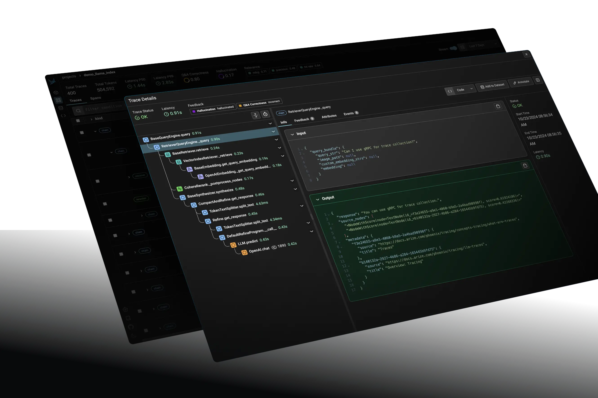

# 第一节 评估常用工具

了解了评估的基本原理之后，来介绍几个RAG评估工具，它们各自代表了不同的设计哲学和应用场景。

## 一、LlamaIndex Evaluation

`LlamaIndex Evaluation` 是**深度集成于LlamaIndex框架内的评估模块**，专为使用该框架构建的RAG应用提供无缝的评估能力。作为RAG开发框架的原生组件，其核心定位是**为开发者在开发、调试和迭代周期中提供快速、灵活的嵌入式评估解决方案**。它强调与开发流程的紧密结合，允许开发者在构建过程中即时验证和对比不同RAG策略的性能[^1]。

> **适用场景**：对于深度使用 `LlamaIndex` 框架构建RAG应用的开发者而言，其内置评估模块是无缝集成的首选，提供了一站式的开发与评估体验。

### 1.1 核心理念与工作流

`LlamaIndex` 的评估理念是利用LLM作为“裁判”，以自动化的方式对RAG系统的各个环节进行打分。这种方法在很多场景下无需预先准备“标准答案”，大大降低了评估门槛。其典型工作流如下：

1.  **准备评估数据集**：通过 `DatasetGenerator` 从文档中自动生成问题-答案对（`QueryResponseDataset`），或加载一个已有的数据集。为了效率，通常会将生成的数据集保存到本地，避免重复生成。
2.  **构建查询引擎**：搭建一个或多个需要被评估的RAG查询引擎（`QueryEngine`）。这是进行对比实验的基础。
3.  **初始化评估器**：根据评估维度，选择并初始化一个或多个评估器，如 `FaithfulnessEvaluator`（忠实度）和 `RelevancyEvaluator`（相关性）。
4.  **执行批量评估**：使用 `BatchEvalRunner` 来管理整个评估过程。它能够高效地（可并行）将查询引擎应用于数据集中的所有问题，并调用所有评估器进行打分。
5.  **分析结果**：从评估运行器返回的结果中，计算各项指标的平均分，从而量化地对比不同RAG策略的优劣。

### 1.2 应用实例：对比不同检索策略

下面示例基于我们在第三章学习的“句子窗口检索”技术，通过评估，对比它与“常规分块检索”在响应质量上的差异。

**代码示例：**


```python
# ... (省略数据加载、文档解析、查询引擎构建等步骤)

# 1. 初始化评估器
# 定义需要评估的指标：忠实度和相关性
faithfulness_evaluator = FaithfulnessEvaluator(llm=Settings.llm)
relevancy_evaluator = RelevancyEvaluator(llm=Settings.llm)
evaluators = {"faithfulness": faithfulness_evaluator, "relevancy": relevancy_evaluator}

# 2. 使用BatchEvalRunner执行批量评估
# 从数据集中获取查询列表
queries = response_eval_dataset.queries

# 评估“句子窗口检索”引擎
print("\n=== 评估句子窗口检索 ===")
sentence_runner = BatchEvalRunner(evaluators, workers=2, show_progress=True)
sentence_response_results = await sentence_runner.aevaluate_queries(
    queries=queries, query_engine=sentence_query_engine
)

# 评估“常规分块检索”引擎
print("\n=== 评估常规分块检索 ===")
base_runner = BatchEvalRunner(evaluators, workers=2, show_progress=True)
base_response_results = await base_runner.aevaluate_queries(
    queries=queries, query_engine=base_query_engine
)

# 3. 分析并打印结果
# ... (省略结果计算与打印的辅助函数)
print(f"句子窗口检索: 忠实度={sentence_faith:.1%}, 相关性={sentence_rel:.1%}")
print(f"常规分块检索: 忠实度={base_faith:.1%}, 相关性={base_rel:.1%}")
```

**结果输出：**

```bash
============================================================
响应评估结果对比
============================================================

句子窗口检索:
  忠实度: 53.3%
  相关性: 66.7%

常规分块检索:
  忠实度: 0.0%
  相关性: 6.7%
```

通过这个结果可以看出，在本次实验中“句子窗口检索”的忠实度和相关性上均显著优于“常规分块检索”。

### 1.3 核心评估维度

LlamaIndex提供了丰富的评估器，覆盖了从检索到响应的各个环节。上述示例中主要使用了**响应评估**维度：

*   `Faithfulness` (忠实度): 评估生成的答案是否完全基于检索到的上下文，是检测“幻觉”现象的关键指标。分数越高，说明答案越可靠。
*   `Relevancy` (相关性): 评估生成的答案与用户提出的原始问题是否直接相关，确保答案切题。

此外，它还支持专门的**检索评估**维度，如：

*   `Hit Rate` (命中率): 评估检索到的上下文中是否包含了正确的答案。
*   `MRR` (平均倒数排名): 衡量找到正确答案的效率，排名越靠前得分越高。

## 二、RAGAS

RAGAS（RAG Assessment）是一个**独立的、专注于RAG的开源评估框架**。提供了一套全面的指标来量化RAG管道的检索和生成两大核心环节的性能。其最显著的特色是支持**无参考评估**，即在许多场景下无需人工标注的“标准答案”即可进行评估，极大地降低了评估成本。现对RAG管道的持续监控和改进。如果你需要一个轻量级、与具体RAG实现解耦、能够快速对核心指标进行量化评估的工具时，`RAGAS` 是一个理想的选择。

### 2.1 设计理念

`RAGAS` 的核心思想是通过分析问题（`question`）、生成的答案（`answer`）和检索到的上下文（`context`）三者之间的关系，来综合评估RAG系统的性能。它将复杂的评估问题分解为几个简单、可量化的维度。

### 2.2 工作流程与核心指标

RAGAS的评估流程非常简洁，通常遵循以下步骤：

1.  **准备数据集**：根据官方文档，一个标准的评估数据集应包含 `question`（问题）、`answer`（RAG系统生成的答案）、`contexts`（检索到的上下文）以及 `ground_truth`（标准参考答案）这四列。不过，`ground_truth` 对于计算 `context_recall` 等指标是必需的，但对于 `faithfulness` 等指标则是可选的。
2.  **运行评估**：调用 `ragas.evaluate()` 函数，传入准备好的数据集和需要评估的指标列表。
3.  **分析结果**：获取一个包含各项指标量化分数的评估报告。

其核心评估指标包括：

*   `faithfulness`: 衡量生成的答案中有多少比例的信息是可以由检索到的上下文所支持的。
*   `context_recall`: 衡量检索到的上下文与标准答案（`ground_truth`）的对齐程度，即标准答案中的信息是否被上下文完全“召回”。
*   `context_precision`: 衡量检索到的上下文中，信噪比如何，即有多少是真正与回答问题相关的。
*   `answer_relevancy`: 评估答案与问题的相关程度。此指标不评估事实准确性，只关注答案是否切题。

## 三、Phoenix (Arize Phoenix)

Phoenix (现由Arize维护) 是一个**开源的LLM可观测性与评估平台**。在RAG评估生态中，它主要扮演**生产环境中的可视化分析与故障诊断引擎**的角色。它通过捕获LLM应用的轨迹（Traces），提供强大的可视化、切片和聚类分析能力，帮助开发者理解线上真实数据的表现。Phoenix 的核心价值在于**从海量生产数据中发现问题、监控性能漂移并进行深度诊断**，是连接线下评估与线上运维的关键桥梁。它不仅提供评估指标，更强调对LLM应用进行追踪（Tracing）和可视化分析，从而快速定位问题[^3]。



### 3.1 核心理念

`Phoenix` 的核心是“AI可观测性”，它通过追踪RAG系统内部的每一步调用（如检索、生成等），将整个流程可视化。这使得开发者可以直观地看到每个环节的输入、输出和耗时，并在此基础上进行深入的评估和调试。

### 3.2 工作原理

1.  **代码插桩 (`Instrumentation`)**：基于开放标准 **OpenTelemetry**，在RAG应用代码中集成 `Phoenix` 的追踪功能，自动捕获LLM调用、函数执行等事件。
2.  **生成追踪数据 (`Traces`)**：运行RAG应用，`Phoenix` 会在后台记录下完整的执行链路。
3.  **启动UI进行分析**：在本地启动 `Phoenix` 的Web界面，加载并可视化追踪数据。
4.  **评估与调试**：在UI中对失败的案例或表现不佳的查询进行筛选、钻取，并运行内置的评估器 (`Evals`) 进行根本原因分析。

特色功能：

*   **可视化追踪**: 将RAG的执行流程、数据和评估结果进行可视化展示，极大地方便了问题定位。
*   **根本原因分析**: 通过可视化的界面，可以轻松地对表现不佳的查询进行切片和钻取。
*   **安全护栏 (`Guardrails`)**: 允许为应用添加保护层，防止恶意或错误的输入输出，保障生产环境安全。
*   **数据探索与标注**: 提供数据探索、清洗和标注工具，帮助开发者利用生产数据反哺模型和系统优化。
*   **与Arize平台集成**: `Phoenix` 可以与Arize的商业平台无缝对接，实现生产环境中对RAG系统的持续监控。

## 四、对比建议

| **工具**     | **核心机制** | **独特技术**                | **典型应用场景** |
| ---------- | -------- | ----------------------- | --- |
| RAGAS      | LLM驱动评估  | 合成数据生成、无参考评估架构          | 对比不同RAG策略、版本迭代后的性能回归测试 |
| LlamaIndex | 嵌入式评估    | 异步评估引擎、模块化BaseEvaluator | 开发过程中快速验证单个组件或完整管道的效果 |
| Phoenix    | 追踪分析型    | 分布式追踪、向量聚类分析算法            | 生产环境监控、Bad Case分析、数据漂移检测 |

> 在实践中，这些工具并非互斥，可以结合使用，以获得对RAG系统更全面、多维度的洞察。

## 参考文献

[^1]: [*LlamaIndex Evaluating*](https://docs.llamaindex.ai/en/stable/module_guides/evaluating/)

[^2]: [*Ragas Docs*](https://docs.ragas.io/en/stable/)

[^3]: [*Arize AI Phoenix*](https://arize.com/docs/phoenix)
