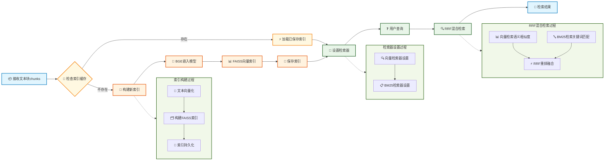

# 第三节 索引构建与检索优化



## 一、核心设计

### 1.1 索引构建

索引构建模块的核心任务是将文本块转换为向量表示，并构建高效的检索索引。这里选择之前一直使用的BGE-small-zh-v1.5作为嵌入模型，并使用FAISS作为向量数据库来存储和检索向量。为了提升系统启动速度，实现索引缓存机制。首次构建后会将FAISS索引保存到本地，后续启动时直接加载已有索引，可以将启动时间从几分钟缩短到几秒钟。

### 1.2 混合检索

检索优化模块实现了多种检索策略的组合。采用双路检索的方式：向量检索基于语义相似度，擅长理解查询意图；BM25检索基于关键词匹配，擅长精确匹配。为了综合两种检索方式的优势，我们使用RRF（Reciprocal Rank Fusion）算法来融合检索结果。这个算法会综合考虑两种检索结果的排名信息，避免过度依赖单一检索方式。

> RRF 可能并不是效果最好的重排方式，但是够用🫠。如果想使用 ColBERT、RankLLM 等更先进的重排方法可以自行尝试。

此外，系统还支持基于元数据的智能过滤，可以按菜品分类、难度等级等条件进行筛选检索。

## 二、索引构建模块

> [index_construction.py完整代码](https://github.com/datawhalechina/all-in-rag/blob/main/code/C8/rag_modules/index_construction.py)

### 2.1 类结构设计

```python
class IndexConstructionModule:
    """索引构建模块 - 负责向量化和索引构建"""

    def __init__(self, model_name: str = "BAAI/bge-small-zh-v1.5",
                 index_save_path: str = "./vector_index"):
        self.model_name = model_name
        self.index_save_path = index_save_path
        self.embeddings = None
        self.vectorstore = None
        self.setup_embeddings()
```

- `index_save_path`: 索引保存路径
- `embeddings`: HuggingFace嵌入模型实例
- `vectorstore`: FAISS向量存储实例


### 2.2 嵌入模型初始化

```python
def setup_embeddings(self):
    """初始化嵌入模型"""
    self.embeddings = HuggingFaceEmbeddings(
        model_name=self.model_name,
        model_kwargs={'device': 'cpu'},
        encode_kwargs={'normalize_embeddings': True}
    )
```

### 2.3 向量索引构建

```python
def build_vector_index(self, chunks: List[Document]) -> FAISS:
    """构建向量索引"""
    if not chunks:
        raise ValueError("文档块列表不能为空")
    
    # 提取文本内容
    texts = [chunk.page_content for chunk in chunks]
    metadatas = [chunk.metadata for chunk in chunks]
    
    # 构建FAISS向量索引
    self.vectorstore = FAISS.from_texts(
        texts=texts,
        embedding=self.embeddings,
        metadatas=metadatas
    )
    
    return self.vectorstore
```

使用FAISS作为向量数据库，它的检索速度很快，同时保存了文本内容和元数据信息，支持大规模向量的高效检索。

### 2.4 索引缓存机制

```python
def save_index(self):
    """保存向量索引到配置的路径"""
    if not self.vectorstore:
        raise ValueError("请先构建向量索引")
    
    # 确保保存目录存在
    Path(self.index_save_path).mkdir(parents=True, exist_ok=True)
    
    self.vectorstore.save_local(self.index_save_path)

def load_index(self):
    """从配置的路径加载向量索引"""
    if not self.embeddings:
        self.setup_embeddings()
    
    if not Path(self.index_save_path).exists():
        return None
    
    self.vectorstore = FAISS.load_local(
        self.index_save_path, 
        self.embeddings,
        allow_dangerous_deserialization=True
    )
    return self.vectorstore
```

索引缓存的效果很明显：首次运行时构建索引需要几分钟，但后续运行时加载索引只需几秒钟。索引文件通常只有几十MB，存储效率很高。

## 三、检索优化模块

> [retrieval_optimization.py完整代码](https://github.com/datawhalechina/all-in-rag/blob/main/code/C8/rag_modules/retrieval_optimization.py)

### 3.1 类结构设计

```python
class RetrievalOptimizationModule:
    """检索优化模块 - 负责混合检索和过滤"""

    def __init__(self, vectorstore: FAISS, chunks: List[Document]):
        self.vectorstore = vectorstore
        self.chunks = chunks
        self.setup_retrievers()
```

- `vectorstore`: FAISS向量存储实例
- `chunks`: 文档块列表，用于BM25检索

### 3.2 检索器设置

```python
def setup_retrievers(self):
    """设置向量检索器和BM25检索器"""
    # 向量检索器
    self.vector_retriever = self.vectorstore.as_retriever(
        search_type="similarity",
        search_kwargs={"k": 5}
    )

    # BM25检索器
    self.bm25_retriever = BM25Retriever.from_documents(
        self.chunks,
        k=5
    )
```

### 3.3 RRF混合检索

```python
def hybrid_search(self, query: str, top_k: int = 3) -> List[Document]:
    """混合检索 - 结合向量检索和BM25检索，使用RRF重排"""
    # 分别获取向量检索和BM25检索结果
    vector_docs = self.vector_retriever.get_relevant_documents(query)
    bm25_docs = self.bm25_retriever.get_relevant_documents(query)

    # 使用RRF重排
    reranked_docs = self._rrf_rerank(vector_docs, bm25_docs)
    return reranked_docs[:top_k]

def _rrf_rerank(self, vector_results: List[Document], bm25_results: List[Document]) -> List[Document]:
    """RRF (Reciprocal Rank Fusion) 重排"""
    
    # RRF融合算法
    rrf_scores = {}
    k = 60  # RRF参数
    
    # 计算向量检索的RRF分数
    for rank, doc in enumerate(vector_results):
        doc_id = id(doc)
        rrf_scores[doc_id] = rrf_scores.get(doc_id, 0) + 1 / (k + rank + 1)

    # 计算BM25检索的RRF分数
    for rank, doc in enumerate(bm25_results):
        doc_id = id(doc)
        rrf_scores[doc_id] = rrf_scores.get(doc_id, 0) + 1 / (k + rank + 1)

    # 合并所有文档并按RRF分数排序
    all_docs = {id(doc): doc for doc in vector_results + bm25_results}
    sorted_docs = sorted(all_docs.items(),
                        key=lambda x: rrf_scores.get(x[0], 0),
                        reverse=True)

    return [doc for _, doc in sorted_docs]
```

在当前系统中，两种检索方式各有优势：

**向量检索的优势**：
- 理解语义相似性，如"简单易做的菜"能匹配到标记为"简单"的菜谱
- 处理同义词和近义词，如"制作方法"和"做法"、"烹饪步骤"
- 理解用户意图，如"适合新手"能找到难度较低的菜谱

**BM25检索的优势**：
- 精确匹配菜名，如"宫保鸡丁"能准确找到对应菜谱
- 匹配具体食材，如"土豆丝"、"西红柿"等关键词
- 处理专业术语，如"爆炒"、"红烧"等烹饪手法

RRF算法能综合两种检索方式的排名信息，既保证了语义理解的准确性，又确保了关键词匹配的精确性。当然还可以用路由的方式，根据查询类型智能选择使用向量检索还是BM25检索。这种方法针对性强，能为不同类型的查询选择最优的检索方式；不足是路由规则的设计和维护比较复杂，边界情况难以处理，而且通常需要调用LLM来判断查询类型，会增加延迟和成本。

### 3.4 元数据过滤检索

```python
def metadata_filtered_search(self, query: str, filters: Dict[str, Any],
                           top_k: int = 5) -> List[Document]:
    """基于元数据过滤的检索"""
    # 先进行向量检索
    vector_retriever = self.vectorstore.as_retriever(
        search_type="similarity",
        search_kwargs={"k": top_k * 3, "filter": filters}  # 扩大检索范围
    )

    results = vector_retriever.invoke(query)
    return results[:top_k]
```

**过滤检索应用场景**：
- 用户询问"推荐几道素菜"时，可以按菜品分类过滤，只检索素菜相关的内容
- 新手用户问"有什么简单的菜谱"时，可以按难度等级过滤，只返回标记为"简单"的菜谱
- 想做汤品时询问"今天喝什么汤"，可以按分类过滤出所有汤品菜谱
