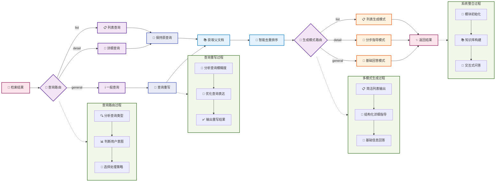

# 第四节 生成集成与系统整合

Boss要打完喽！在最后一节来学习一下如何实现智能的生成集成模块，以及将所有模块整合成一个完整的RAG系统。



## 一、生成集成模块

生成集成模块是整个RAG系统的"大脑"，负责理解用户意图、路由查询类型，并生成高质量的回答。

> [generation_integration.py完整代码](https://github.com/datawhalechina/all-in-rag/blob/main/code/C8/rag_modules/generation_integration.py)

### 1.1 设计思路

**智能查询路由**：根据用户查询自动判断是列表查询、详细查询还是一般查询，选择最适合的生成策略。

**查询重写优化**：对模糊不清的查询进行智能重写，提升检索效果。比如将"做菜"重写为"简单易做的家常菜谱"。

**多模式生成**：
- **列表模式**：适用于推荐类查询，返回简洁的菜品列表
- **详细模式**：适用于制作类查询，提供分步骤的详细指导
- **基础模式**：适用于一般性问题，提供常规回答

> 上面说到的两种主要方法可以回顾 [**查询重构与分发**](https://github.com/datawhalechina/all-in-rag/blob/main/docs/chapter4/14_query_rewriting.md)

### 1.2 类结构设计

```python
class GenerationIntegrationModule:
    """生成集成模块 - 负责LLM集成和回答生成"""
    
    def __init__(self, model_name: str = "kimi-k2-0711-preview", 
                 temperature: float = 0.1, max_tokens: int = 2048):
        self.model_name = model_name
        self.temperature = temperature
        self.max_tokens = max_tokens
        self.llm = None
        self.setup_llm()
```

- `temperature`: 生成温度，控制回答的创造性
- `max_tokens`: 最大生成长度
- `llm`: Moonshot Chat模型实例

### 1.3 查询路由实现

```python
def query_router(self, query: str) -> str:
    """查询路由 - 根据查询类型选择不同的处理方式"""
    prompt = ChatPromptTemplate.from_template("""
根据用户的问题，将其分类为以下三种类型之一：

1. 'list' - 用户想要获取菜品列表或推荐，只需要菜名
   例如：推荐几个素菜、有什么川菜、给我3个简单的菜

2. 'detail' - 用户想要具体的制作方法或详细信息
   例如：宫保鸡丁怎么做、制作步骤、需要什么食材

3. 'general' - 其他一般性问题
   例如：什么是川菜、制作技巧、营养价值

请只返回分类结果：list、detail 或 general

用户问题: {query}

分类结果:""")
    
    # ... (LCEL链式调用)
    return result
```

查询路由是整个系统的关键，决定了后续的处理流程。通过LLM自动判断查询意图，比简单的关键词匹配更准确。

### 1.4 查询重写优化

```python
def query_rewrite(self, query: str) -> str:
    """智能查询重写 - 让大模型判断是否需要重写查询"""
    # 使用LLM分析查询是否需要重写
    # 具体明确的查询（如"宫保鸡丁怎么做"）保持原样
    # 模糊查询（如"做菜"、"推荐个菜"）进行重写优化

    # ... (提示词设计和LCEL链式调用)
    return response
```

查询重写能够将模糊的用户输入转换为更适合检索的查询，显著提升系统的实用性。重写规则包括：保持原意不变、增加相关烹饪术语、优先推荐简单易做的菜品。

### 1.5 多模式生成

**列表模式生成**：
```python
def generate_list_answer(self, query: str, context_docs: List[Document]) -> str:
    """生成列表式回答 - 适用于推荐类查询"""
    # 提取菜品名称
    dish_names = []
    for doc in context_docs:
        dish_name = doc.metadata.get('dish_name', '未知菜品')
        if dish_name not in dish_names:
            dish_names.append(dish_name)
    
    # 构建简洁的列表回答
    if len(dish_names) <= 3:
        return f"为您推荐以下菜品：\n" + "\n".join([f"{i+1}. {name}" for i, name in enumerate(dish_names)])
    # ... (其他情况处理)
```

**详细模式生成**：
```python
def generate_step_by_step_answer(self, query: str, context_docs: List[Document]) -> str:
    """生成分步骤回答"""
    # 使用结构化提示词，包含：
    # - 🥘 菜品介绍
    # - 🛒 所需食材
    # - 👨‍🍳 制作步骤
    # - 💡 制作技巧

    # ... (提示词设计和LCEL链式调用)
    return response
```

详细模式使用结构化的提示词设计，让LLM能够生成格式规范、内容丰富的分步骤指导，重点突出实用性和可操作性。

## 二、系统整合

主程序负责协调各个模块，实现完整的RAG流程：数据准备 → 索引构建 → 检索优化 → 生成集成。同时提供了索引缓存、交互式问答等实用功能。

> [main.py完整代码](https://github.com/datawhalechina/all-in-rag/blob/main/code/C8/main.py)

### 2.1 主系统类设计

```python
class RecipeRAGSystem:
    """食谱RAG系统主类"""
    
    def __init__(self, config: RAGConfig = None):
        self.config = config or DEFAULT_CONFIG
        self.data_module = None
        self.index_module = None
        self.retrieval_module = None
        self.generation_module = None
        
        # 检查数据路径和API密钥
        if not Path(self.config.data_path).exists():
            raise FileNotFoundError(f"数据路径不存在: {self.config.data_path}")
        if not os.getenv("MOONSHOT_API_KEY"):
            raise ValueError("请设置 MOONSHOT_API_KEY 环境变量")
```

主系统类负责协调所有模块，确保系统的完整性和一致性。

### 2.2 系统初始化流程

```python
def initialize_system(self):
    """初始化所有模块"""
    # 1. 初始化数据准备模块
    self.data_module = DataPreparationModule(self.config.data_path)
    
    # 2. 初始化索引构建模块
    self.index_module = IndexConstructionModule(
        model_name=self.config.embedding_model,
        index_save_path=self.config.index_save_path
    )
    
    # 3. 初始化生成集成模块
    self.generation_module = GenerationIntegrationModule(
        model_name=self.config.llm_model,
        temperature=self.config.temperature,
        max_tokens=self.config.max_tokens
    )
```

初始化过程按照依赖关系有序进行，保证每个模块都能正确设置。

### 2.3 知识库构建流程

```python
def build_knowledge_base(self):
    """构建知识库"""
    # 1. 尝试加载已保存的索引
    vectorstore = self.index_module.load_index()
    
    if vectorstore is not None:
        # 加载已有索引，但仍需要文档和分块用于检索模块
        self.data_module.load_documents()
        chunks = self.data_module.chunk_documents()
    else:
        # 构建新索引的完整流程
        self.data_module.load_documents()
        chunks = self.data_module.chunk_documents()
        vectorstore = self.index_module.build_vector_index(chunks)
        self.index_module.save_index()
    
    # 初始化检索优化模块
    self.retrieval_module = RetrievalOptimizationModule(vectorstore, chunks)
```

这个流程运用了之前设计的索引缓存机制，能够大幅提升系统启动速度。

### 2.4 智能问答流程

```python
def ask_question(self, question: str, stream: bool = False):
    """回答用户问题"""
    # 1. 查询路由
    route_type = self.generation_module.query_router(question)

    # 2. 智能查询重写（根据路由类型）
    if route_type == 'list':
        rewritten_query = question  # 列表查询保持原样
    else:
        rewritten_query = self.generation_module.query_rewrite(question)

    # 3. 检索相关子块
    relevant_chunks = self.retrieval_module.hybrid_search(rewritten_query, top_k=self.config.top_k)

    # 4. 根据路由类型选择回答方式
    if route_type == 'list':
        # 列表查询：返回菜品名称列表
        relevant_docs = self.data_module.get_parent_documents(relevant_chunks)
        return self.generation_module.generate_list_answer(question, relevant_docs)
    else:
        # 详细查询：获取完整文档并生成详细回答
        relevant_docs = self.data_module.get_parent_documents(relevant_chunks)

        if route_type == "detail":
            # 详细查询使用分步指导模式
            return self.generation_module.generate_step_by_step_answer(question, relevant_docs)
        else:
            # 一般查询使用基础回答模式
            return self.generation_module.generate_basic_answer(question, relevant_docs)
```

这部分展示了程序执行流程：智能路由 → 查询优化 → 混合检索 → 父子文档处理 → 多模式生成。

### 2.5 实际使用示例

#### 2.5.1 不同查询类型的效果

**列表查询示例**：
```
用户问题: "推荐几道简单的素菜"
查询类型: list
生成结果:
为您推荐以下菜品：
1. 西红柿炒鸡蛋
2. 土豆丝
3. 青椒炒豆腐
```

**详细查询示例**：
```
用户问题: "宫保鸡丁怎么做？"
查询类型: detail
生成结果:
## 🥘 菜品介绍
宫保鸡丁是一道经典川菜，口感麻辣鲜香...

## 🛒 所需食材
- 鸡胸肉 300g
- 花生米 100g
- 干辣椒 10个
...

## 👨‍🍳 制作步骤
1. 鸡肉切丁，用料酒和生抽腌制15分钟
2. 热锅下油，爆炒花生米至微黄盛起
...
```

#### 2.5.2 交互式问答

系统提供了完整的命令行交互界面，启动时会显示"尝尝咸淡RAG系统"的欢迎信息：

```python
def run_interactive(self):
    """运行交互式问答"""
    print("=" * 60)
    print("🍽️  尝尝咸淡RAG系统 - 交互式问答  🍽️")
    print("=" * 60)
    print("💡 解决您的选择困难症，告别'今天吃什么'的世纪难题！")

    # 初始化系统和构建知识库
    self.initialize_system()
    self.build_knowledge_base()

    while True:
        user_input = input("\n您的问题: ").strip()
        if user_input.lower() in ['退出', 'quit', 'exit']:
            break

        # 询问是否使用流式输出
        stream_choice = input("是否使用流式输出? (y/n, 默认y): ").strip().lower()
        use_stream = stream_choice != 'n'

        if use_stream:
            # 流式输出，实时显示生成过程
            for chunk in self.ask_question(user_input, stream=True):
                print(chunk, end="", flush=True)
        else:
            # 普通输出
            answer = self.ask_question(user_input, stream=False)
            print(answer)
```

**运行效果示例**：
```
============================================================
🍽️  尝尝咸淡RAG系统 - 交互式问答  🍽️
============================================================
💡 解决您的选择困难症，告别'今天吃什么'的世纪难题！

✅ 成功加载已保存的向量索引！
✅ 系统初始化完成！

您的问题: 推荐几道简单的素菜
是否使用流式输出? (y/n, 默认y): y

为您推荐以下素菜：
1. 西红柿炒鸡蛋 - 经典家常菜，简单易做
2. 土豆丝 - 爽脆可口，适合新手
3. 青椒炒豆腐 - 营养丰富，制作简单
```

流式输出的实现通过LangChain的`chain.stream()`方法，它会返回一个生成器，每次yield一个文本片段。在交互式界面中，通过`print(chunk, end="", flush=True)`实时输出每个片段，`end=""`避免换行，`flush=True`确保立即显示，从而实现逐字逐句的流式效果。

## 三、优化方向

虽然当前系统已经具备了完整的RAG功能，但仍有许多优化空间。以下是一些值得探索的方向：

### 3.1 图数据库集成

将食谱数据转换为图结构，能够更好地表达食材、菜品、烹饪方法之间的复杂关系：
- 支持复杂的关系查询，如"和鸡肉搭配的食材有哪些"
- 能够发现食材之间的潜在关联
- 支持基于图的推荐算法

### 3.2 多模态数据融合

集成菜品图片等多模态信息：
- 使用CLIP等多模态模型进行图文联合检索
- 支持"这是什么菜"的视觉查询
- 通过图像识别食材，推荐相关菜谱

### 3.3 专业知识增强

集成专业烹饪知识库：
- 营养成分数据库，提供营养分析和健康建议
- 烹饪技巧知识图谱，优化制作指导
- 食材替换规则库，支持过敏和偏好适配