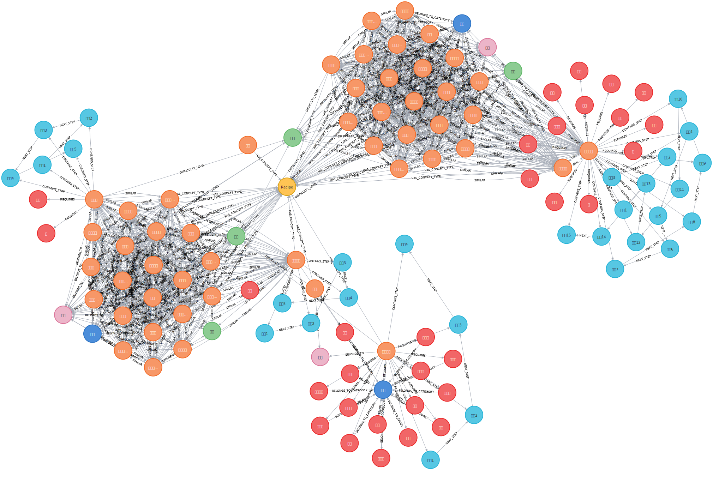

# 第一节 图RAG系统架构与环境配置

> 在前面章节的基础上，接下来构建一个更先进的图RAG系统。通过引入Neo4j图数据库和智能查询路由机制，实现真正的知识图谱增强检索，解决传统RAG在复杂查询和关系推理方面的局限性。



## 一、项目背景与目标

### 1.1 从传统RAG到图RAG的演进

上一章中，我们构建了基于向量检索的传统RAG系统，采用了父子文本块的分块策略，能够有效回答简单的菜谱查询。但在处理复杂的关系推理和多跳查询时仍存在明显局限：

- **关系理解缺失**：虽然父子分块保持了文档结构，但无法显式建模食材、菜谱、烹饪方法之间的语义关系
- **跨文档关联困难**：难以发现不同菜谱之间的相似性、替代关系等隐含联系
- **推理能力有限**：缺乏基于知识图谱的多跳推理能力，难以回答需要复杂逻辑推理的问题

### 1.2 图RAG系统的核心优势

通过引入知识图谱，我们的新系统将具备：

- **结构化知识表达**：以图的形式显式编码实体间的语义关系
- **增强推理能力**：支持多跳推理和复杂关系查询
- **智能查询路由**：根据查询复杂度自动选择最适合的检索策略
- **事实性与可解释性**：基于图结构的推理路径提供可追溯的答案

## 二、环境配置

> 若需要进行外部访问，需更换本地或服务器环境

### 2.1 创建虚拟环境

```bash
# 使用conda创建环境
conda create -n graph-rag python=3.12.7
conda activate graph-rag
```

### 2.2 安装核心依赖

```bash
cd code/C9
pip install -r requirements.txt
```

### 2.3 Neo4j数据库配置

使用Docker Compose方式安装Neo4j，配置文件位于 [`data/C9/docker-compose.yml`](https://github.com/datawhalechina/all-in-rag/blob/main/data/C9/docker-compose.yml)：

#### 2.3.1 启动Neo4j服务

```bash
# 进入docker-compose.yml所在目录
cd data/C9

# 启动Neo4j服务
docker-compose up -d

# 检查服务状态
docker-compose ps
```

#### 2.3.2 访问Neo4j Web界面

启动成功后，可以通过以下方式访问：
- **Web界面**：http://localhost:7474
- **用户名**：neo4j
- **密码**：all-in-rag

> 当前网址为本地访问，如果你是部署在远程服务器上，需要将 `localhost` 修改为你的服务器IP地址。

#### 2.3.3 数据导入

Docker Compose配置中包含了自动数据导入功能。启动服务时会自动执行以下步骤：

1. **等待Neo4j服务就绪**：通过健康检查确保数据库可用
2. **执行导入脚本**：自动运行 `data/C9/cypher/neo4j_import.cypher`
3. **导入菜谱数据**：包括菜谱、食材、烹饪步骤等节点和关系

导入的数据包括：
- **菜谱节点**：包含菜名、难度、烹饪时间、菜系等信息
- **食材节点**：包含食材名称、分类、营养信息等
- **烹饪步骤节点**：包含步骤描述、烹饪方法、所需工具等
- **关系网络**：菜谱与食材、步骤之间的复杂关系

如果需要手动重新导入数据：

```bash
# 进入容器执行导入脚本
docker exec -it neo4j-db cypher-shell -u neo4j -p all-in-rag -f /import/cypher/neo4j_import.cypher
```

### 2.4 Milvus向量数据库配置

#### 2.4.1 使用Docker安装Milvus

> 如果前面已经安装过了可以跳过此步，通过 `docker-compose ps` 确认Milvus服务正在运行即可。

```bash
# 下载Milvus standalone配置文件
wget https://github.com/milvus-io/milvus/releases/download/v2.5.11/milvus-standalone-docker-compose.yml -O docker-compose.yml

# 启动Milvus
docker-compose up -d
```

#### 2.4.2 验证安装

```bash
# 检查Milvus服务状态
docker-compose ps
```

### 2.5 配置连接参数

在项目根目录创建 `.env` 文件：

```env
# Neo4j配置
NEO4J_URI=bolt://localhost:7687
NEO4J_USER=neo4j
NEO4J_PASSWORD=all-in-rag
NEO4J_DATABASE=neo4j

# Milvus配置
MILVUS_HOST=localhost
MILVUS_PORT=19530

# LLM API配置
MOONSHOT_API_KEY=your_api_key_here
```

## 三、系统架构设计

### 3.1 整体架构

我们的图RAG系统采用模块化设计，包含以下核心组件：

```mermaid
flowchart TD
    %% 系统启动和初始化
    START["🚀 启动高级图RAG系统"] --> CONFIG["⚙️ 加载配置<br/>GraphRAGConfig"]
    CONFIG --> INIT_CHECK{"🔍 检查系统依赖"}
    
    %% 依赖检查
    INIT_CHECK -->|Neo4j连接失败| NEO4J_ERROR["❌ Neo4j连接错误<br/>检查图数据库状态"]
    INIT_CHECK -->|Milvus连接失败| MILVUS_ERROR["❌ Milvus连接错误<br/>检查向量数据库"]
    INIT_CHECK -->|LLM API失败| LLM_ERROR["❌ LLM API错误<br/>检查API密钥"]
    INIT_CHECK -->|依赖正常| INIT_MODULES["✅ 初始化核心模块"]
    
    %% 知识库状态检查
    INIT_MODULES --> KB_CHECK{"📚 检查知识库状态"}
    KB_CHECK -->|Milvus集合存在| LOAD_KB["⚡ 加载已存在知识库"]
    KB_CHECK -->|集合不存在| BUILD_KB["🔨 构建新知识库"]
    
    %% 加载已有知识库
    LOAD_KB --> LOAD_SUCCESS{"加载成功？"}
    LOAD_SUCCESS -->|成功| SYSTEM_READY["✅ 系统就绪<br/>显示统计信息"]
    LOAD_SUCCESS -->|失败| REBUILD_KB["🔄 重建知识库"]
    
    %% 构建新知识库流程
    BUILD_KB --> NEO4J_LOAD["🔗 从Neo4j加载图数据<br/>菜谱、食材、烹饪步骤节点"]
    REBUILD_KB --> NEO4J_LOAD
    NEO4J_LOAD --> BUILD_DOCS["📝 构建结构化菜谱文档<br/>组合图数据为完整文档"]
    BUILD_DOCS --> CHUNK_DOCS["✂️ 智能文档分块<br/>按章节或长度分块"]
    CHUNK_DOCS --> BUILD_VECTOR["🎯 构建Milvus向量索引"]
    BUILD_VECTOR --> SYSTEM_READY
    
    %% 用户交互循环
    SYSTEM_READY --> USER_INPUT["👤 用户输入查询"]
    USER_INPUT --> SPECIAL_CMD{"🔍 特殊命令检查"}
    
    %% 特殊命令处理
    SPECIAL_CMD -->|stats| STATS["📊 显示系统统计<br/>路由统计、知识库状态"]
    SPECIAL_CMD -->|rebuild| REBUILD_CMD["🔄 重建知识库命令"]
    SPECIAL_CMD -->|quit| EXIT["👋 退出系统"]
    
    %% 普通查询处理 - 智能路由核心
    SPECIAL_CMD -->|普通查询| QUERY_ANALYSIS["🧠 深度查询分析"]
    
    %% 查询分析的四个维度
    QUERY_ANALYSIS --> COMPLEXITY_ANALYSIS["📊 复杂度分析<br/>0.0-0.3: 简单查找<br/>0.4-0.7: 中等复杂<br/>0.8-1.0: 高复杂推理"]
    QUERY_ANALYSIS --> RELATION_ANALYSIS["🔗 关系密集度分析<br/>0.0-0.3: 单一实体<br/>0.4-0.7: 实体关系<br/>0.8-1.0: 复杂关系网络"]
    QUERY_ANALYSIS --> REASONING_ANALYSIS["🤔 推理需求判断<br/>多跳推理？因果分析？<br/>对比分析？"]
    QUERY_ANALYSIS --> ENTITY_ANALYSIS["🏷️ 实体识别统计<br/>实体数量和类型"]
    
    %% LLM智能分析
    COMPLEXITY_ANALYSIS --> LLM_ANALYSIS["🤖 LLM智能分析<br/>综合评估查询特征"]
    RELATION_ANALYSIS --> LLM_ANALYSIS
    REASONING_ANALYSIS --> LLM_ANALYSIS
    ENTITY_ANALYSIS --> LLM_ANALYSIS
    
    %% 分析结果和降级处理
    LLM_ANALYSIS --> ANALYSIS_SUCCESS{"分析成功？"}
    ANALYSIS_SUCCESS -->|成功| ROUTE_DECISION["🎯 智能路由决策"]
    ANALYSIS_SUCCESS -->|失败| RULE_FALLBACK["📋 降级到规则分析<br/>基于关键词匹配"]
    RULE_FALLBACK --> ROUTE_DECISION
    
    %% 三种检索策略路由
    ROUTE_DECISION -->|简单查询<br/>复杂度<0.4| HYBRID_SEARCH["🔍 传统混合检索<br/>保底策略"]
    ROUTE_DECISION -->|复杂推理<br/>关系密集>0.7| GRAPH_RAG_SEARCH["🕸️ 图RAG检索<br/>高级复杂策略"]
    ROUTE_DECISION -->|中等复杂<br/>需要组合| COMBINED_SEARCH["🔄 组合检索策略<br/>融合两种方法"]
    
    %% 检索执行和错误处理
    HYBRID_SEARCH --> HYBRID_SUCCESS{"检索成功？"}
    GRAPH_RAG_SEARCH --> GRAPH_SUCCESS{"检索成功？"}
    COMBINED_SEARCH --> COMBINED_SUCCESS{"检索成功？"}
    
    %% 高级策略失败时降级到传统混合检索
    GRAPH_SUCCESS -->|失败| FALLBACK_TO_HYBRID["⬇️ 降级到传统混合检索<br/>保底方案"]
    COMBINED_SUCCESS -->|失败| FALLBACK_TO_HYBRID
    
    %% 传统混合检索失败时直接异常
    HYBRID_SUCCESS -->|失败| SYSTEM_ERROR["❌ 系统检索异常<br/>传统混合检索失败<br/>无更低级降级"]
    FALLBACK_TO_HYBRID --> FALLBACK_SUCCESS{"降级检索成功？"}
    FALLBACK_SUCCESS -->|失败| SYSTEM_ERROR
    
    %% 成功路径
    HYBRID_SUCCESS -->|成功| GENERATE["🎨 生成回答"]
    GRAPH_SUCCESS -->|成功| GENERATE
    COMBINED_SUCCESS -->|成功| GENERATE
    FALLBACK_SUCCESS -->|成功| GENERATE
    
    %% 固定的流式输出
    GENERATE --> STREAM_OUTPUT["📺 流式输出回答<br/>use_stream = True<br/>逐字符实时显示"]
    
    %% 统计更新和循环
    STREAM_OUTPUT --> UPDATE_STATS["📈 更新路由统计"]
    UPDATE_STATS --> USER_INPUT
    
    %% 特殊命令返回循环
    STATS --> USER_INPUT
    REBUILD_CMD --> BUILD_KB
    
    %% 错误处理返回
    NEO4J_ERROR --> EXIT
    MILVUS_ERROR --> EXIT
    LLM_ERROR --> EXIT
    SYSTEM_ERROR --> USER_INPUT
    
    %% 详细子流程
    subgraph DataFlow ["📊 图数据处理流程"]
        NEO4J_DB["🗄️ Neo4j图数据库<br/>存储菜谱、食材、烹饪步骤<br/>以及它们之间的关系网络"]
        RECIPE_BUILD["📝 结构化菜谱文档构建<br/>菜谱名称 + 分类 + 难度<br/>+ 食材列表 + 制作步骤<br/>+ 时间信息 + 标签"]
        DOC_CHUNK["✂️ 智能文档分块<br/>按章节分块：## 所需食材、## 制作步骤<br/>或按长度分块：chunk_size=500<br/>重叠处理：chunk_overlap=50"]
        MILVUS_INDEX["🎯 Milvus向量索引<br/>BGE-small-zh-v1.5<br/>512维向量空间"]
        
        NEO4J_DB --> RECIPE_BUILD
        RECIPE_BUILD --> DOC_CHUNK
        DOC_CHUNK --> MILVUS_INDEX
    end

    subgraph HybridFlow ["🔍 传统混合检索流程（保底）"]
        DUAL_RETRIEVAL["🎯 双层检索<br/>实体级+主题级"]
        VECTOR_SEARCH["📊 增强向量检索<br/>语义相似度匹配"]
        RRF_MERGE["⚖️ RRF轮询融合<br/>公平合并不同结果"]
        INTERNAL_FALLBACK["🔧 内部降级机制<br/>关键词提取失败→简单分词<br/>图索引不足→Neo4j补充<br/>Neo4j失败→静默失败"]
        
        DUAL_RETRIEVAL --> RRF_MERGE
        VECTOR_SEARCH --> RRF_MERGE
        INTERNAL_FALLBACK --> RRF_MERGE
    end
    
    subgraph GraphRAGFlow ["🕸️ 图RAG检索流程（高级复杂）"]
        GRAPH_UNDERSTAND["🧠 图查询理解<br/>entity_relation/multi_hop<br/>subgraph/path_finding"]
        MULTI_HOP["🔄 多跳图遍历<br/>最大深度3跳<br/>发现隐含关联"]
        SUBGRAPH_EXTRACT["🕸️ 知识子图提取<br/>完整知识网络<br/>最大100节点"]
        GRAPH_REASONING["🤔 图结构推理<br/>推理链构建<br/>可信度验证"]
        
        GRAPH_UNDERSTAND --> MULTI_HOP
        GRAPH_UNDERSTAND --> SUBGRAPH_EXTRACT
        MULTI_HOP --> GRAPH_REASONING
        SUBGRAPH_EXTRACT --> GRAPH_REASONING
    end
    
    subgraph CombinedFlow ["🔄 组合检索流程"]
        SPLIT_QUOTA["📊 分配检索配额<br/>traditional_k = top_k // 2<br/>graph_k = top_k - traditional_k"]
        PARALLEL_SEARCH["⚡ 并行执行检索<br/>传统检索 + 图RAG检索"]
        ROUND_ROBIN["🔄 Round-robin合并<br/>交替添加结果<br/>图RAG优先"]
        DEDUP["🧹 去重和排序<br/>基于内容哈希"]
        
        SPLIT_QUOTA --> PARALLEL_SEARCH
        PARALLEL_SEARCH --> ROUND_ROBIN
        ROUND_ROBIN --> DEDUP
    end
    
    subgraph FallbackStrategy ["⬇️ 降级策略（有限降级）"]
        LEVEL3["🕸️ 图RAG检索<br/>最高级：多跳推理+子图提取"]
        LEVEL2["🔄 组合检索<br/>中级：融合两种方法"]
        LEVEL1["🔍 传统混合检索<br/>保底：无更低级降级"]
        ERROR_LEVEL["❌ 系统异常<br/>传统混合检索失败"]
        
        LEVEL3 -->|失败| LEVEL1
        LEVEL2 -->|失败| LEVEL1
        LEVEL1 -->|失败| ERROR_LEVEL
    end
    
    %% 样式定义
    classDef startup fill:#e3f2fd,stroke:#0277bd,stroke-width:2px
    classDef config fill:#f1f8e9,stroke:#388e3c,stroke-width:2px
    classDef basic fill:#fff3e0,stroke:#f57c00,stroke-width:2px
    classDef advanced fill:#e8eaf6,stroke:#3f51b5,stroke-width:2px
    classDef knowledge fill:#e8f5e8,stroke:#1b5e20,stroke-width:2px
    classDef analysis fill:#f3e5f5,stroke:#4a148c,stroke-width:2px
    classDef routing fill:#e1f5fe,stroke:#01579b,stroke-width:2px
    classDef generation fill:#fce4ec,stroke:#880e4f,stroke-width:2px
    classDef userflow fill:#fff8e1,stroke:#f57c00,stroke-width:2px
    classDef error fill:#ffebee,stroke:#c62828,stroke-width:2px
    classDef success fill:#e8f5e8,stroke:#2e7d32,stroke-width:2px
    classDef fallback fill:#fff3e0,stroke:#ff6f00,stroke-width:2px
    classDef stream fill:#e1f5fe,stroke:#0288d1,stroke-width:2px
    classDef combined fill:#f3e5f5,stroke:#7b1fa2,stroke-width:2px
    classDef graphdata fill:#e8f5e8,stroke:#2e7d32,stroke-width:2px
    
    %% 应用样式
    class START,INIT_MODULES,SYSTEM_READY startup
    class CONFIG config
    class HYBRID_SEARCH,HybridFlow,LEVEL1 basic
    class GRAPH_RAG_SEARCH,GraphRAGFlow,LEVEL3 advanced
    class KB_CHECK,LOAD_KB,BUILD_KB,NEO4J_LOAD,BUILD_DOCS,CHUNK_DOCS,BUILD_VECTOR knowledge
    class QUERY_ANALYSIS,COMPLEXITY_ANALYSIS,RELATION_ANALYSIS,REASONING_ANALYSIS,ENTITY_ANALYSIS,LLM_ANALYSIS analysis
    class ROUTE_DECISION,ANALYSIS_SUCCESS,RULE_FALLBACK routing
    class GENERATE generation
    class USER_INPUT,SPECIAL_CMD,STATS,REBUILD_CMD,EXIT userflow
    class NEO4J_ERROR,MILVUS_ERROR,LLM_ERROR,SYSTEM_ERROR,ERROR_LEVEL error
    class LOAD_SUCCESS,INIT_CHECK,HYBRID_SUCCESS,GRAPH_SUCCESS,COMBINED_SUCCESS,FALLBACK_SUCCESS success
    class FALLBACK_TO_HYBRID,FallbackStrategy fallback
    class STREAM_OUTPUT,UPDATE_STATS stream
    class COMBINED_SEARCH,CombinedFlow,LEVEL2 combined
    class DataFlow,NEO4J_DB graphdata
```



### 3.2 核心模块说明

#### 图数据准备模块 (GraphDataPreparationModule)
- **功能**：连接Neo4j数据库，加载图数据，构建结构化菜谱文档
- **特点**：支持图数据到文档的智能转换，保持知识结构完整性

#### 向量索引模块 (MilvusIndexConstructionModule)  
- **功能**：构建和管理Milvus向量索引，支持语义相似度检索
- **特点**：使用BGE-small-zh-v1.5模型，512维向量空间

#### 混合检索模块 (HybridRetrievalModule)
- **功能**：传统的混合检索策略，结合向量检索和图扩展
- **特点**：双层检索（实体级+主题级），RRF轮询融合

#### 图RAG检索模块 (GraphRAGRetrieval)
- **功能**：基于图结构的高级检索，支持多跳推理和子图提取
- **特点**：图查询理解、多跳遍历、知识子图提取

#### 智能查询路由 (IntelligentQueryRouter)
- **功能**：分析查询特征，自动选择最适合的检索策略
- **特点**：LLM驱动的查询分析，动态策略选择

#### 生成集成模块 (GenerationIntegrationModule)
- **功能**：基于检索结果生成最终答案，支持流式输出
- **特点**：自适应生成策略，错误处理与重试机制

### 3.3 数据流程

1. **数据准备阶段**：
   - 从Neo4j加载图数据（菜谱、食材、步骤节点及其关系）
   - 构建结构化菜谱文档，保持知识完整性
   - 进行智能文档分块，支持章节和长度双重分块策略
   - 构建Milvus向量索引，支持语义检索

2. **查询处理阶段**：
   - 用户输入查询
   - 智能查询路由器分析查询特征（复杂度、关系密集度、推理需求）
   - 根据分析结果选择检索策略：
     - 简单查询 → 传统混合检索
     - 复杂推理 → 图RAG检索  
     - 中等复杂 → 组合检索策略
   - 执行相应的检索操作
   - 生成模块基于检索结果生成答案

3. **错误处理与降级**：
   - 高级策略失败时自动降级到传统混合检索
   - 传统混合检索失败时返回系统异常
   - 支持流式输出中断时的自动重试机制

## 四、项目文件结构

```
code/C9/
├── main.py                          # 主程序入口
├── config.py                        # 配置文件
├── requirements.txt                 # 依赖包列表
└── rag_modules/                     # RAG模块包
    ├── __init__.py
    ├── graph_data_preparation.py    # 图数据准备模块
    ├── milvus_index_construction.py # Milvus索引构建模块
    ├── hybrid_retrieval.py          # 混合检索模块
    ├── graph_rag_retrieval.py       # 图RAG检索模块
    ├── intelligent_query_router.py  # 智能查询路由器
    └── generation_integration.py    # 生成集成模块
```

## 五、快速开始

### 5.1 启动系统

```bash
# 确保Neo4j和Milvus服务已启动
python main.py
```

### 5.2 系统初始化

首次运行时，系统会自动：
1. 检查并连接Neo4j和Milvus数据库
2. 加载图数据并构建菜谱文档
3. 创建向量索引
4. 初始化各个检索模块
5. 显示系统统计信息

### 5.3 交互式问答

系统启动后，可以进行交互式问答：

```
您的问题: 川菜有哪些特色菜？
您的问题: 如何制作宫保鸡丁？
您的问题: 减肥期间适合吃什么菜？
您的问题: stats  # 查看系统统计
您的问题: quit   # 退出系统
```
