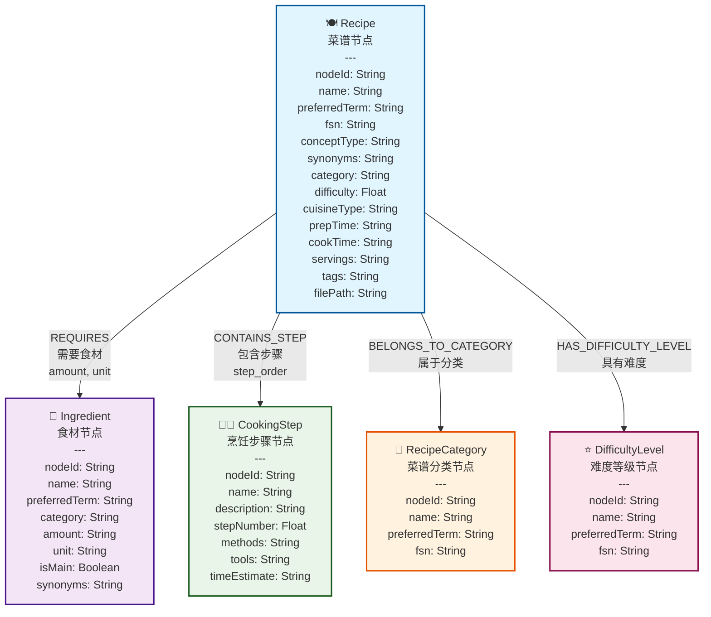
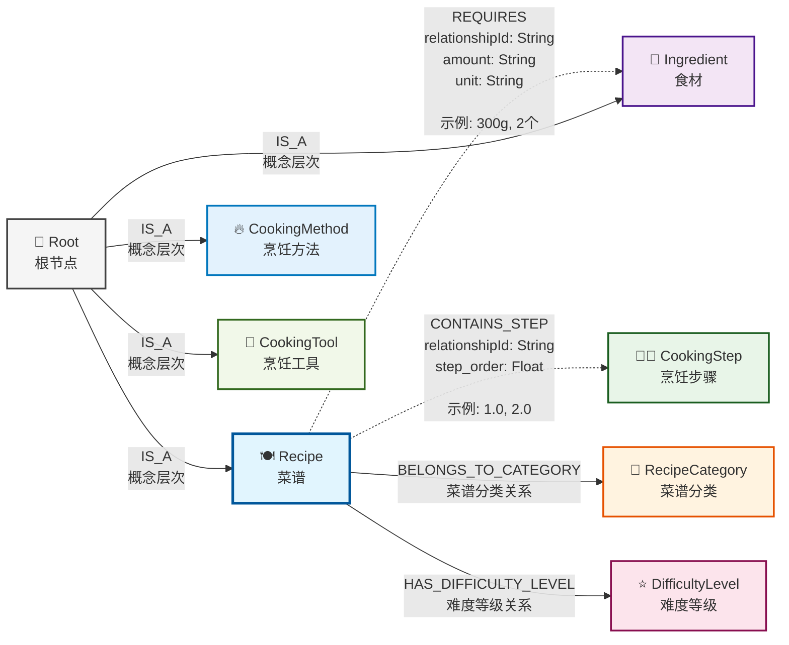

# 第二节 图数据建模与Neo4j集成

> [本节完整代码](https://github.com/datawhalechina/all-in-rag/blob/main/code/C9/rag_modules/graph_data_preparation.py)

## 一、数据来源与转换

### 1.1 从Markdown到图数据的转换

本章的图数据来源于第八章中使用的Markdown格式菜谱数据。为了构建知识图谱，笔者用AI开发了一个简单的[Agent](https://github.com/datawhalechina/all-in-rag/tree/main/code/C9/agent(%E4%BB%A3%E7%A0%81%E7%B3%BBai%E7%94%9F%E6%88%90))，通过LLM将结构化的Markdown菜谱数据转换为CSV格式的图数据。

**转换流程**：
1. **读取Markdown菜谱**：从第八章的数据源加载菜谱文件
2. **LLM解析提取**：使用大语言模型识别和提取实体及关系
3. **结构化输出**：生成nodes.csv和relationships.csv文件
4. **图数据导入**：通过Cypher脚本导入Neo4j数据库

### 1.2 图数据文件结构

转换后的图数据包含两个核心文件：

```
data/C9/cypher/
├── nodes.csv          # 节点数据（菜谱、食材、步骤等）
├── relationships.csv  # 关系数据（菜谱-食材、菜谱-步骤等）
└── neo4j_import.cypher # 数据导入脚本
```

## 二、图数据模型设计

### 2.1 实际数据结构分析

基于LLM转换后的实际图数据，知识图谱包含以下核心实体类型。如果你有游戏逆向经验，可以把这些实体类型想象成虚幻引擎烹饪游戏中的对象类，节点间的关系就像对象间的指针引用：

**核心实体类型**：
- **Recipe (菜谱)**：具体的菜品，包含难度、菜系、时间等属性
- **Ingredient (食材)**：制作菜品所需的原料，包含分类、用量、单位等
- **CookingStep (烹饪步骤)**：详细的制作步骤，包含方法、工具、时间估计
- **CookingMethod (烹饪方法)**：如炒、煮、蒸、炸等烹饪技法
- **CookingTool (烹饪工具)**：如炒锅、蒸锅、刀具等
- **DifficultyLevel (难度等级)**：一星到五星的难度分级
- **RecipeCategory (菜谱分类)**：素菜、荤菜、水产、早餐等分类

**实际数据特点**：
- **统一编码体系**：使用nodeId进行唯一标识（如201000001）
- **多语言支持**：包含preferredTerm、fsn等多语言字段
- **丰富属性**：每个实体包含详细的属性信息
- **层次化结构**：从抽象概念到具体实例的层次化组织

### 2.2 实际节点模型

基于实际数据的图数据模型：



**节点类型说明**：

- **🍽️ Recipe (菜谱节点)**: 核心实体，包含菜谱的完整信息
- **🥬 Ingredient (食材节点)**: 制作菜谱所需的食材信息
- **👨‍🍳 CookingStep (烹饪步骤节点)**: 详细的制作步骤和方法
- **📂 RecipeCategory (菜谱分类节点)**: 菜品分类（素菜、荤菜、水产等）
- **⭐ DifficultyLevel (难度等级节点)**: 制作难度分级（一星到五星）

### 2.3 实际关系模型

基于实际数据的关系结构：



**关系类型说明**：

| 关系编码 | 关系类型 | 说明 | 属性 |
|---------|---------|------|------|
| **801000001** | REQUIRES | 菜谱-食材关系 | relationshipId, amount, unit |
| **801000003** | CONTAINS_STEP | 菜谱-步骤关系 | relationshipId, step_order |
| **801000004** | HAS_DIFFICULTY_LEVEL | 菜谱-难度关系 | relationshipId |
| **801000005** | BELONGS_TO_CATEGORY | 菜谱-分类关系 | relationshipId |

**关系特点**：
- **虚线箭头**：表示带有丰富属性的关系（如REQUIRES、CONTAINS_STEP）
- **实线箭头**：表示简单的分类关系
- **层次化结构**：Root节点作为概念层次的顶层节点

## 三、Neo4j数据导入

### 3.1 数据准备脚本

系统通过 `GraphDataPreparationModule` 来处理图数据的加载和管理：

```python
class GraphDataPreparationModule:
    def __init__(self, neo4j_config: dict):
        """
        初始化图数据准备模块
        
        Args:
            neo4j_config: Neo4j连接配置
        """
        self.driver = GraphDatabase.driver(
            neo4j_config['uri'],
            auth=(neo4j_config['user'], neo4j_config['password'])
        )
        
    def load_graph_data(self) -> List[Dict]:
        """
        从Neo4j加载图数据
        
        Returns:
            包含菜谱信息的字典列表
        """
        query = """
        MATCH (r:Recipe)
        OPTIONAL MATCH (r)-[:REQUIRES]->(i:Ingredient)
        OPTIONAL MATCH (r)-[:HAS_STEP]->(s:Step)
        OPTIONAL MATCH (r)-[:BELONGS_TO]->(c:Category)
        RETURN r, collect(DISTINCT i) as ingredients, 
               collect(DISTINCT s) as steps,
               collect(DISTINCT c) as categories
        ORDER BY r.name
        """
        
        with self.driver.session() as session:
            result = session.run(query)
            return [record for record in result]
```

### 3.2 实际CSV数据格式

转换后的CSV文件格式（基于实际数据）：

**nodes.csv结构**：
```csv
nodeId,labels,name,preferredTerm,fsn,conceptType,synonyms,category,difficulty,cuisineType,prepTime,cookTime,servings,tags,filePath,amount,unit,isMain,description,stepNumber,methods,tools,timeEstimate
```

**实际数据示例**：
```csv
201000184,Recipe,干煎阿根廷红虾,干煎阿根廷红虾,,Recipe,"[{'term': '干pan-fried阿根廷红虾', 'language': 'zh'}]",水产,3.0,,提前1天冷藏解冻+10分钟,约5分钟,1人,"趁热吃,柠檬可增酸提味",dishes\aquatic\干煎阿根廷红虾\干煎阿根廷红虾.md,,,,,,,,
201000185,Ingredient,阿根廷红虾,阿根廷红虾,,Ingredient,,蛋白质,,,,,,,,2-3,只,True,,,,,
201000196,CookingStep,步骤1,步骤1,,CookingStep,,,,,,,,,,,,,阿根廷红虾提前1天从速冻取出放到冷藏里自然解冻,1.0,解冻,冰箱,24小时
```

**relationships.csv结构**：
```csv
startNodeId,endNodeId,relationshipType,relationshipId,amount,unit,step_order
```

**实际关系示例**：
```csv
201000184,201000185,801000001,R_000001,2-3,只,
201000184,201000196,801000003,R_000010,,,1.0
201000184,720000000,801000002,R_000020,,,
```

## 四、图数据查询与检索

### 4.1 基础查询模式

#### 简单实体查询
```cypher
// 查找所有水产类菜谱
MATCH (r:Recipe)
WHERE r.category = "水产"
RETURN r.name, r.difficulty, r.prepTime, r.cookTime

// 查找包含特定食材的菜谱
MATCH (r:Recipe)-[:REQUIRES]->(i:Ingredient)
WHERE i.name CONTAINS "虾"
RETURN r.name, r.difficulty, i.name, i.amount, i.unit

// 使用全文搜索查找菜谱
CALL db.index.fulltext.queryNodes("recipe_fulltext_index", "川菜 OR 辣椒")
YIELD node, score
RETURN node.name, node.category, score
ORDER BY score DESC
```

#### 多跳关系查询
```cypher
// 查找某个难度等级的所有菜谱（基于属性查询）
MATCH (r:Recipe)
WHERE r.difficulty = 3.0
RETURN r.name, r.category, r.prepTime, r.cookTime, r.difficulty

// 查找菜谱的完整制作流程
MATCH (r:Recipe {name: "干煎阿根廷红虾"})-[:CONTAINS_STEP]->(s:CookingStep)
RETURN r.name, s.stepNumber, s.description, s.methods, s.tools
ORDER BY s.stepNumber
```

### 4.2 复杂推理查询

#### 基于约束的菜谱推荐
```cypher
// 查找适合新手的简单菜谱（低难度、步骤少）
MATCH (r:Recipe)
WHERE r.difficulty <= 2.0
  AND r.stepCount <= 5
RETURN r.name, r.difficulty, r.stepCount, r.category
ORDER BY r.difficulty, r.stepCount

// 查找制作时间短的菜谱
MATCH (r:Recipe)
WHERE r.prepTime IS NOT NULL AND r.cookTime IS NOT NULL
  AND r.prepTime CONTAINS "分钟" AND r.cookTime CONTAINS "分钟"
RETURN r.name, r.prepTime, r.cookTime, r.category
ORDER BY r.name
```

#### 菜谱组合推荐
```cypher
// 查找同一分类下的不同菜谱
MATCH (r1:Recipe), (r2:Recipe)
WHERE r1.category = r2.category
  AND r1.category = "水产"
  AND r1.nodeId <> r2.nodeId
RETURN r1.name, r2.name, r1.category
LIMIT 5

// 查找包含相同食材的不同菜谱
MATCH (r1:Recipe)-[:REQUIRES]->(i:Ingredient)<-[:REQUIRES]-(r2:Recipe)
WHERE r1.nodeId <> r2.nodeId
  AND i.name = "阿根廷红虾"
RETURN r1.name, r2.name, i.name
```

## 五、图数据到文档的转换

### 5.1 结构化文档构建

```python
def build_recipe_documents(self, graph_data: List[Dict]) -> List[Document]:
    """将图数据转换为结构化文档"""

    documents = []
    for record in graph_data:
        recipe = record['r']
        ingredients = record['ingredients']
        steps = record['steps']
        categories = record['categories']

        # 构建结构化文档内容
        content_parts = [
            f"# {recipe['name']}",
            f"分类: {', '.join([c['name'] for c in categories])}",
            f"难度: {recipe['difficulty']}星",
            # ... 时间、份量等基本信息
            "",
            "## 所需食材"
        ]

        # 添加食材列表
        for i, ingredient in enumerate(ingredients, 1):
            content_parts.append(f"{i}. {ingredient['name']}")

        content_parts.extend(["", "## 制作步骤"])

        # 添加制作步骤（按顺序排序）
        sorted_steps = sorted(steps, key=lambda x: x.get('order', 0))
        for step in sorted_steps:
            content_parts.extend([
                f"### 第{step['order']}步",
                step['description'],
                ""
            ])

        # 创建Document对象
        document = Document(
            page_content="\n".join(content_parts),
            metadata={
                'recipe_name': recipe['name'],
                'node_id': recipe.get('nodeId'),  # 关键：保持与图节点的关联
                'difficulty': recipe.get('difficulty', 0),
                'categories': [c['name'] for c in categories],
                'ingredients': [i['name'] for i in ingredients]
                # ... 其他元数据
            }
        )
        documents.append(document)

    return documents
```

> **为什么不直接读取原始Markdown文件？**
>
> 虽然第八章中HowToCook项目的Markdown格式是统一的，但图RAG的价值在于提供更丰富的信息：
>
> **原始Markdown的特点**：
> - **格式统一**：HowToCook项目有良好的Markdown结构（`#`、`##`、`###`层级）
> - **信息完整**：包含菜品名称、原料、制作步骤等基本信息
> - **元数据推断**：可以从文件路径推断分类，从`★★★★★`符号推断难度
>
> **图数据构建文档的额外价值**：
> 1. **关系信息丰富**：包含食材间的替代关系、菜谱间的相似性等图关系
> 2. **结构化查询**：可以通过图关系快速获取相关信息（如"包含鸡肉的所有菜谱"）
> 3. **动态内容生成**：根据图关系动态生成推荐内容（如"相似菜谱"、"替代食材"）
> 4. **语义增强**：图数据库可以存储更丰富的语义信息和计算结果
> 5. **查询优化**：图查询在复杂关系检索上比文本搜索更高效

### 5.2 图RAG中的分块策略

在图RAG系统中，分块策略与上个项目有所不同，主要体现在**数据来源和上下文获取方式**的差异：

**图RAG vs 传统RAG的分块对比**：

| 特性 | 第八章 传统RAG | 第九章 图RAG |
|------|-----------------|----------------|
| **数据来源** | 直接读取Markdown文件 | 从图数据库构建文档 |
| **上下文获取** | 父子文档映射 | 图关系遍历 |
| **关系信息** | 有限（仅父子关系） | 丰富（多种图关系） |
| **分块策略** | 按Markdown标题分块 | 按语义+长度智能分块 |
| **元数据来源** | 文件路径+内容推断 | 图节点结构化数据 |

**图RAG分块的特点**：
1. **保持图关联**：每个chunk通过`parent_id`与图节点关联
2. **语义优先分块**：优先按章节分块，保持语义完整性
3. **丰富的元数据**：直接从图节点获取结构化信息
4. **双重上下文**：既有文本块关系，又有图关系信息

### 5.3 实际分块实现

在图RAG系统中，采用的实际分块策略：

```python
def chunk_documents(self, chunk_size: int = 500, chunk_overlap: int = 50) -> List[Document]:
    """图RAG文档分块：结合图结构优势的智能分块策略"""

    chunks = []
    for doc in self.documents:
        content = doc.page_content

        if len(content) <= chunk_size:
            # 短文档：保持完整，避免破坏语义
            chunk = Document(
                page_content=content,
                metadata={
                    **doc.metadata,
                    "parent_id": doc.metadata["node_id"],  # 关键：保持与图节点的关联
                    "chunk_index": 0,
                    "doc_type": "chunk"
                }
            )
            chunks.append(chunk)
        else:
            # 长文档：智能分块策略
            sections = content.split('\n## ')

            if len(sections) <= 1:
                # 无章节结构：按长度分块（带重叠）
                total_chunks = (len(content) - 1) // (chunk_size - chunk_overlap) + 1
                for i in range(total_chunks):
                    start = i * (chunk_size - chunk_overlap)
                    end = min(start + chunk_size, len(content))
                    # ... 创建chunk，保持parent_id关联
            else:
                # 有章节结构：按语义分块（推荐）
                for i, section in enumerate(sections):
                    chunk_content = section if i == 0 else f"## {section}"
                    # ... 创建chunk，包含section_title信息

    return chunks
```

图RAG的分块策略在保持语义完整性的基础上，充分利用图数据库的结构化优势。与第八章直接读取Markdown文件不同，这里从图数据库构建标准化文档，每个chunk通过`parent_id`与原始Recipe节点保持关联，既继承了传统的父子文档映射关系，又能通过图关系遍历获取更丰富的上下文信息。在具体实现上，采用智能分块策略：短文档保持完整避免破坏语义，长文档优先按`##`标题进行章节分块，必要时才进行长度分块，同时为每个chunk提供丰富的元数据（如chunk_id、chunk_index、total_chunks等），确保后续处理的灵活性和可追溯性。

