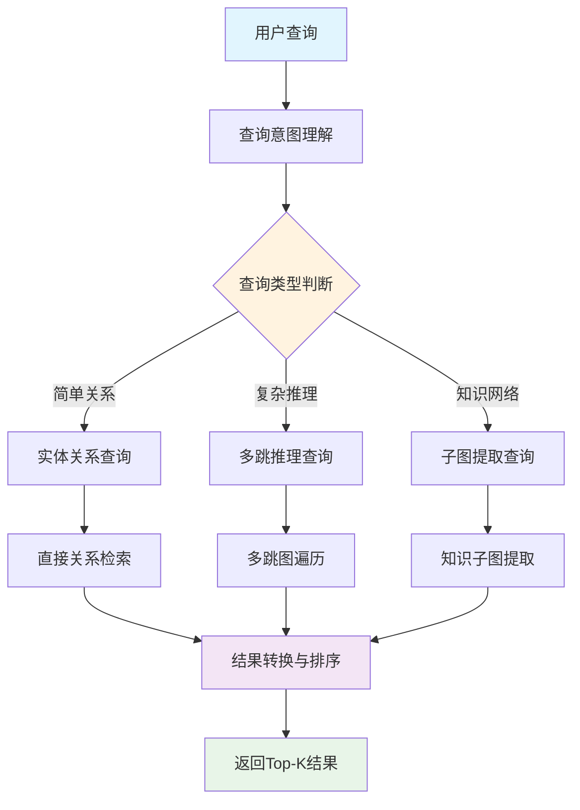

# 第四节 智能查询路由与检索策略

> 不同类型的查询需要不同的检索策略。本节将详细介绍如何构建智能查询路由器，实现查询复杂度分析和检索策略的自动选择，以及三种核心检索策略的设计与实现。

## 一、智能查询路由器设计

### 1.1 查询路由的必要性

在图RAG系统中，可以实现更多样化的查询类型：

**简单查询**：
- "川菜有哪些？"
- "宫保鸡丁怎么做？"
- "减肥菜推荐"

**复杂推理查询**：
- "适合糖尿病人吃的低糖川菜有哪些，并且制作时间不超过30分钟？"
- "如果我只有鸡肉和蔬菜，能做什么菜，最好是不同菜系的？"
- "哪些菜可以用豆腐替代肉类，并且保持相似的口感？"

**中等复杂查询**：
- "家常菜中哪些适合新手制作？"
- "有什么菜可以用剩余的土豆和胡萝卜？"

不同复杂度的查询需要不同的检索策略来获得最佳效果。

### 1.2 查询分析框架

智能查询路由器通过四个维度分析查询特征：

```python
class IntelligentQueryRouter:
    def __init__(self, traditional_retrieval, graph_rag_retrieval, llm_client, config):
        self.traditional_retrieval = traditional_retrieval
        self.graph_rag_retrieval = graph_rag_retrieval
        self.llm_client = llm_client
        self.config = config

        # 路由统计
        self.route_stats = {
            "traditional_count": 0,
            "graph_rag_count": 0,
            "combined_count": 0,
            "total_queries": 0
        }

    def analyze_query(self, query: str) -> QueryAnalysis:
        """深度分析查询特征，决定最佳检索策略"""

        analysis_prompt = f"""
        作为RAG系统的查询分析专家，请深度分析以下查询的特征：

        查询：{query}

        请从以下维度分析：

        1. 查询复杂度 (0-1)：
           - 0.0-0.3: 简单信息查找（如：红烧肉怎么做？）
           - 0.4-0.7: 中等复杂度（如：川菜有哪些特色菜？）
           - 0.8-1.0: 高复杂度推理（如：为什么川菜用花椒而不是胡椒？）

        2. 关系密集度 (0-1)：
           - 0.0-0.3: 单一实体信息（如：西红柿的营养价值）
           - 0.4-0.7: 实体间关系（如：鸡肉配什么蔬菜？）
           - 0.8-1.0: 复杂关系网络（如：川菜的形成与地理、历史的关系）

        3. 推理需求：是否需要多跳推理、因果分析、对比分析？
        4. 实体识别：查询中包含多少个明确实体？

        基于分析推荐检索策略：
        - hybrid_traditional: 适合简单直接的信息查找
        - graph_rag: 适合复杂关系推理和知识发现
        - combined: 需要两种策略结合

        返回JSON格式：
        {{
            "query_complexity": 0.6,
            "relationship_intensity": 0.8,
            "reasoning_required": true,
            "entity_count": 3,
            "recommended_strategy": "graph_rag",
            "confidence": 0.85,
            "reasoning": "该查询涉及多个实体间的复杂关系，需要图结构推理"
        }}
        """

        try:
            response = self.llm_client.chat.completions.create(
                model=self.config.llm_model,
                messages=[{"role": "user", "content": analysis_prompt}],
                temperature=0.1,
                max_tokens=800
            )

            result = json.loads(response.choices[0].message.content.strip())

            # 构建QueryAnalysis对象
            analysis = QueryAnalysis(
                query_complexity=result.get("query_complexity", 0.5),
                relationship_intensity=result.get("relationship_intensity", 0.5),
                reasoning_required=result.get("reasoning_required", False),
                entity_count=result.get("entity_count", 1),
                recommended_strategy=SearchStrategy(result.get("recommended_strategy", "hybrid_traditional")),
                confidence=result.get("confidence", 0.5),
                reasoning=result.get("reasoning", "默认分析")
            )

            return analysis

        except Exception as e:
            logger.error(f"查询分析失败: {e}")
            # 降级方案：基于规则的简单分析
            return self._rule_based_analysis(query)
```

### 1.3 规则基础的降级分析

当LLM分析失败时，使用基于规则的降级分析：

```python
def _rule_based_analysis(self, query: str) -> QueryAnalysis:
    """基于规则的降级分析"""
    # 简单的规则判断
    complexity_keywords = ["为什么", "如何", "关系", "影响", "原因", "比较", "区别"]
    relation_keywords = ["配", "搭配", "组合", "相关", "联系", "连接"]

    complexity = sum(1 for kw in complexity_keywords if kw in query) / len(complexity_keywords)
    relation_intensity = sum(1 for kw in relation_keywords if kw in query) / len(relation_keywords)

    # 策略选择
    if complexity > 0.3 or relation_intensity > 0.3:
        strategy = SearchStrategy.GRAPH_RAG
    else:
        strategy = SearchStrategy.HYBRID_TRADITIONAL

    return QueryAnalysis(
        query_complexity=complexity,
        relationship_intensity=relation_intensity,
        reasoning_required=complexity > 0.3,
        entity_count=len(query.split()),  # 简单估算
        recommended_strategy=strategy,
        confidence=0.6,
        reasoning="基于规则的简单分析"
    )
```

### 1.4 智能路由执行

基于分析结果，路由到最适合的检索策略：

```python
def route_query(self, query: str, top_k: int = 5) -> Tuple[List[Document], QueryAnalysis]:
    """智能路由查询到最适合的检索引擎"""
    logger.info(f"开始智能路由: {query}")

    # 1. 分析查询特征
    analysis = self.analyze_query(query)

    # 2. 更新统计
    self._update_route_stats(analysis.recommended_strategy)

    # 3. 根据策略执行检索
    try:
        if analysis.recommended_strategy == SearchStrategy.HYBRID_TRADITIONAL:
            logger.info("使用传统混合检索")
            documents = self.traditional_retrieval.hybrid_search(query, top_k)

        elif analysis.recommended_strategy == SearchStrategy.GRAPH_RAG:
            logger.info("🕸️ 使用图RAG检索")
            documents = self.graph_rag_retrieval.graph_rag_search(query, top_k)

        elif analysis.recommended_strategy == SearchStrategy.COMBINED:
            logger.info("🔄 使用组合检索策略")
            documents = self._combined_search(query, top_k)

        # 4. 结果后处理
        documents = self._post_process_results(documents, analysis)

        return documents, analysis

    except Exception as e:
        logger.error(f"查询路由失败: {e}")
        # 降级到传统检索
        documents = self.traditional_retrieval.hybrid_search(query, top_k)
        return documents, analysis

def _combined_search(self, query: str, top_k: int) -> List[Document]:
    """组合搜索策略：结合传统检索和图RAG的优势"""
    # 分配结果数量
    traditional_k = max(1, top_k // 2)
    graph_k = top_k - traditional_k

    # 执行两种检索
    traditional_docs = self.traditional_retrieval.hybrid_search(query, traditional_k)
    graph_docs = self.graph_rag_retrieval.graph_rag_search(query, graph_k)

    # 合并和去重（简化实现）
    # ... 具体的合并逻辑

    return combined_docs
```

## 二、三种检索策略详解

### 2.1 传统混合检索策略

> [混合检索模块代码](https://github.com/datawhalechina/all-in-rag/blob/main/code/C9/rag_modules/hybrid_retrieval.py)

适用于简单查询，结合双层检索和向量检索：

```python
class HybridRetrievalModule:
    def hybrid_search(self, query: str, top_k: int = 5) -> List[Document]:
        """
        混合检索：使用Round-robin轮询合并策略
        公平轮询合并不同检索结果，不使用权重配置
        """
        logger.info(f"开始混合检索: {query}")

        # 1. 双层检索（实体+主题检索）
        dual_docs = self.dual_level_retrieval(query, top_k)

        # 2. 增强向量检索
        vector_docs = self.vector_search_enhanced(query, top_k)

        # 3. Round-robin轮询合并
        merged_docs = []
        seen_doc_ids = set()
        max_len = max(len(dual_docs), len(vector_docs))

        # Round-robin策略：交替从两个结果列表中取文档
        # 这种方法确保了不同检索方法的结果都能得到公平的展示机会
        for i in range(max_len):
            # 先添加双层检索结果
            if i < len(dual_docs):
                doc = dual_docs[i]
                doc_id = doc.metadata.get("node_id", hash(doc.page_content))
                if doc_id not in seen_doc_ids:
                    seen_doc_ids.add(doc_id)
                    doc.metadata["search_method"] = "dual_level"
                    doc.metadata["final_score"] = doc.metadata.get("relevance_score", 0.0)
                    merged_docs.append(doc)

            # 再添加向量检索结果
            if i < len(vector_docs):
                doc = vector_docs[i]
                doc_id = doc.metadata.get("node_id", hash(doc.page_content))
                if doc_id not in seen_doc_ids:
                    seen_doc_ids.add(doc_id)
                    doc.metadata["search_method"] = "vector"
                    doc.metadata["final_score"] = doc.metadata.get("relevance_score", 0.0)
                    merged_docs.append(doc)

        return merged_docs[:top_k]
```

**Round-robin轮询合并原理**：Round-robin（轮询）是一种公平调度算法，在RAG系统中用于融合多个检索结果。其核心是按顺序轮流从不同的结果列表中选择文档，而不是基于分数权重进行合并。这种方法确保了每种检索策略的结果都能得到公平的展示机会，避免了某种方法因排序靠前而被过度选择的问题。相比复杂的加权融合，Round-robin实现简单且稳定，无需调优权重参数，自然保持了结果的多样性。

### 2.2 图RAG检索策略

> [图RAG检索模块代码](https://github.com/datawhalechina/all-in-rag/blob/main/code/C9/rag_modules/graph_rag_retrieval.py)

适用于复杂推理查询，基于图结构进行多跳推理：

```python
class GraphRAGRetrieval:
    def graph_rag_search(self, query: str, top_k: int = 5) -> List[Document]:
        """
        图RAG主搜索接口：整合所有图RAG能力
        """
        logger.info(f"开始图RAG检索: {query}")

        # 1. 查询意图理解
        graph_query = self.understand_graph_query(query)
        logger.info(f"查询类型: {graph_query.query_type.value}")

        results = []

        try:
            # 2. 根据查询类型执行不同策略
            if graph_query.query_type in [QueryType.MULTI_HOP, QueryType.PATH_FINDING]:
                # 多跳遍历
                paths = self.multi_hop_traversal(graph_query)
                results.extend(self._paths_to_documents(paths, query))

            elif graph_query.query_type == QueryType.SUBGRAPH:
                # 子图提取
                subgraph = self.extract_knowledge_subgraph(graph_query)

                # 图结构推理
                reasoning_chains = self.graph_structure_reasoning(subgraph, query)

                results.extend(self._subgraph_to_documents(subgraph, reasoning_chains, query))

            elif graph_query.query_type == QueryType.ENTITY_RELATION:
                # 实体关系查询
                paths = self.multi_hop_traversal(graph_query)
                results.extend(self._paths_to_documents(paths, query))

            # 3. 图结构相关性排序
            results = self._rank_by_graph_relevance(results, query)

            return results[:top_k]

        except Exception as e:
            logger.error(f"图RAG检索失败: {e}")
            return []
```

**图RAG检索流程**：



**多跳推理**：

多跳推理是指通过图中的多个节点和关系进行间接推理，这是图RAG相比传统RAG的核心优势。传统检索只能找到直接匹配的信息，而多跳推理能够发现数据中的隐含关联。

- **工作原理**：
  1. **路径发现**：在知识图谱中寻找连接起始实体和目标实体的路径
  2. **关系传递**：通过中间节点传递语义关系
  3. **隐含推理**：发现原始数据中没有明确表达的知识关联

- **具体示例**：用户问"鸡肉配什么蔬菜好？"

  ```
  传统检索：只能找到直接提到"鸡肉+蔬菜"的文档（可能很少）

  多跳推理：
  1跳：鸡肉 → 宫保鸡丁、口水鸡、白切鸡...
  2跳：宫保鸡丁 → 胡萝卜、青椒、花生米...
  3跳：胡萝卜 → 蔬菜类别

  推理结果：鸡肉经常与胡萝卜、青椒等蔬菜搭配
  ```

- **多跳推理的价值**：
  - **知识发现**：挖掘数据中的隐含关系
  - **推荐增强**：提供更丰富的搭配建议
  - **语义理解**：模拟人类的联想思维过程
  - **数据利用**：充分利用图结构的关系信息

通过这种多跳遍历，系统能发现"鸡肉"和"胡萝卜"之间的隐含关系：它们经常在同一道菜中出现，即使在原始数据中没有直接的"鸡肉-胡萝卜"关系。

### 2.3 组合检索策略

> [智能查询路由器代码](https://github.com/datawhalechina/all-in-rag/blob/main/code/C9/rag_modules/intelligent_query_router.py)

适用于中等复杂查询，结合传统检索和图RAG的优势：

```python
def _combined_search(self, query: str, top_k: int) -> List[Document]:
    """组合搜索策略：结合传统检索和图RAG的优势"""
    # 分配结果数量
    traditional_k = max(1, top_k // 2)
    graph_k = top_k - traditional_k

    # 执行两种检索
    traditional_docs = self.traditional_retrieval.hybrid_search(query, traditional_k)
    graph_docs = self.graph_rag_retrieval.graph_rag_search(query, graph_k)

    # Round-robin轮询合并（参考LightRAG的融合策略）
    combined_docs = []
    seen_contents = set()

    # 交替添加结果，保持多样性（Round-robin策略）
    max_len = max(len(traditional_docs), len(graph_docs))
    for i in range(max_len):
        # 添加传统检索结果
        if i < len(traditional_docs):
            doc = traditional_docs[i]
            if doc.page_content not in seen_contents:
                seen_contents.add(doc.page_content)
                doc.metadata["search_strategy"] = "traditional"
                combined_docs.append(doc)

        # 添加图RAG结果
        if i < len(graph_docs):
            doc = graph_docs[i]
            if doc.page_content not in seen_contents:
                seen_contents.add(doc.page_content)
                doc.metadata["search_strategy"] = "graph_rag"
                combined_docs.append(doc)

    return combined_docs[:top_k]
```

**Round-robin轮询合并机制**：在组合检索中，Round-robin算法按照固定的轮转顺序从传统检索和图RAG检索的结果中交替选择文档。具体过程是：第1个位置选择传统检索的第1个结果，第2个位置选择图RAG的第1个结果，第3个位置选择传统检索的第2个结果，以此类推。这种机制避免了复杂的分数融合计算，通过位置轮转自然实现了不同检索策略结果的均衡分布，是一种简单而有效的多源信息融合方法。

## 三、路由决策逻辑

智能查询路由器通过分析查询特征，自动选择最适合的检索策略：

**决策规则**：
- **简单查询**（复杂度 < 0.4）→ 传统混合检索
- **复杂推理查询**（复杂度 > 0.7 或关系密集度 > 0.7）→ 图RAG检索
- **中等复杂查询**（0.4 ≤ 复杂度 ≤ 0.7）→ 组合检索策略

**路由统计与优化**：

```python
def _update_route_stats(self, strategy: SearchStrategy):
    """更新路由统计信息"""
    self.route_stats["total_queries"] += 1
    if strategy == SearchStrategy.HYBRID_TRADITIONAL:
        self.route_stats["traditional_count"] += 1
    elif strategy == SearchStrategy.GRAPH_RAG:
        self.route_stats["graph_rag_count"] += 1
    elif strategy == SearchStrategy.COMBINED:
        self.route_stats["combined_count"] += 1
```

> 最后的生成部分就不过多赘述了，和第八章类似，可以自行查阅代码。本章项目并不完善，仅作为对 GraphRAG 流程和架构的理解。可根据前面所学内容自行优化。
