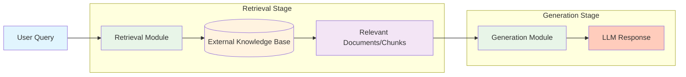

# Chapter 1: Introduction to RAG

## 1. What is RAG?

### 1.1 Core Definition

RAG (Retrieval-Augmented Generation) is a technical paradigm that **combines information retrieval with text generation**. Its core logic is: before a large language model (LLM) generates text, it first dynamically retrieves relevant information from external knowledge bases through a retrieval mechanism, and integrates the retrieval results into the generation process, thereby improving the accuracy and timeliness of the output[^1][^2][^3].

> Of course, the definition of RAG will expand with technological development, so the current definition serves only as the establishment of a basic framework.

💡 **RAG Essence**: Before LLM generates text, first retrieve relevant information from **external knowledge bases** as context to assist in generating more accurate answers.

### 1.2 Technical Principles

- **Two-Stage Architecture**:



- **Key Components**:
  1. **Indexing** 📑: Split unstructured documents (PDF/Word, etc.) into chunks and convert them into vector data through embedding models.
  2. **Retrieval** 🔍️: Based on query semantics, recall the most relevant document chunks (Context) from the vector database.
  3. **Generation** ✨: Use retrieval results as context input to LLM to generate natural language responses.

### 1.3 Technical Evolution Classification

RAG technology can be classified by complexity[^4]:

**Basic RAG**
- Basic "indexing-retrieval-generation" workflow
- Simple document chunking
- Basic vector retrieval mechanism

**Advanced RAG**
- Added data cleaning processes
- Metadata optimization
- Multi-round retrieval strategies
- Improved accuracy and efficiency

**Modular RAG**
- Flexible integration with search engines
- Reinforcement learning optimization
- Knowledge graph enhancement
- Support for complex business scenarios


## 2. Why Use RAG[^5]?

### 2.1 Solving Core Limitations of LLMs

| Problem | RAG Solution |
|---------------------|----------------------------------|
| **Static Knowledge Limitations** | Real-time retrieval from external knowledge bases, supporting dynamic updates |
| **Hallucination** | Generate based on retrieved content, reducing error rates |
| **Insufficient Domain Expertise** | Introduce domain-specific knowledge bases (e.g., medical/legal) |
| **Data Privacy Risks** | Local deployment of knowledge bases, avoiding sensitive data leakage |

### 2.2 Key Advantages

1. **Accuracy Improvement**
- Knowledge base expansion: Supplement the deficiencies of LLM pre-training knowledge, enhance understanding of professional domains
- Reduce hallucination phenomena: Provide specific reference materials to reduce fabricated information
- Traceable citations: Support citing original documents, improving credibility and persuasiveness of output content

2. **Real-time Guarantee**
- Dynamic knowledge updates: Knowledge base content can be updated and maintained in real-time independently of the model
- Reduce time lag: Avoid knowledge timeliness issues caused by LLM pre-training data cutoff dates

3. **Cost Effectiveness**
- Avoid frequent fine-tuning: Compared to repeatedly fine-tuning LLMs, maintaining knowledge bases is more cost-effective
- Reduce inference costs: For domain-specific problems, smaller base models can be used with knowledge bases
- Resource consumption optimization: Reduce computational resource requirements for storing complete knowledge in model weights
- Quick adaptation to changes: New information or policy updates only require updating the knowledge base, no model retraining needed

4. **Scalability**
- Multi-source integration: Support building unified knowledge bases from different sources and formats of data
- Modular design: Retrieval components can be optimized independently without affecting generation components

### 2.3 Risk-Graded Application Scenarios

> The following shows the applicability of RAG technology in scenarios with different risk levels

| Risk Level | Examples | RAG Applicability |
|:--------:|:------------------------------|:--------------------------:|
| **Low Risk** | Translation/Grammar checking | High reliability |
| **Medium Risk** | Contract drafting/Legal consultation | Requires human review |
| **High Risk** | Evidence analysis/Visa decisions | Requires strict quality control mechanisms |

## 3. How to Get Started with RAG?

### 3.1 Basic Toolchain Selection

**Development Frameworks**
- **LangChain**: Provides pre-built RAG chains (like rag_chain), supporting quick integration of LLM with vector databases
- **LlamaIndex**: Optimized for knowledge base indexing, simplifying document chunking and embedding processes

**Vector Databases**
- **Milvus**: Open-source high-performance vector database
- **FAISS**: Lightweight vector search library
- **Pinecone**: Cloud service vector database

### 3.2 Four Steps to Build Minimum Viable Product (MVP)

1. **Data Preparation**
   - Format support: PDF, Word, web text, etc.
   - Chunking strategy: Split by semantics (like paragraphs) or fixed length, avoiding information fragmentation

2. **Index Construction**
   - Embedding models: Choose open-source models (like text-embedding-ada-002) or fine-tune domain-specific models
   - Vectorization: Convert text chunks to vectors and store in database

3. **Retrieval Optimization**
   - Hybrid retrieval: Combine keyword (BM25) with semantic search (vector similarity) to improve recall
   - Reranking: Use small models to filter Top-K relevant chunks (like Cohere Reranker)

4. **Generation Integration**
   - Prompt engineering: Design templates to guide LLM in integrating retrieved content
   - LLM selection: GPT, Claude, Ollama, etc. (balance cost/performance trade-offs)

### 3.3 Beginner-Friendly Solutions

- **LangChain4j Easy RAG**: Simply upload documents, automatically handle indexing and retrieval
- **FastGPT**: Open-source knowledge base platform with visual RAG workflow configuration
- **GitHub Templates**: Such as "TinyRAG" project[^6], providing complete code

### 3.4 Advanced Optimization Directions

**Evaluation Metrics**
```
Retrieval Quality: Context Relevance
Generation Quality: Faithfulness, Factual Accuracy
```

**Performance Optimization**
```
Layered Indexing: Enable caching mechanisms for high-frequency data
Multimodal Extension: Support image/table retrieval
```

> RAG technology is still rapidly developing, so keep following the latest advances in academia and industry!

## References

[^1]: [Genesis, J. (2025). *Retrieval-Augmented Text Generation: Methods, Challenges, and Applications*](https://www.researchgate.net/publication/391141346_Retrieval-Augmented_Generation_Methods_Applications_and_Challenges).

[^2]: [Gao et al. (2023). *Retrieval-Augmented Generation for Large Language Models: A Survey*](https://arxiv.org/abs/2312.10997).

[^3]: [Lewis et al. (2020). *Retrieval-Augmented Generation for Knowledge-Intensive NLP Tasks*](https://arxiv.org/abs/2005.11401).

[^4]: [Gao et al. (2024). *Modular RAG: Transforming RAG Systems into LEGO-like Reconfigurable Frameworks*](https://arxiv.org/abs/2407.21059).

[^5]: [*RAG: Why Does It Matter, What Is It, and Does It Guarantee Accuracy?*](https://www.lawdroidmanifesto.com/p/rag-why-does-it-matter-what-is-it).

[^6]: [*TinyRAG: GitHub Project*](https://github.com/KMnO4-zx/TinyRAG).
